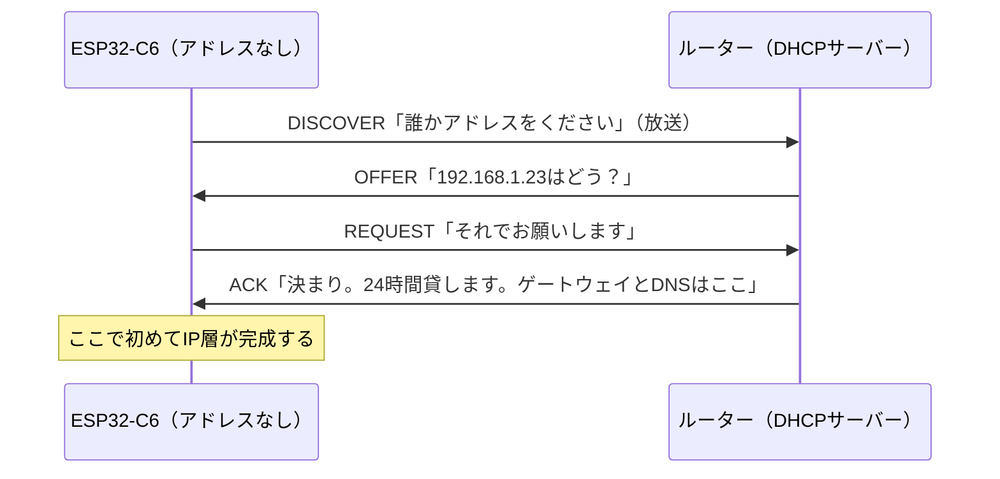

## このページでできるようになること

- DHCPが何を自動化しているのかを説明できる
- アドレスが「もらう」ではなく「借りる」（リース）ものである理由を説明できる
- embassy-netでDHCPを有効にし、アドレス取得を待つコードを書ける

## 先に結論

DHCP（Dynamic Host Configuration Protocol）は、ネットワークに入ってきた機器へ**IPアドレス・サブネット・ゲートウェイ・DNSサーバーの場所**を自動で配る仕組みです。家庭ではルーターがDHCPサーバーを兼ねています。embassy-netでは`Config::dhcpv4(Default::default())`と書くだけで、スタックが裏でこのやり取りを行います。アドレスは一定期間の**貸し出し（リース）**なので、ずっと同じとは限りません。プログラム側では`stack.wait_config_up().await`で「借りられるまで待つ」のが基本形です。

## 身近なたとえ

DHCPは「ホテルのチェックイン」です。ホテル（ネットワーク）に着いた客（C6）はフロント（DHCPサーバー＝ルーター）に「部屋をください」と頼み、フロントが空き部屋（未使用のIPアドレス）を選んで鍵を貸します。館内図（サブネット）や外出口の場所（ゲートウェイ）、案内所の電話番号（DNSサーバー）も一緒に教えてくれます。

ただし実際のDHCPでは、部屋は**期限付きの貸し出し**で、期限（リース期間）が近づくと自動で延長を申請します。また、チェックイン前の客はまだ住所を持たないため、「宛先を知らないまま館内放送で呼びかける」特殊な手順（ブロードキャスト）から始まる点もホテルとは違います。

## 仕組み

DHCPのやり取りは4往復です。頭文字をとってDORAと呼ばれることもあります。



ACKで受け取るのはアドレスだけではありません。**サブネット・ゲートウェイ・DNSサーバーのアドレス**という「このネットワークで暮らすための設定一式」が届きます。前ページの図の登場人物が全部そろうわけです。DNSサーバーの場所がここで手に入ることは、[8ページ](/embassy-esp32-c6/part10/08-dns/)で効いてきます。

Wi-Fi接続（リンク層）が完成して初めて、このやり取りの電波が届くようになります。だから順番は必ず「Wi-Fi接続 → DHCP → その上の通信」です。

## RustとEmbassyではどう書くか

`examples/08-wifi/src/main.rs`からの抜粋です。設定はスタック生成時に渡す1行、待つのは1行です。

```rust
// DHCPでIPアドレスをもらう設定
let net_config = embassy_net::Config::dhcpv4(Default::default());
```

```rust
// ネットワークスタックを生成。stackは操作用ハンドル、runnerは駆動役
let (stack, runner) = embassy_net::new(
    wifi_interface,
    net_config,
    STACK_RESOURCES.init(StackResources::new()),
    seed,
);
```

```rust
// DHCPでIPアドレスが取れるまで待つ
info!("IPアドレスの取得を待っています...");
stack.wait_config_up().await;
if let Some(config) = stack.config_v4() {
    info!("IPアドレスを取得しました: {}", config.address);
}
```

## コードを一行ずつ読む

```rust
let net_config = embassy_net::Config::dhcpv4(Default::default());
```

「IP設定はDHCPで自動取得する」という宣言です。`Default::default()`はDHCPの細かい調整項目を既定値のままにする、という意味です。ちなみにembassy-netには、アドレスを固定で指定する`Config::ipv4_static`もあります（ルーター側の設定と揃える必要があるため、教材ではDHCPを使います）。

```rust
stack.wait_config_up().await;
```

DORAのやり取りが済んで設定一式が有効になるまで、このtaskは眠ります。実際のやり取りを進めるのは前々ページで起動した`net_task`（`runner.run()`）です。「待つ人」と「働く人」が別のtaskである、というEmbassyらしい分業です。

```rust
if let Some(config) = stack.config_v4() {
```

`wait_config_up`の直後なら設定はあるはずですが、型の上では`Option`なので`if let`で丁寧に取り出しています。

## 実行方法

前ページと同じです。

```bash
SSID=あなたのSSID PASSWORD=あなたのパスワード cargo run --release -p wifi
```

```text
INFO - Wi-Fiに接続しました: ...
INFO - IPアドレスの取得を待っています...
INFO - IPアドレスを取得しました: 192.168.1.23/24
```

「接続しました」から「取得しました」までのわずかな時間が、まさにDORAの4往復が飛んでいる時間です。

## よくある失敗

- **`wait_config_up`から永遠に返ってこない**: ①そもそもWi-Fi接続に失敗している（リンク層がなければDHCPの電波は届きません）、②`net_task`を起動し忘れている（やり取りを進める人がいない）、③ネットワークにDHCPサーバーがいない、の順に疑ってください。ログで「Wi-Fiに接続しました」が出ているかがまず切り分けの分岐点です
- **IPアドレス取得前にソケット通信を始めてしまう**: アドレスがないうちは送信元住所が書けないので、TCP接続などは失敗します。`wait_config_up().await`を必ず先に置いてください
- **C6のアドレスをルーターの管理画面でメモして固定的に使う**: リースが切れたり再起動したりすると別のアドレスになることがあります。特定の機器に固定アドレスを与えたい場合は、ルーター側の「DHCP固定割り当て」機能を使うのが定石です

## やってみよう

ルーターの管理画面にDHCPの「クライアント一覧」や「リース一覧」があれば開いてみてください。C6が一覧に載っていて、リース期間が確認できるはずです。C6を再起動して、同じアドレスが再び貸し出されるかも観察してみましょう。

## 確認問題

1. DHCPがIPアドレスのほかに配ってくれる設定を2つ挙げてください。
2. DHCPのアドレスが「もらう」ではなく「借りる」と言われるのはなぜですか。
3. `stack.wait_config_up().await`で眠っている間、DHCPのやり取りを実際に進めているのは誰ですか。

<details>
<summary>答え</summary>

1. サブネット（ネットワークの区切り）、ゲートウェイのアドレス、DNSサーバーのアドレスなどです。
2. リース期間という期限付きの貸し出しだからです。期限が切れれば返却され、別の機器に割り当てられることもあります。
3. `net_task`で回り続けているembassy-netの`Runner`です。待つtaskと働くtaskが分業しています。

</details>

## まとめ

- DHCPはIPアドレス・サブネット・ゲートウェイ・DNSサーバーを自動で配る仕組み。やり取りはDISCOVER→OFFER→REQUEST→ACKの4往復
- アドレスは期限付きのリース。固定ではない
- embassy-netでは`Config::dhcpv4(Default::default())`で有効化し、`stack.wait_config_up().await`で取得を待ってから通信を始める

## 次のページ

住所がそろったので、いよいよデータを送ります。「確実に届ける」トランスポート層の主役、TCPをソケットで使います。

- 前: [4. IPアドレス](/embassy-esp32-c6/part10/04-ip-address/)
- 次: [6. TCP](/embassy-esp32-c6/part10/06-tcp/)
