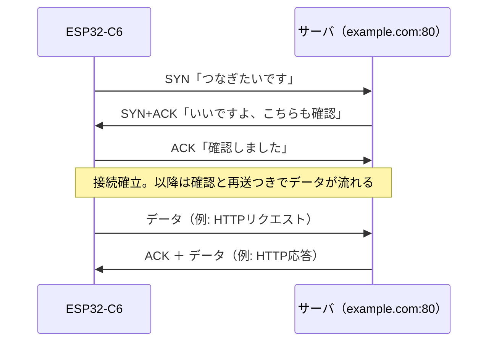

## このページでできるようになること

- TCPが「確実に届ける」ためにしていることを説明できる
- ポート番号の役割を説明できる
- `TcpSocket`で接続し、送受信できる
- ソケットのバッファを自分で用意する意味を説明できる

## 先に結論

TCP（Transmission Control Protocol）は、IPの「小包配送」の上に**確実で順序通りのデータの流れ**を作るプロトコルです。届いたか確認し、失われたら再送し、順番が入れ替わったら並べ直します。通信の相手先は「IPアドレス＋ポート番号」で指定します。embassy-netでは`TcpSocket::new(stack, &mut rx_buffer, &mut tx_buffer)`でソケットを作り、`connect`でつなぎ、embedded-io-asyncの`write`/`read`で送受信します。ソケットが使うメモリ（バッファ）は**自分で用意して貸す**のがno_stdの流儀です。

## 身近なたとえ

IPだけの通信は「普通のはがき」です。出せば届くことが多いけれど、途中で失くなっても誰も教えてくれず、複数枚の順番もばらばらに届きます。TCPは「電話」に近い体験を作ります。最初に「もしもし、聞こえますか」で相手とつながり（接続）、話した内容は相手に届いた順で聞こえ、聞き取れなければ言い直してもらえます。

ただし実際のTCPは、電話のような専用線があるわけではなく、**裏では相変わらずはがき（IPパケット）を大量にやり取りしている**点が違います。番号を振り、受領の返事（ACK）を待ち、返事がなければ再送する——その事務作業を全部自動でやることで、「切れ目のないデータの流れ」に見せかけています。

## 仕組み

### ポート番号 — 同じ住所の中の窓口

1台のサーバは多くのサービスを同時に提供します。そこで住所（IPアドレス）に加えて**ポート番号**（0〜65535）で窓口を分けます。Webサーバ（HTTP）は80番、HTTPSは443番、と定番の番号が決まっています。`connect((address, 80))`の`80`がこれです。

### 接続のはじまり — 3ウェイハンドシェイク



`connect`の`.await`が返ってくるのは、この3往復が済んだときです。

### バッファを自分で持つ意味

PCのプログラムでは、ソケットを作るとOSが裏でメモリを確保してくれます。しかしno_stdのマイコンにはOSがなく、原則ヒープも使いません。そこでembassy-netでは、**受信用と送信用のメモリ（バッファ）をプログラマが配列で用意し、ソケットに貸し出します**。

バッファは「取りに来るまでの待合室」です。相手はこちらの都合と無関係にデータを送ってきますが、無線の再送やほかのtaskの都合で、こちらの`read`はすぐ呼ばれないかもしれません。その間、届いたデータは受信バッファに貯まります。バッファが小さいと、こちらが読み終わるまで相手に送るのを待ってもらうことになり、通信が遅くなります（第9部で学んだバックプレッシャそのものです）。逆に大きくするとRAMを食います。サイズ決めはこのトレードオフです。

## RustとEmbassyではどう書くか

`examples/08-wifi/src/main.rs`からの抜粋です（`address`は次々ページで学ぶDNSで得たIPアドレスです）。

```rust
// TCPソケット用の送受信バッファ
let mut rx_buffer = [0u8; 4096];
let mut tx_buffer = [0u8; 1024];
```

```rust
// TCPソケットを作ってポート80（HTTP）へ接続
let mut socket = TcpSocket::new(stack, &mut rx_buffer, &mut tx_buffer);
socket.set_timeout(Some(Duration::from_secs(10)));

info!("{address}:80 へ接続します");
match socket.connect((address, 80)).await {
    Ok(()) => info!("接続しました"),
    Err(e) => {
        error!("接続に失敗しました: {e:?}");
        Timer::after(Duration::from_secs(30)).await;
        continue;
    }
}
```

送信と受信です（送る中身のHTTPは9ページで読み解きます）。

```rust
match socket.write_all(request).await {
    Ok(()) => info!("HTTPリクエストを送信しました"),
    Err(e) => {
        error!("送信に失敗しました: {e:?}");
        Timer::after(Duration::from_secs(30)).await;
        continue;
    }
}
```

```rust
// 応答を先頭500バイトまで読み取る
let mut response = [0u8; 500];
let mut total = 0;
while total < response.len() {
    match socket.read(&mut response[total..]).await {
        Ok(0) => break, // サーバが接続を閉じた
        Ok(n) => total += n,
        Err(e) => {
            warn!("受信中にエラーが発生しました: {e:?}");
            break;
        }
    }
}
```

```rust
socket.close();
```

これは抜粋です。完全なコードは`examples/08-wifi`を見てください。

## コードを一行ずつ読む

```rust
let mut socket = TcpSocket::new(stack, &mut rx_buffer, &mut tx_buffer);
```

スタックと2つのバッファを渡してソケットを作ります。`&mut`で**貸して**いるだけなので、バッファの所有権は手元に残ります。第3部の借用の規則により、ソケットが生きている間このバッファを他の用途に使うことはコンパイラが禁止してくれます。バッファの使用中の横取りというC言語で起きがちな事故が、型の段階で防がれています。

```rust
socket.set_timeout(Some(Duration::from_secs(10)));
```

相手からの応答が10秒途絶えたらエラーにする設定です。無線は切れるものなので、待ちっぱなしを防ぐ保険は実用コードでは必須です。

```rust
socket.connect((address, 80)).await
```

「IPアドレス＋ポート番号」の組で相手を指定し、3ウェイハンドシェイクが終わるまで待ちます。失敗は`Result`で返るので、panicせずリトライできます。

```rust
socket.write_all(request).await
```

`write_all`はembedded-io-asyncの`Write`トレイトのメソッドです。TCPは一度に送りきれないことがあり、素の`write`は「何バイト送れたか」を返します。`write_all`は全部送り終わるまで面倒を見てくれる版です。第8部のUARTと同じトレイトである点に注目してください。「バイト列を書く・読む」という共通の能力に対し、下がUARTかTCPかをドライバが吸収しています。

```rust
Ok(0) => break, // サーバが接続を閉じた
```

`read`が`Ok(0)`を返すのは「相手が送り終えて接続を閉じた」合図です。エラーではありません。この行を忘れると、閉じた接続から永遠に読もうとするバグになります。

## 実行方法

前ページと同じコマンドで実行します。DNS（8ページ）とHTTP（9ページ）を含む全体が動き、次のようなログが出ます。

```bash
SSID=あなたのSSID PASSWORD=あなたのパスワード cargo run --release -p wifi
```

```text
INFO - 93.184.215.14:80 へ接続します
INFO - 接続しました
INFO - HTTPリクエストを送信しました
INFO - ---- 応答の先頭500バイト ----
...
```

## よくある失敗

- **`connect`がタイムアウトする**: 相手のIPアドレス・ポート番号の間違い、相手サーバの停止、ルーターやファイアウォールによる遮断が典型です。まずスマホなど別の機器から同じ相手に届くか確認して、C6側の問題かネットワーク側の問題かを切り分けます
- **バッファを他で使ってコンパイルエラー**: ソケットに`&mut`で貸したバッファは、ソケットが生きている間は触れません。「値を借用中」というエラーが出たら、ソケットの寿命（スコープ）を見直してください
- **`read`を1回呼んだだけで全データを読めたと思い込む**: TCPは**区切りのないバイトの流れ**です。1回の`read`で届く量は毎回違います。exampleのように「必要な分までループで読む」「`Ok(0)`で終わりと知る」書き方が基本です

## やってみよう

`set_timeout`の秒数を`1`に縮めて実行してみてください。回線状況によってはタイムアウトエラーが観察できます。次に、受信バッファ`rx_buffer`を`[0u8; 512]`に減らして、動きが変わるか（読み取りの回数が増えるか）をログで観察してみましょう。

## 確認問題

1. IPだけでは足りず、TCPが上に必要なのはなぜですか。TCPが追加している仕事を2つ挙げてください。
2. 接続先の指定に、IPアドレスのほかにポート番号が必要なのはなぜですか。
3. `TcpSocket::new`にバッファを渡すのはなぜですか。PCのプログラムとの違いを踏まえて説明してください。

<details>
<summary>答え</summary>

1. IPは小包を運ぶだけで、紛失しても知らせず順序も保証しないからです。TCPは①届いたか確認して失われた分を再送する、②順序を並べ直して切れ目のないバイトの流れに見せる、という仕事を追加しています（接続の確立・終了の管理もTCPの仕事です）。
2. 1台の機器（1つのIPアドレス）が複数のサービスを同時に提供するためです。ポート番号で「同じ住所の中のどの窓口か」を区別します。
3. no_stdのマイコンにはソケット用メモリを裏で確保してくれるOSがないからです。プログラマが配列でメモリを用意し、`&mut`でソケットに貸し出します。

</details>

## まとめ

- TCPはIPの上に「確認・再送・並べ直し」を足して、確実で順序通りのバイトの流れを作る。相手は「IPアドレス＋ポート番号」で指定する
- embassy-netでは`TcpSocket::new(stack, &mut rx, &mut tx)`→`connect`→`write_all`/`read`→`close`。バッファは自分で用意して貸す
- `read`の`Ok(0)`は相手が接続を閉じた合図。TCPに「1通のメッセージ」という区切りはない

## 次のページ

TCPの兄弟分、UDPを学びます。確認も再送もしない代わりに軽くて速い——その割り切りがどんな場面で活きるのかを整理します。

- 前: [5. DHCP](/embassy-esp32-c6/part10/05-dhcp/)
- 次: [7. UDP](/embassy-esp32-c6/part10/07-udp/)
