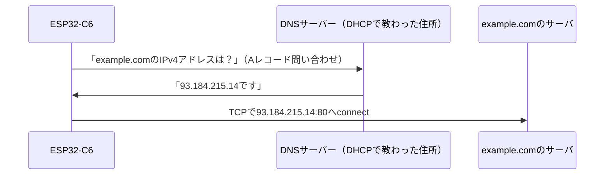

## このページでできるようになること

- DNSが解決している問題（名前と住所の対応）を説明できる
- `stack.dns_query`で名前からIPv4アドレスを引ける
- 問い合わせ先のDNSサーバーをC6がどうやって知ったのかを説明できる

## 先に結論

TCPの`connect`に必要なのはIPアドレスですが、人間が覚えているのは「example.com」のような**名前**です。名前から住所（IPアドレス）を引く仕組みがDNS（Domain Name System）です。embassy-netでは`stack.dns_query("example.com", DnsQueryType::A).await`の1行で解決できます。問い合わせ先のDNSサーバーのアドレスは、DHCPのチェックイン（5ページ）のときに教えてもらったものが自動で使われます。第10部で学んだ部品（DHCP・UDP）が、ここで一本につながります。

## 身近なたとえ

DNSは「電話帳」、というより「番号案内サービス」です。「example.comさんの番号を教えてください」と案内所に電話すると、「93.184.215.14です」と返ってきます。かけたい相手ではなく、まず案内所に問い合わせる——この2段構えがポイントです。

ただし実際のDNSは1冊の電話帳ではなく、**世界中に分散した案内所のネットワーク**です。身近な案内所（ルーターやプロバイダのDNSサーバー）が知らなければ、さらに上位の案内所に聞きに行ってくれます。しかも一度調べた結果はしばらく覚えておく（キャッシュ）ので、2回目からは速く答えられます。

## 仕組み



- 問い合わせは軽い1往復で済むため、基本は**UDP**で行われます（前ページの「呼びかけに向く」の実例です）
- `DnsQueryType::A`の**Aレコード**は「名前→IPv4アドレス」の対応表の種類です。ほかにIPv6アドレスを引くAAAAレコードなどもあります
- 1つの名前に複数のアドレスが登録されていることもあります（混雑を分散するため）。だから答えは一覧で返ってきます

DNSはトランスポート層の上で動く**アプリケーション層のプロトコル**ですが、HTTPのような「本命の会話」の前準備として使われる、裏方の存在です。

## RustとEmbassyではどう書くか

`examples/08-wifi/src/main.rs`からの抜粋です。embassy-netの`dns` featureを有効にしてあります（Cargo.tomlはexamples参照）。

```rust
use embassy_net::dns::DnsQueryType;
```

```rust
// DNSで example.com のIPv4アドレスを解決する
let address = match stack.dns_query("example.com", DnsQueryType::A).await {
    Ok(addresses) => match addresses.first() {
        Some(addr) => *addr,
        None => {
            error!("DNS応答にアドレスが含まれていません");
            Timer::after(Duration::from_secs(30)).await;
            continue;
        }
    },
    Err(e) => {
        error!("DNS解決に失敗しました: {e:?}");
        Timer::after(Duration::from_secs(30)).await;
        continue;
    }
};
info!("example.com のIPアドレス: {address}");
```

## コードを一行ずつ読む

```rust
stack.dns_query("example.com", DnsQueryType::A).await
```

スタックに「この名前のAレコード（IPv4アドレス）を引いて」と頼みます。問い合わせ先のDNSサーバーは指定していないことに注目してください。DHCPが配ってくれた設定一式にDNSサーバーのアドレスが含まれていて、スタックがそれを自動で使います。

```rust
Ok(addresses) => match addresses.first() {
```

結果はアドレスの一覧です。`first()`は「空かもしれない一覧の先頭」を`Option`で返すので、`Some`/`None`を`match`で処理します。ネットワーク越しの答えは「失敗するかもしれない（`Result`）」うえに「空かもしれない（`Option`）」——第3部で学んだ2つの型が二重に守ってくれています。

```rust
Err(e) => { error!(...); Timer::after(...).await; continue; }
```

DNSは相手あっての通信なので、失敗は日常です。panicせずログを出して30秒後にやり直す——無線プログラムの基本姿勢です。

## 実行方法

前ページと同じコマンドで実行します。

```bash
SSID=あなたのSSID PASSWORD=あなたのパスワード cargo run --release -p wifi
```

```text
INFO - IPアドレスを取得しました: 192.168.1.23/24
INFO - example.com のIPアドレス: 93.184.215.14
INFO - 93.184.215.14:80 へ接続します
```

表示されるアドレスは、DNSの負荷分散によって実行のたびに変わることがあります。それも正常です。

## よくある失敗

- **DHCP完了前に`dns_query`を呼んで失敗する**: DNSサーバーの住所はDHCPで教わります。`stack.wait_config_up().await`より前に名前解決はできません。層と順序（Wi-Fi→DHCP→DNS→TCP）を守ってください
- **名前の綴りを間違えて「解決に失敗」する**: 存在しない名前への問い合わせは、DNSサーバーから「そんな名前はありません」と返ってきてエラーになります。通信エラーと区別が付きにくいので、まず綴りを疑ってください
- **一度成功した名前解決の結果を永久に使い回す**: サーバの引っ越しでアドレスは変わりえます。exampleのようにリクエストのたび（あるいは定期的）に引き直すのが安全です

## やってみよう

`"example.com"`を`"www.rust-lang.org"`など別の名前に変えて、引けるアドレスを見てみましょう。PCでも`nslookup example.com`（または`dig example.com`）を実行して、C6と同じ答えが得られるか比べてみてください。

## 確認問題

1. TCPの`connect`の前にDNSが必要なのはなぜですか。
2. C6は問い合わせ先のDNSサーバーのアドレスを、いつ・どうやって知りましたか。
3. `dns_query`の結果が「`Result`の中に一覧」で返ってくるのはなぜですか。

<details>
<summary>答え</summary>

1. `connect`にはIPアドレスが必要ですが、プログラムに書いてあるのは「example.com」という名前だからです。名前を住所に変換するのがDNSです。
2. DHCPでIPアドレスを借りたとき（5ページ）です。ACKで届く設定一式にDNSサーバーのアドレスが含まれ、embassy-netが自動で使います。
3. ネットワーク越しの問い合わせは失敗しうるので`Result`、成功しても1つの名前に複数のアドレスが登録されていることがあるので一覧です。

</details>

## まとめ

- DNSは名前（example.com）を住所（IPアドレス）に変換する分散型の案内サービス。問い合わせは基本UDPの1往復
- embassy-netでは`stack.dns_query("名前", DnsQueryType::A).await`。DNSサーバーの住所はDHCP経由で自動設定される
- 順序は必ず「Wi-Fi→DHCP→DNS→TCP」。名前解決の失敗はリトライで扱う

## 次のページ

住所が分かり、TCPでつながりました。いよいよ最上位の層、HTTPです。ブラウザが毎日話している言葉の中身を、生のテキストのまま読み解きます。

- 前: [7. UDP](/embassy-esp32-c6/part10/07-udp/)
- 次: [9. HTTP](/embassy-esp32-c6/part10/09-http/)
