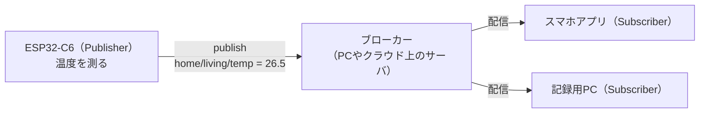
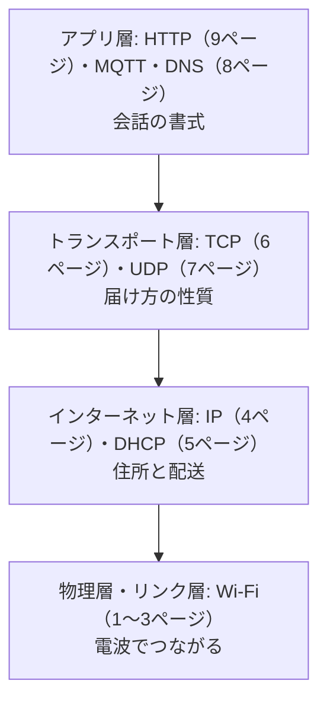

## このページでできるようになること

- MQTTの登場人物（ブローカー・トピック・QoS）と、HTTPとの発想の違いを説明できる
- C6を小型HTTPサーバーにする仕組みを、層の言葉で説明できる
- 物理層からアプリ層までの積み重ねを、自分の言葉で総まとめできる

> このページは概念説明のみです。MQTTと小型HTTPサーバーの実装は本教材の対象外です（理由は本文で説明します）。

## 先に結論

MQTT（Message Queuing Telemetry Transport）は、IoT機器のための軽量な**出版・購読（Publish/Subscribe）型**プロトコルです。機器どうしが直接話す代わりに、全員が**ブローカー**という仲介サーバにつなぎ、**トピック**という名前の掲示板を通じてメッセージを配ります。HTTPと同じく**TCPの上のアプリケーション層**であり、Wi-Fiの上に直接乗るわけではありません。逆方向の発想として、C6自身がTCPの接続を受け付けて**小さなHTTPサーバー**になることもできます。どちらも第10部で積んだ層の上の「会話の書式」の選択肢にすぎない——それがこの部の結論です。

## 身近なたとえ

HTTPが「お店に注文しに行く」やり方だとすれば、MQTTは「学級新聞の回覧システム」です。記事を書く人（Publisher）は新聞係（ブローカー）に記事を渡すだけ。読みたい人（Subscriber）は「スポーツ欄を購読します」と新聞係に伝えておけば、新しい記事が出るたびに届けてもらえます。書く人と読む人は、お互いの名前も住所も知る必要がありません。

ただし実際のMQTTでは、新聞係（ブローカー）は**自分で用意するか借りる必要がある**別のコンピュータ上のサーバソフトです。マイコンだけでは完結しない、という点がたとえ以上に重要です。

## 仕組み

### MQTTの登場人物

- **トピック**は`home/living/temp`のように`/`で区切った階層的な名前です。購読側は`home/living/#`（living以下ぜんぶ）のようにまとめて購読もできます
- 送り手と受け手が互いを知らなくてよいので、受け手を後から増やしても送り手のコードは変わりません。第9部で学んだChannelによるtask間の疎結合と同じ設計思想が、機器間に広がった形です
- 機器からブローカーへの接続はTCPで張りっぱなしにするのが基本で、サーバ側から機器へ即座にメッセージを押し届けられます（HTTPの「聞かれたら答える」との大きな違いです）

### QoS — 届け方の約束

MQTTはメッセージごとに配達の確実さ（QoS: Quality of Service）を選べます。

| QoS | 約束 | 特徴 |
|---|---|---|
| 0 | 最大1回（届かないかも） | 最軽量。毎秒のセンサ値など向き |
| 1 | 最低1回（重複するかも） | 確認と再送あり。重複への備えが必要 |
| 2 | ちょうど1回 | 最も確実だが往復が多く重い |

「確実さと軽さのトレードオフ」というTCP/UDP（7ページ）と同じ軸が、アプリ層にもう一段現れているわけです。

### 逆の発想 — C6を小型HTTPサーバーにする

9ページではC6がクライアント（注文する側）でした。逆に、C6がポート80で**接続を受け付け**、届いたGETリクエストを読み、センサ値を載せたHTTP応答を返せば、スマホのブラウザから「C6のページ」が見られます。embassy-netの`TcpSocket`には接続を受け付ける`accept`が用意されており、層の構造はクライアントのときと完全に同じです。違いは会話を「始める側」か「待つ側」かだけです。

### なぜ本教材では実装しないのか

正直に理由を書きます。

- **MQTT**: no_std（OSなし・ヒープ最小）環境で使える成熟したMQTTクレートは、2026年時点でまだ限定的です。また動かすには**ブローカーを別途用意する**必要があり、教材の「ボードとPCだけで完結する」方針から外れます。よって概念説明のみとします
- **小型HTTPサーバー**: embassy-netの機能としては実現可能ですが、本教材のexamplesでは検証していません。未検証のコードを載せない方針（正直なcode_status）に従い、こちらも概念のみとします

いずれも「C6にできない」のではなく、「教材として責任を持って検証した範囲の外」という区別です。挑戦する価値は十分あります。

## 第10部の総まとめ — 層の積み重ね

- どの層も**下の層のサービスを借りて、自分の仕事だけをする**。MQTTが動くのはWi-Fiのおかげ「だけ」ではなく、IPとTCPを含む4層全部のおかげ
- トラブルのときは**下の層から順に**確認する。電波はつながっているか→IPはあるか→TCPは張れるか→アプリの書式は正しいか
- 新しいプロトコルに出会っても怖くない。「どの層の話か」「下に何を要求するか」を見極めれば、必ずこの地図のどこかに収まります

## よくある失敗

- **「MQTTはWi-Fiの機能」だと思ってしまう**: MQTTはTCPの上のアプリケーション層プロトコルです。Ethernetや携帯回線の上でも同じように動きますし、Wi-Fiがあってもブローカーがなければ何も始まりません
- **ブローカーなしでMQTTを始めようとする**: Publisher/Subscriberはブローカーがいて初めて出会えます。試すならPCにブローカーソフト（Mosquittoなど）を立てるのが定番です
- **C6のサーバーに外出先からアクセスできると期待する**: C6のアドレスはプライベートアドレス（4ページ）です。家の外からは直接届きません

## やってみよう

自宅を「温度センサ×3、表示したいスマホ×2」のシステムにすると想像して、HTTP（各センサに聞きに行く）とMQTT（ブローカー経由で配る）それぞれの構成図を紙に描いてみてください。センサを1台増やしたとき、どちらの構成が変更が少ないかも考えてみましょう。

## 確認問題

1. MQTTのブローカーは何をする存在ですか。また、なぜ送り手と受け手が互いを知らなくて済むのですか。
2. QoS 0とQoS 1の違いと、それぞれに向くデータの例を挙げてください。
3. 「Wi-FiがつながればMQTTが使える」という説明の誤りを、層の言葉で訂正してください。

答え

1. すべてのメッセージを仲介するサーバです。送り手はトピック名に向けて発行し、受け手はトピック名を購読するだけなので、互いの住所や存在を知る必要がありません。
2. QoS 0は「最大1回」で確認なし——毎秒の温度など、1通失われても次で補えるデータ向き。QoS 1は「最低1回」で確認・再送あり（重複しうる）——「エアコンをつけて」のような失えない命令向きです。
3. Wi-Fiはリンク層までしか提供しません。MQTTが動くには、その上にIP（住所、通常DHCPで取得）、TCP（確実な接続）が積み重なり、さらにブローカーというサーバが必要です。

## まとめ

- MQTTはTCPの上で動く出版・購読型のプロトコル。ブローカーが仲介し、トピックで宛先を決め、QoSで配達の確実さを選ぶ
- C6は会話を「始める側」（HTTPクライアント）にも「待つ側」（小型サーバー）にもなれる。層の構造はどちらも同じ
- 本教材ではMQTTと小型サーバーは概念のみ（no_stdクレートの成熟度とブローカーの必要性、未検証コードを載せない方針のため）

## 次のページ

第10部はこれで完結です。第11部では同じC6のもうひとつの無線、BLE（Bluetooth Low Energy）に進みます。Wi-Fiとはまったく違う「省電力で近距離」という設計思想を、また層の考え方で読み解いていきます。

- 前: [9. HTTP](/embassy-esp32-c6/part10/09-http/)
- 次: [第11部 1. BLEの基礎](/embassy-esp32-c6/part11/01-ble-basics/)
