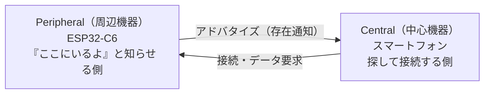

## このページでできるようになること

- BLE（Bluetooth Low Energy）とWi-Fiの使い分けを説明できる
- BLEとBluetooth Classic（従来規格）の違いを説明できる
- ESP32-C6が対応するのはBLEだけであることと、その意味を説明できる

## 先に結論

BLE（Bluetooth Low Energy）は「小さなデータを、少ない電力で、近くの相手と」やり取りするための無線規格です。Wi-Fiのような大容量通信は苦手ですが、ボタン電池で何か月も動くような省電力が得意です。スマートフォンはBLEに標準対応しているので、ルーターなしでESP32-C6とスマートフォンを直接つなげます。注意点がひとつあります。**ESP32-C6が対応するのはBLEのみで、Bluetooth Classic（従来規格）には対応していません**。ワイヤレスイヤホンの音楽転送（A2DP）のような用途はC6では作れません。C6のBLEはBluetooth 5.3認証です。

## 身近なたとえ

Wi-Fiは「宅配便のトラック」です。大きな荷物（動画やWebページ）を運べますが、トラックを動かすには燃料（電力）がたくさん要ります。BLEは「メモを手渡しする」ようなものです。運べるのは小さな紙切れ（数十バイトのデータ）だけですが、ほとんど疲れません（電力をほとんど使いません）。

ただし実際のBLEは「手渡し」と違って電波なので、10m程度の距離なら壁越しでも届きますし、渡す相手を電波上の手順（アドバタイズと接続）で見つける必要があります。

## 仕組み

### BLEとWi-Fiの違い

どちらも同じ2.4GHz帯の電波を使いますが、設計の目標がまったく違います。

| 項目 | Wi-Fi（第10部） | BLE |
|---|---|---|
| 得意なデータ量 | 大きい（動画・Webページ） | 小さい（センサ値・ボタン状態） |
| 消費電力 | 大きい | 非常に小さい |
| つなぎ方 | ふつうルーター（AP）経由 | 機器同士が直接つながる |
| スマートフォンとの相性 | 同じネットワークにいれば通信可 | アプリから直接接続できる |
| 通信距離のめやす | 数十m | 数m〜10m程度 |

「センサの値やボタンの状態をスマートフォンに届けたい」なら、ルーターの設定が不要で省電力なBLEが向いています。第12部の最終プロジェクト（無線ボタン端末）でこの性質を活かします。

### BLEとBluetooth Classicの違い

「Bluetooth」という名前はひとつですが、中身は2つの別物の規格が同居しています。

- **Bluetooth Classic（BR/EDR）**: 音楽転送（A2DP）やハンズフリー通話など、途切れない連続データ向け。イヤホンやスピーカーが使う
- **BLE（Bluetooth Low Energy）**: Bluetooth 4.0で追加された低消費電力の規格。小さなデータを間欠的に送る用途向け。スマートウォッチや活動量計、ビーコンが使う

両者は名前が似ているだけで、電波の使い方も通信手順も互換性がありません。**ESP32-C6はBLE側だけに対応**しています（データシート記載: Bluetooth 5.3認証、送信出力最大+20dBm）。つまりC6を「Bluetoothスピーカー」にはできませんが、「スマートフォンから読めるセンサ端末」には最適です。

### BLEの2つの役割

BLEの通信には役割分担があります。



- **Peripheral（ペリフェラル）**: 自分の存在を知らせ（アドバタイズ）、接続を待ち、データを提供する側。ESP32-C6はこの役割で使うのが基本です
- **Central（セントラル）**: 周囲を探し（スキャン）、接続しに行く側。スマートフォンがこの役割です

次のページから、アドバタイズ（02）→ データの構造（03）→ 接続処理（04）と順に見ていきます。

## RustとEmbassyではどう書くか

C6でBLEを使うときの構成は「esp-radio（電波を扱うコントローラ）+ trouble-host（通信手順を扱うホストスタック）」の2階建てです。初期化はこの2行が入り口になります。

```rust
    // BLE（Bluetooth Low Energy）コントローラ（電波を扱う下位層）を初期化し、
    // HCIというインターフェース経由でホストスタック（trouble-host）につなぐ
    let connector = BleConnector::new(peripherals.BT, Default::default()).unwrap();
    let controller: ExternalController<_, 1> = ExternalController::new(connector);
```

これは抜粋です。完全なコードは examples/09-ble を見てください。

## コードを一行ずつ読む

- `BleConnector::new(peripherals.BT, ...)` — C6のBLE無線ハードウェア（`BT`ペリフェラル）を受け取り、コントローラを起動します。所有権を渡すので、BLEハードウェアを二重に使う間違いはコンパイル時に防がれます
- `ExternalController::new(connector)` — コントローラを**HCI**（Host Controller Interface: ホストとコントローラの間の標準インターフェース）として包み、trouble-hostから使えるようにします
- ここでの`unwrap()`は初期化直後の一度だけで、失敗する状況（無線初期化前の呼び出しなど）は設計上ありえないため許容しています

コントローラ（電波の送受信）とホスト（GATTなどの手順）を分ける設計はBLE標準そのものの構造です。esp-rsチームはホスト側にEmbassy公式のtrouble-hostを推奨しており、本教材もそれに従います。

## 実行方法

このページは概念が主役なので、動かすのは第11部6ページ目（BLEでボタン状態を送る）でまとめて行います。先に試したい人は次を実行してください。

```bash
cd examples/09-ble
cargo run --release
```

シリアルログに「アドバタイズ中（名前: C6-BUTTON）」と表示されれば、C6がBLEの電波を出しています。

## よくある失敗

- **「Bluetoothイヤホンとして使いたい」** — できません。音楽転送はBluetooth Classicの機能（A2DP）で、C6はBLEのみ対応です。データシートで「Bluetooth LE」とだけ書かれているのはこのためです
- **「Wi-Fiと同時に使えば最強では」** — 同じ2.4GHz帯の無線を共有するため、同時利用は時間を分け合う動作になり、両方の性能が下がります。本教材ではBLEとWi-Fiは別々の章で扱います
- **「BLEなら何でも省電力」** — BLEでも電波を出す瞬間は大きな電流が流れます（データシート典型値: 送信130mA @0dBm）。省電力になるのは「通信していない時間を長くできる」からです。省電力設計は第12部で扱います

## やってみよう

自分の身の回りの機器を3つ選び、「Wi-Fi向き」「BLE向き」「Bluetooth Classic向き」に分類してみましょう（例: 監視カメラ、体重計、ワイヤレスイヤホン）。理由を一言ずつ書けたら合格です。

## 確認問題

1. BLEがWi-Fiより優れている点を2つ挙げてください。
2. ESP32-C6でワイヤレスイヤホン（音楽再生）を作れないのはなぜですか。
3. PeripheralとCentralのうち、ESP32-C6が主に担当する役割はどちらですか。

<details>
<summary>答え</summary>

1. 消費電力が非常に小さいこと、ルーターなしでスマートフォンと直接つながること（ほかに、小さなデータの間欠送信に向く、なども可）。
2. 音楽転送（A2DP）はBluetooth Classicの機能であり、C6はBLE（Bluetooth Low Energy）のみに対応しているため。
3. Peripheral（周辺機器）。存在を知らせて接続を待ち、データを提供する側です。

</details>

## まとめ

- BLEは「小さなデータ・低消費電力・スマートフォン直結」が得意な無線規格
- ESP32-C6はBLE 5.3のみ対応で、Bluetooth Classic（A2DP等）は使えない
- C6はPeripheral（存在を知らせて接続を待つ側）、スマートフォンはCentral（探して接続する側）

## 次のページ

Peripheralの仕事はまず「ここにいるよ」と知らせることから始まります。その仕組みであるアドバタイズを詳しく見ましょう。

[2. Advertising →](/embassy-esp32-c6/part11/02-advertising/)

---

前: [10. MQTTと小型サーバー](/embassy-esp32-c6/part10/10-mqtt-or-server/) | 次: [2. Advertising](/embassy-esp32-c6/part11/02-advertising/)
