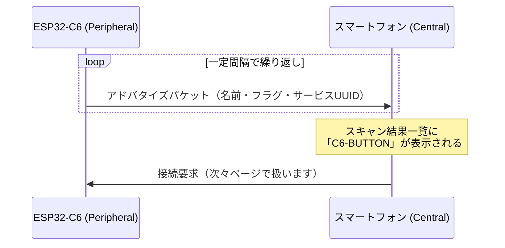

## このページでできるようになること

- アドバタイズが「接続前の存在通知」であることを説明できる
- アドバタイズパケット（最大31バイト）に入れる情報の種類が分かる
- trouble-hostの`AdStructure`でアドバタイズデータを組み立てられる

## 先に結論

アドバタイズとは、Peripheral（周辺機器）が「私はここにいます。名前は◯◯で、こんな機能があります」という小さなパケットを、決まった間隔で繰り返し放送することです。Central（スマートフォン）はこれをスキャンして発見します。パケットは最大31バイトしかないので、名前・フラグ・サービスUUIDなど本当に必要な情報だけを詰めます。trouble-hostでは`AdStructure`の配列をエンコードして作ります。

## 身近なたとえ

アドバタイズはお店の「のぼり旗」です。通りを歩く人（スマートフォン）に「ラーメン屋です、営業中です」と伝え続けます。旗を見た人は素通りしてもよいし、入店（接続）してもかまいません。

ただし実際のアドバタイズは旗と違って、0.1秒〜1秒程度の間隔で繰り返し送信される電波のパケットであり、届く相手も見える範囲に限りません。また、旗と違って載せられる文字数（31バイト）に厳しい制限があります。

## 仕組み

### 放送専用チャンネルで繰り返し送る

BLEは2.4GHz帯を40本のチャンネルに分けて使います。そのうち3本（37・38・39番）がアドバタイズ専用です。Peripheralはこの3本で順番に同じパケットを送り、Centralは3本を順に聞いて（スキャンして）機器を発見します。



### パケットに詰める3つの定番情報

アドバタイズパケットは**AD Structure**（種類タグ + データ）の並びでできています。examples/09-bleでは次の3つを入れています。

| AD Structure | 意味 | この教材での値 |
|---|---|---|
| Flags | 発見のされ方と対応規格の宣言 | 一般発見可能 + Classic非対応 |
| Service UUIDs (16bit) | 持っているサービスの予告 | 0x180F（バッテリーサービス） |
| Complete Local Name | 機器名 | "C6-BUTTON" |

## RustとEmbassyではどう書くか

examples/09-bleの`advertise`関数から、パケットを組み立てて送信を始める部分を抜粋します。

```rust
    // アドバタイズパケット（最大31バイト）にフラグ・サービスUUID・名前を詰める
    let mut advertiser_data = [0; 31];
    let len = AdStructure::encode_slice(
        &[
            AdStructure::Flags(LE_GENERAL_DISCOVERABLE | BR_EDR_NOT_SUPPORTED),
            // バッテリーサービス(0x180F)を持っていることを知らせる
            AdStructure::ServiceUuids16(&[[0x0f, 0x18]]),
            AdStructure::CompleteLocalName(name.as_bytes()),
        ],
        &mut advertiser_data[..],
    )?;
    let advertiser = peripheral
        .advertise(
            &Default::default(),
            Advertisement::ConnectableScannableUndirected {
                adv_data: &advertiser_data[..len],
                scan_data: &[],
            },
        )
        .await?;
```

これは抜粋です。完全なコードは examples/09-ble を見てください。

## コードを一行ずつ読む

- `let mut advertiser_data = [0; 31];` — アドバタイズパケットの上限がちょうど31バイトなので、固定長配列で確保します。ヒープは使いません（第5部の方針どおり）
- `AdStructure::Flags(LE_GENERAL_DISCOVERABLE | BR_EDR_NOT_SUPPORTED)` — 「いつでも発見されてよい」+「BR/EDR（Bluetooth Classic）には対応しない」という宣言です。C6はそもそもClassic非対応なので、このフラグは事実をそのまま伝えています
- `AdStructure::ServiceUuids16(&[[0x0f, 0x18]])` — バッテリーサービスのUUIDは0x180Fですが、バイト列では**下位バイトが先**（リトルエンディアン）なので`[0x0f, 0x18]`と書きます。接続前から「バッテリー残量を提供できる機器だ」と分かるようにする予告です
- `AdStructure::CompleteLocalName(name.as_bytes())` — スキャン一覧に表示される名前です。長い名前はそれだけ31バイトを圧迫します
- `encode_slice`は詰めた結果の長さ`len`を返し、31バイトを超えるとエラー（`Err`）になります。`?`演算子でエラーを呼び出し元へ返します（第3部のResultの復習です）
- `Advertisement::ConnectableScannableUndirected` — 「接続可能・追加情報の問い合わせ可能・宛先指定なし」という、もっとも一般的なアドバタイズの種類です

## 実行方法

```bash
cd examples/09-ble
cargo run --release
```

```text
INFO - [adv] アドバタイズ中（名前: C6-BUTTON）
```

この状態でスマートフォンのBLE（Bluetooth Low Energy）スキャナアプリ（nRF Connectなど）を開くと、一覧に「C6-BUTTON」が現れます。接続しなくても名前とサービスUUID 0x180Fが見えることを確認してください。これがアドバタイズの効果です。

## よくある失敗

- **名前を長くしたらエラーになる** — Flags(3バイト) + サービスUUID(4バイト) + 名前(2バイト+文字数)の合計が31バイトを超えると`encode_slice`が失敗します。名前は短く保つか、追加情報はスキャン応答（`scan_data`）に回します
- **UUIDのバイト順を逆に書く** — `[0x18, 0x0f]`と書くと0x0F18という別のUUIDを名乗ることになります。16ビットUUIDのバイト列表記はリトルエンディアン（下位が先）です
- **スキャナに何も出ない** — アドバタイズはプログラムが動いている間だけ送信されます。書き込み後にリセットで止まっていないか、シリアルログで「アドバタイズ中」が出ているかを先に確認しましょう

## やってみよう

`advertise`関数に渡している名前（`main`側の`"C6-BUTTON"`）を自分の好きな短い名前（半角英数）に変えて書き込み、スキャナアプリでの表示が変わることを確認しましょう。5分でできます。

## 確認問題

1. アドバタイズパケットの最大サイズは何バイトですか。
2. `BR_EDR_NOT_SUPPORTED`フラグは何を宣言していますか。
3. 接続する前のCentralが、その機器の持つサービスを知る手がかりは何ですか。

<details>
<summary>答え</summary>

1. 31バイトです。
2. BR/EDR（Bluetooth Classic）に対応していないこと。ESP32-C6はBLE（Bluetooth Low Energy）のみ対応なので事実どおりの宣言です。
3. アドバタイズパケット内のService UUIDs（この教材では16ビットUUID 0x180F = バッテリーサービス）です。

</details>

## まとめ

- アドバタイズはPeripheralによる「存在の繰り返し放送」で、専用3チャンネルで送られる
- パケットは最大31バイト。Flags・サービスUUID・名前を`AdStructure`で詰める
- 16ビットUUIDのバイト列はリトルエンディアン（0x180F → `[0x0f, 0x18]`）

## 次のページ

発見してもらったあと、Centralに提供する「データの棚」がGATTです。ServiceとCharacteristicの構造を学びます。

[3. ServiceとCharacteristic →](/embassy-esp32-c6/part11/03-service-characteristic/)

---

前: [1. BLEの基礎](/embassy-esp32-c6/part11/01-ble-basics/) | 次: [3. ServiceとCharacteristic](/embassy-esp32-c6/part11/03-service-characteristic/)
