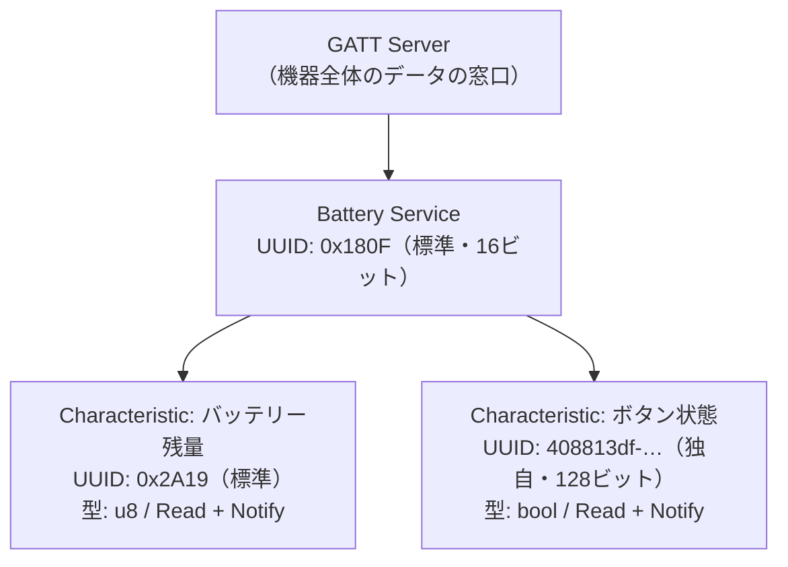

## このページでできるようになること

- GATTのServer→Service→Characteristicという入れ子構造を説明できる
- 標準UUID（16ビット）と独自UUID（128ビット）の使い分けが分かる
- Read（読み取り）とNotify（通知）の違いを説明できる

## 先に結論

BLE（Bluetooth Low Energy）で接続後にデータをやり取りする仕組みが**GATT**（Generic Attribute Profile）です。データは「Server（サーバー）の中にService（サービス）があり、その中にCharacteristic（特性 = 実際の値）がある」という入れ子で整理されます。それぞれをUUIDという番号で識別します。バッテリー残量のような定番データにはBluetooth SIGが決めた16ビットの標準UUID（サービス0x180F、値0x2A19）があり、自分だけのデータには128ビットの独自UUIDを作ります。値の受け取り方にはCentralが読みに行く**Read**と、Peripheral側から変化を押し届ける**Notify**があります。

## 身近なたとえ

GATTは「自動販売機の商品棚」です。自動販売機（Server）にはドリンクコーナー（Service）があり、そこに個々の商品（Characteristic）が並びます。商品には全国共通の商品コード（標準UUID）が付いたものと、その店オリジナルの商品（独自UUID）があります。

ただし実際のGATTは自動販売機と違い、商品（値）を「取り出す」のではなく「読み取る」ので何度読んでも減りません。また、Notifyは「商品の入れ替えがあったら店側から知らせてくれる」仕組みで、自動販売機にはない機能です。

## 仕組み

examples/09-bleが提供するGATTの構造はこうなっています。



### UUID — 世界でぶつからない名前

UUIDは識別番号です。使い分けの基準は単純です。

- **16ビット標準UUID**: Bluetooth SIG（規格団体）が定義済みのもの。バッテリーサービス=0x180F、バッテリー残量=0x2A19など。標準UUIDを使うと、スマートフォンのアプリが「これはバッテリー残量だ」と自動で理解し、単位（%）まで表示してくれます
- **128ビット独自UUID**: 標準にないデータ（この例ではBOOTボタンの状態）のために自分で作る、事実上世界で唯一の番号。相手のアプリはただのバイト列として表示します

### ReadとNotify — 取りに行くか、届けてもらうか

| 方式 | 動き | 向いている場面 |
|---|---|---|
| Read | Centralが「今の値をください」と要求する | たまにしか変わらない値 |
| Notify | 値が変わったときPeripheralが押し届ける | ボタンの押下など、即座に知りたい変化 |

ボタン状態をReadだけで扱うと、Centralが読みに来た瞬間の状態しか分かりません。押した瞬間を届けるにはNotifyが必要です。ただしNotifyは、Central側が「通知を受け取ります」と申し込む（購読する）まで送られません。

## RustとEmbassyではどう書くか

trouble-hostでは、この構造をstructとマクロで宣言します。examples/09-bleから抜粋します。

```rust
// GATTサーバー定義。#[gatt_server]マクロがサービス一覧から
// 属性テーブル（BLE（Bluetooth Low Energy）のデータベース）を生成する
#[gatt_server]
struct Server {
    battery_service: BatteryService,
}

/// バッテリーサービス（Bluetooth SIG標準のサービスUUID 0x180F）
#[gatt_service(uuid = service::BATTERY)]
struct BatteryService {
    /// バッテリー残量（標準UUID 0x2A19）。読み取りと通知に対応。
    /// この例では実測値ではなく、2秒ごとに減らすデモ値を入れる
    #[characteristic(uuid = characteristic::BATTERY_LEVEL, read, notify, value = 100)]
    level: u8,
    /// BOOTボタンの状態（独自の128ビットUUID）。押されていればtrue。
    /// 標準サービスに独自の特性を追加する例でもある
    #[characteristic(
        uuid = "408813df-5dd4-1f87-ec11-cdb001100000",
        read,
        notify,
        value = false
    )]
    button_pressed: bool,
}
```

これは抜粋です。完全なコードは examples/09-ble を見てください。

## コードを一行ずつ読む

- `#[gatt_server]` — structの各フィールド（サービス）から、GATTの属性テーブル（Centralに見せるデータベース）を自動生成するマクロです。手作業でテーブルを組む代わりに、Rustの型で構造を宣言できます
- `#[gatt_service(uuid = service::BATTERY)]` — このstructがひとつのServiceであることを宣言します。`service::BATTERY`はtrouble-hostに用意された標準UUID定数（0x180F）です
- `#[characteristic(uuid = ..., read, notify, value = 100)]` — フィールドをCharacteristicにします。`read`と`notify`が「Centralから読める」「変化を通知できる」という許可（プロパティ）で、`value = 100`が初期値です
- `level: u8` — バッテリー残量の型です。標準の定義が0〜100の1バイト値なので`u8`がぴったり合います。型を間違えるとCentral側の表示が壊れるので、Rustの型がそのまま仕様書の役割を果たします
- `uuid = "408813df-..."` — 独自UUIDは文字列で指定します。独自UUIDを新しく作るときは、UUID生成ツールで乱数から作れば衝突をほぼ心配する必要はありません

## 実行方法

```bash
cd examples/09-ble
cargo run --release
```

スマートフォンのnRF Connectなどで「C6-BUTTON」に接続すると、Battery Service（0x180F）の中にBattery Level（0x2A19）と独自UUIDの特性が2つ並んで見えます。0x2A19は「Battery Level」という名前と%表示に自動変換され、独自UUIDは「Unknown Characteristic」と表示されます。この違いが標準UUIDの効果です。

## よくある失敗

- **Notifyを設定したのに値が届かない** — Central側が購読（通知の有効化）をしていないケースが大半です。nRF Connectでは特性の右にある下向き三重矢印のアイコンを押して購読します
- **独自UUIDを適当な16ビット値にする** — 16ビットUUIDの番号空間はBluetooth SIGの管理下で、勝手に使うと標準機能と衝突します。独自データには必ず128ビットUUIDを使います
- **値の型と実際のデータ長が合わない** — たとえばバッテリー残量に`u32`を使うと、標準を期待するアプリは正しく表示できません。標準UUIDを使うときは定義されたデータ形式（0x2A19ならu8）に従います

## やってみよう

`level`の初期値`value = 100`を`value = 42`に変えて書き込み、接続直後にReadすると42%と表示されることを確認しましょう。「Readは今の値を取りに行く」ことが体感できます。

## 確認問題

1. GATTの入れ子構造を外側から順に3つ挙げてください。
2. バッテリー残量に16ビット標準UUIDを使う利点は何ですか。
3. ボタンの押下を即座にスマートフォンへ届けたいとき、ReadとNotifyのどちらを使いますか。その理由は。

<details>
<summary>答え</summary>

1. Server → Service → Characteristic。
2. スマートフォン側のアプリが標準UUID（0x180F/0x2A19）を認識し、名前や%表示を自動で正しく扱ってくれるため。
3. Notify。Readでは押した瞬間にCentralが読みに来ない限り変化を検出できないが、Notifyは変化した瞬間にPeripheral側から押し届けられるため。

</details>

## まとめ

- GATTはServer→Service→Characteristicの入れ子構造で、UUIDで識別する
- 定番データは16ビット標準UUID、独自データは128ビットUUIDを使う
- Readは「取りに行く」、Notifyは「届けてもらう」。Notifyには購読が必要

## 次のページ

構造を宣言できたら、次は接続を受け付けて動かす番です。アドバタイズ→接続→GATTイベント処理という一連の流れをコードで追います。

[4. Peripheralを作る →](/embassy-esp32-c6/part11/04-peripheral/)

---

前: [2. Advertising](/embassy-esp32-c6/part11/02-advertising/) | 次: [4. Peripheralを作る](/embassy-esp32-c6/part11/04-peripheral/)
