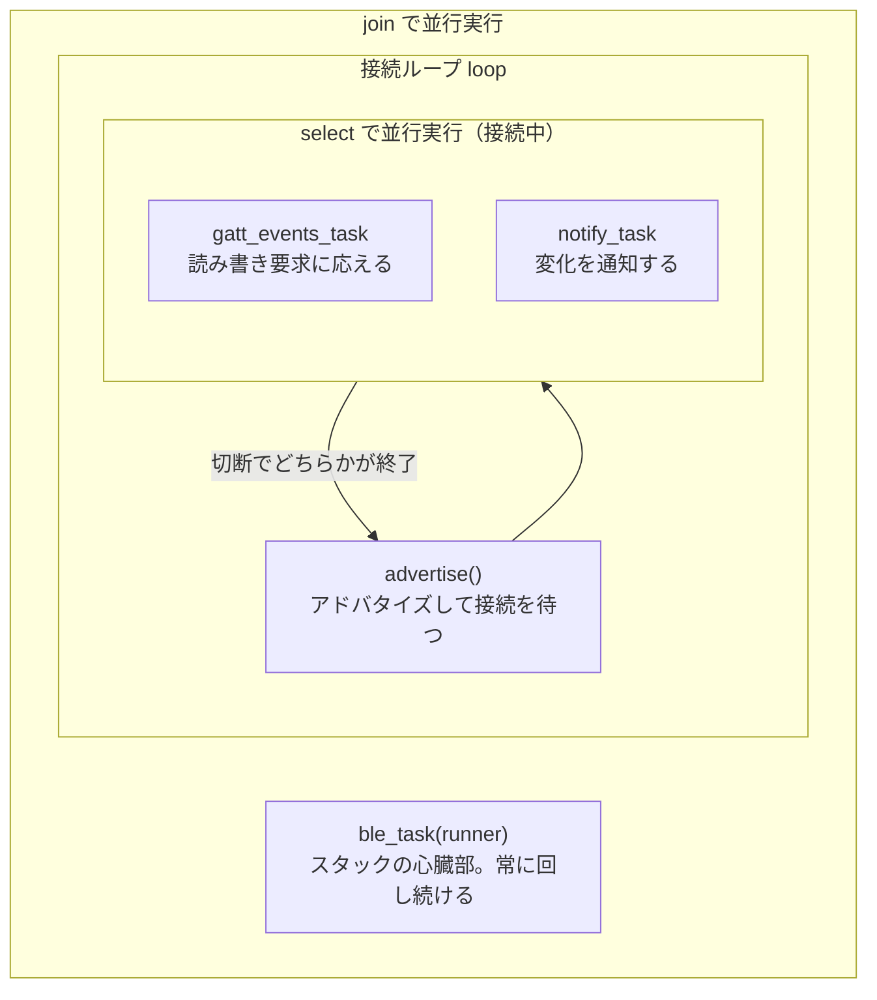

## このページでできるようになること

- Peripheralの一生（アドバタイズ→接続→イベント処理→切断→再アドバタイズ）を説明できる
- trouble-hostのスタック構築（HostResources・Host・Runner）の役割が分かる
- 複数のasync処理をjoinとselectで組み合わせる構造を読める

## 先に結論

Peripheralは「アドバタイズして待つ→接続されたら要求に応える→切断されたらまたアドバタイズに戻る」というループで一生を過ごします。trouble-hostでは、スタックの内部処理を回し続ける`Runner`（心臓部）と、接続を受け付ける`Peripheral`を`join`で並行実行します。接続中は「GATTイベント処理」と「通知送信」を`select`で並行させ、どちらかが終わったら（=切断されたら）ループの先頭へ戻ります。第9部で学んだjoin/selectがそのまま設計の道具になります。

## 身近なたとえ

Peripheralの動きは個人商店の店主です。開店の看板を出して待ち（アドバタイズ）、お客が来たら接客し（GATTイベント処理）、同時に「新商品入荷しました」と声もかけます（Notify）。お客が帰ったら、また看板を出して次のお客を待ちます。

ただし実際のBLE（Bluetooth Low Energy）では、この例のように接客できるのは同時に1組だけとは限りません。examples/09-bleでは`CONNECTIONS_MAX = 1`と自分で上限を決めており、その分のメモリを最初に確保しています。

## 仕組み

全体の構造を図にするとこうなります。



ポイントは2つです。

- **Runnerは止めてはいけない**: 電波の下ごしらえ（パケットの受け渡しなど）を全部担うので、`join`で他の処理と常に並行させます
- **切断は「エラー」ではなく「ループの区切り」**: 接続が切れたら`select`が終わり、`loop`の先頭で再びアドバタイズします。切断されても panic せず営業を続けるのが正しいPeripheralです

## RustとEmbassyではどう書くか

examples/09-bleの`ble_peripheral_run`関数がこの構造そのものです。

```rust
    // ホストスタックが使うメモリ（接続・チャネル管理領域）を確保
    let mut resources: HostResources<DefaultPacketPool, CONNECTIONS_MAX, L2CAP_CHANNELS_MAX> =
        HostResources::new();
    let stack = trouble_host::new(controller, &mut resources).set_random_address(address);
    let Host {
        mut peripheral,
        runner,
        ..
    } = stack.build();

    info!("GATTサーバーを起動し、アドバタイズを開始します");
    let server = Server::new_with_config(GapConfig::Peripheral(PeripheralConfig {
        name: "C6-BUTTON",
        appearance: &appearance::power_device::GENERIC_POWER_DEVICE,
    }))
    .unwrap();

    // ble_taskはスタックの心臓部で、常に動かし続ける必要がある。
    // joinでアドバタイズ・接続処理と並行実行する
    let _ = join(ble_task(runner), async {
        loop {
            match advertise("C6-BUTTON", &mut peripheral, &server).await {
                Ok(conn) => {
                    // 接続が確立したら、GATTイベント処理と通知タスクを並行実行。
                    // どちらかが終わったら（=切断されたら）アドバタイズに戻る
                    let a = gatt_events_task(&server, &conn);
                    let b = notify_task(&server, &conn, &mut button);
                    select(a, b).await;
                }
                Err(e) => {
                    panic!("[adv] エラー: {:?}", e);
                }
            }
        }
    })
    .await;
```

これは抜粋です。完全なコードは examples/09-ble を見てください。

## コードを一行ずつ読む

- `HostResources<DefaultPacketPool, CONNECTIONS_MAX, L2CAP_CHANNELS_MAX>` — スタックが使うメモリを**型引数で**先に確保します。同時接続1・チャネル2と決め打ちすることで、ヒープに頼らず必要量が決まります（no_stdらしい設計です）
- `stack.build()`で得られる`Host`から、`peripheral`（接続受付係）と`runner`（心臓部）を取り出します。役割ごとに別の値に分かれているので、「受付だけしてrunnerを回し忘れる」ミスは動かしてすぐ気づけます
- `Server::new_with_config(GapConfig::Peripheral(...))` — 第3ページで宣言した`Server`を、機器名と外観（appearance: 機器の種類を表す標準コード）付きで実体化します
- `join(ble_task(runner), async { ... })` — 「両方を最後まで動かす」joinです（第9部8ページ）。runnerと接続ループはどちらも終わらない前提の常駐処理です
- `select(a, b).await` — 「先に終わった方で打ち切る」selectです（第9部7ページ）。切断されるとgatt_events_taskもnotify_taskも続行できないため、どちらかの終了を切断の合図として使っています
- 接続の受け入れ側は`advertise`関数内の`advertiser.accept().await?.with_attribute_server(server)?`です。接続が来たら、その接続にGATTサーバーを結び付けて`GattConnection`を得ます

### GATTイベントに応える

接続中の仕事は`gatt_events_task`にあります。中心部を抜粋します。

```rust
        match conn.next().await {
            GattConnectionEvent::Disconnected { reason } => break reason,
            GattConnectionEvent::Gatt { event } => {
                match &event {
                    GattEvent::Read(event) => {
                        if event.handle() == level.handle {
                            info!(
                                "[gatt] バッテリー残量が読み取られました: {:?}",
                                server.get(&level)
                            );
                        }
```

`conn.next().await`で接続イベントを1件ずつ受け取り、切断なら`break`、Read/Write要求ならログを出して`event.accept()`で応答します。第3部で学んだ`match`と`enum`が、BLEのイベント処理でもそのまま主役です。

## 実行方法

```bash
cd examples/09-ble
cargo run --release
```

```text
INFO - デバイスアドレス: ...
INFO - GATTサーバーを起動し、アドバタイズを開始します
INFO - [adv] アドバタイズ中（名前: C6-BUTTON）
INFO - [adv] 接続されました
INFO - [gatt] バッテリー残量が読み取られました: Ok(100)
INFO - [gatt] 切断されました: ...
INFO - [adv] アドバタイズ中（名前: C6-BUTTON）
```

スマートフォンから接続→値の読み取り→切断を行い、最後にまたアドバタイズへ戻ることを確認してください。

## よくある失敗

- **接続はできるが読み書きが一切応答しない** — `ble_task(runner)`を並行実行し忘れると、スタックの内部処理が進まず何も起きません。runnerは常に回し続ける必要があります
- **2台目のスマートフォンから接続できない** — `CONNECTIONS_MAX = 1`なので同時接続は1台までです。前のスマートフォン側の接続を切ってから試してください
- **切断のたびにプログラムを再起動している** — 正しく組めば切断後は自動でアドバタイズに戻ります。戻らない場合、接続ループの外で`return`やpanicをしていないか構造を見直しましょう

## やってみよう

`gatt_events_task`のRead処理に、読み取られた回数を数えるカウンタ（`let mut count: u32 = 0;`をループの外に置き、Readのたびに増やしてログ表示）を追加してみましょう。スマートフォンからReadするたびにカウントが増えれば、イベント処理の流れが追えています。

## 確認問題

1. `Runner`（ble_task）の役割は何ですか。止めるとどうなりますか。
2. 接続中に`select(a, b)`を使うのはなぜですか。`join`ではだめですか。
3. 切断されたPeripheralが次にすべきことは何ですか。

<details>
<summary>答え</summary>

1. BLE（Bluetooth Low Energy）スタックの内部処理（パケットの受け渡しなど）を回し続ける心臓部。止めるとアドバタイズも接続処理も一切進まなくなります。
2. 切断されたらイベント処理と通知の「どちらか一方が終わった時点で」両方を打ち切り、アドバタイズに戻りたいから。joinは両方の完了を待つので、切断後もループを抜けられません。
3. 再びアドバタイズを始めて次の接続を待つこと（ループの先頭に戻る）。

</details>

## まとめ

- Peripheralの一生は「アドバタイズ→接続→応答→切断→再アドバタイズ」のループ
- trouble-hostはrunner（常駐の心臓部）とperipheral（接続受付）に役割が分かれ、joinで並行させる
- 接続中はGATTイベント処理と通知をselectで並行させ、切断でループを回す

## 次のページ

ここまでC6は「待つ側」でした。では「探して接続しに行く側」= Centralとは何者で、C6でどこまでできるのでしょうか。

[5. Central →](/embassy-esp32-c6/part11/05-central/)

---

前: [3. ServiceとCharacteristic](/embassy-esp32-c6/part11/03-service-characteristic/) | 次: [5. Central](/embassy-esp32-c6/part11/05-central/)
