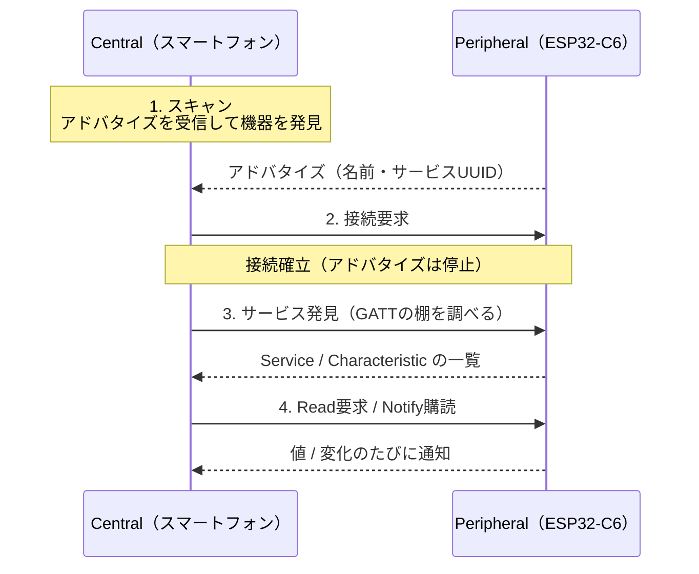

## このページでできるようになること

- Centralの仕事（スキャン→接続→サービス発見→読み書き・購読）を順に説明できる
- 「スマートフォンがCentral、C6がPeripheral」という本教材の構図を説明できる
- C6をCentralにする場合の現在の対応状況を正しく述べられる

> このページは概念説明のみです。動かして検証したCentralのコードは本教材にはありません（理由は後述します）。

## 先に結論

Central（セントラル）は、BLE（Bluetooth Low Energy）で「探して、接続しに行き、データを要求する」側です。本教材ではこの役割をずっとスマートフォンが担ってきました。前ページまでにnRF Connectでやった操作（スキャン→接続→Readや購読）は、まさにCentralの仕事そのものです。ESP32-C6をCentralにすることもハードウェア的には可能で、trouble-hostにもスキャンや接続開始のAPIがありますが、本教材ではビルド検証をしていないため概念説明にとどめます（教材はPeripheral主体です）。

## 身近なたとえ

PeripheralとCentralの関係は「お店とお客」です。お店（Peripheral）は看板を出して待ち、お客（Central）は店を探し、入店し、商品を注文します。どの店に入るか、何を注文するか、いつ帰るかの主導権はお客側にあります。

ただし実際のBLEでは、お客（Central）は複数の店（Peripheral）に同時に「入店」（接続を維持）できます。スマートフォンがスマートウォッチとイヤホンと体温計に同時につながるのはこのためです。

## 仕組み

### Centralの仕事の流れ

前ページまでのPeripheralの一生を、反対側から見た図です。

1. **スキャン**: アドバタイズ専用チャンネル（37・38・39）を聞き、周囲の機器の名前・サービスUUID・電波強度を集める
2. **接続**: 選んだ相手に接続要求を送る。以降その相手のアドバタイズは止まる
3. **サービス発見**: GATTの棚（Service/Characteristic）を問い合わせて構造を知る。nRF Connectで接続直後に一覧が出るのはこの手順の結果です
4. **読み書き・購読**: Readで値を取り、Notifyを購読して変化を受け取る

主導権は常にCentral側にあります。接続の間隔（何ミリ秒ごとに通信するか）などの条件を決めるのも基本的にCentralです。

### なぜ本教材のC6はPeripheral役なのか

- **ボタン端末という教材の題材に合う**: 「小さな機器がデータを提供し、スマートフォンが集める」のはBLEのもっとも典型的な構図です
- **相手側の画面で確認できる**: Central役のスマートフォンには画面があるので、学習中の動作確認が簡単です
- **検証状況**: C6をCentralにする構成（trouble-hostのscan/central機能）は、本教材ではcargo checkによる検証をしていません。動かないという意味ではなく、「検証済みコードだけを載せる」という本教材の方針により概念説明のみとしています

### C6をCentralにしたくなるのはどんなときか

- スマートフォンなしで、市販のBLEセンサ（温度計など）からC6がデータを集めたいとき
- C6同士でBLE接続を張りたいとき（片方がCentral役になる必要があります）

このような構成に挑戦する場合は、trouble-hostのリポジトリにあるscan/centralの公式サンプルを出発点にしてください。なお「C6同士で直接通信したい」だけなら、次々ページで学ぶESP-NOWのほうがずっと簡単です。

## よくある誤解

- **「CentralはPeripheralより高性能な機器がなる」** — 役割の違いであって性能の上下ではありません。同じC6がどちらの役割も担えます（BLE 5.3ではひとつの機器が両方を兼ねることもできます）
- **「接続中もアドバタイズは続く」** — 接続可能型のアドバタイズは接続が確立すると止まります。だからこそ1台としか接続できない設定のPeripheralは、接続中は他のCentralから見えなくなります

## やってみよう

nRF Connectで「C6-BUTTON」に接続する一連の操作を、このページの4ステップ（スキャン→接続→サービス発見→購読）と対応付けてみましょう。アプリのどの画面がどのステップにあたるか説明できれば、Centralの仕事を理解できています。

## 確認問題

1. Centralの4つの仕事を順に挙げてください。
2. 本教材でCentralの役割を担っているのは何ですか。
3. 「C6でCentralを書くコードは本教材にない」理由として正しいのはどれですか — (a) C6のハードウェアが非対応 (b) trouble-hostに機能がない (c) 教材として未検証のため概念説明にとどめている

答え

1. スキャン → 接続 → サービス発見 → 読み書き・購読。
2. スマートフォン（nRF ConnectなどのBLE（Bluetooth Low Energy）スキャナアプリ）。
3. (c)。ハードウェアは対応しており、trouble-hostにもscan/central機能はありますが、本教材ではビルド検証をしていないためです。

## まとめ

- Centralは「探して接続しに行く側」で、スキャン→接続→サービス発見→読み書き・購読の順に進む
- 本教材の構図は「C6 = Peripheral、スマートフォン = Central」
- C6のCentral化は可能だが本教材では未検証のため扱わない。C6同士の直接通信はESP-NOWが手軽

## 次のページ

役割の全体像がつかめたところで、いよいよ第11部の山場です。BOOTボタンの状態をNotifyでスマートフォンへ届ける完全なプログラムを動かします。

[6. BLEでボタン状態を送る →](/embassy-esp32-c6/part11/06-ble-button/)

---

前: [4. Peripheralを作る](/embassy-esp32-c6/part11/04-peripheral/) | 次: [6. BLEでボタン状態を送る](/embassy-esp32-c6/part11/06-ble-button/)
