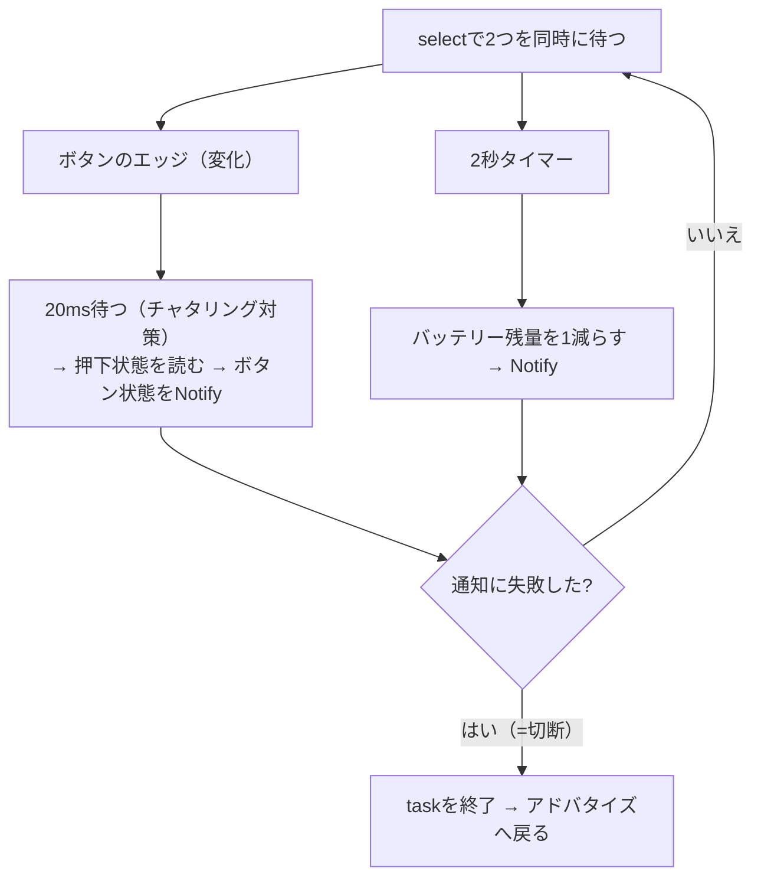

## このページでできるようになること

- ボタンの変化待ちと定期通知をselectで組み合わせたtaskを説明できる
- Notifyの失敗を切断の合図として扱う設計を説明できる
- スマートフォンのBLEスキャナアプリで通知の受信を確認できる

## 先に結論

このページでは examples/09-ble を丸ごと動かします。BOOTボタン（GPIO9）の押す/離すを`wait_for_any_edge`で待ち、変化のたびにNotifyでスマートフォンへ届けます。同時に2秒ごとのデモ用バッテリー残量通知も送ります。「ボタン待ち」と「2秒タイマー」を`select`で並行して待つのがコードの核心です。Notifyの送信に失敗したら切断とみなしてtaskを終え、アドバタイズに戻ります。これは第12部の最終プロジェクト（無線ボタン端末）の原型です。

## 身近なたとえ

このプログラムは「呼び鈴つきの受付」です。来客がボタンを押した瞬間にチャイム（Notify）が鳴り、さらに受付は2秒ごとに定時連絡（バッテリー残量）も送ります。チャイム線が切れていたら（通知失敗）、相手が帰ったと判断して受付を初期状態（アドバタイズ）に戻します。

ただし実際のNotifyはチャイムと違い、事前にスマートフォン側が「通知を受け取ります」と購読の申し込みをしていないと届きません。ここが確認手順のつまずきポイントです。

## 仕組み

通知を送るtaskがやることは、2つの「待ち」の合成です。



第6部（ボタン・チャタリング・async wait）と第9部（select）で学んだ部品が、BLE（Bluetooth Low Energy）という新しい舞台でそのまま組み合わさっています。

## RustとEmbassyではどう書くか

まずボタンの準備です（examples/09-bleのmainから抜粋）。

```rust
    // BOOTボタン（GPIO9）。ボタンとGNDの間に入っているので内部プルアップを
    // 有効にし、押されるとLowになる
    let button_config = InputConfig::default().with_pull(Pull::Up);
    let button = Input::new(peripherals.GPIO9, button_config);
```

核心の`notify_task`です。

```rust
async fn notify_task<P: PacketPool>(
    server: &Server<'_>,
    conn: &GattConnection<'_, '_, P>,
    button: &mut Input<'_>,
) {
    let level = server.battery_service.level;
    let button_char = server.battery_service.button_pressed;
    let mut battery: u8 = 100;
    loop {
        // ボタンのエッジ（変化）待ちと2秒タイマーを並行して待つ
        match select(button.wait_for_any_edge(), Timer::after_secs(2)).await {
            Either::First(_) => {
                // チャタリング（接点の細かい振動）が落ち着くまで少し待つ
                Timer::after_millis(20).await;
                let pressed = button.is_low(); // プルアップなので押下=Low
                info!("[notify] ボタン状態を通知: {}", pressed);
                if button_char.notify(conn, &pressed).await.is_err() {
                    info!("[notify] 通知に失敗しました（切断）");
                    break;
                }
            }
            Either::Second(_) => {
                // デモ用: 実測値ではなく単に1ずつ減らす（0になったら100へ戻す）
                battery = if battery == 0 { 100 } else { battery - 1 };
                info!("[notify] バッテリー残量を通知: {}", battery);
                if level.notify(conn, &battery).await.is_err() {
                    info!("[notify] 通知に失敗しました（切断）");
                    break;
                }
            }
        }
    }
}
```

これは抜粋です。完全なコードは examples/09-ble を見てください。

## コードを一行ずつ読む

- `select(button.wait_for_any_edge(), Timer::after_secs(2))` — 「ボタンが変化する」か「2秒経つ」か、先に起きた方を処理します。CPUはどちらも起きない間は眠っていられます（ポーリングで回り続けません）
- `Either::First(_)` — selectの結果は`Either`型で返り、どちらが先だったかを`match`で場合分けします（第9部7ページの復習）
- `Timer::after_millis(20).await` — ボタンの接点は押した瞬間に細かく振動します（チャタリング）。20ms待って落ち着いてから状態を読むことで、1回の押下で通知が連発するのを抑えます（第6部5ページ）
- `let pressed = button.is_low();` — プルアップ入力なので「押されている = Low」です。trueが「押されている」を意味するように、ここで論理を反転しています
- `button_char.notify(conn, &pressed).await` — 購読中のCentralへ値を押し届けます。戻り値が`Err`なら相手はもういません（切断）。panicせず`break`でtaskを終えるのがポイントで、呼び出し元の`select`が終わり、外側のループがアドバタイズを再開します
- `battery`はデモ値です。実際の電池電圧ではありません（実測するならADC: 第7部）。「Notifyの動きを目で見る」ための仕掛けです

## 配線

不要です。BOOTボタン（GPIO9）とWS2812用配線は開発ボードに最初から載っています。

## 実行方法

### 1. 書き込み

```bash
cd examples/09-ble
cargo run --release
```

```text
INFO - デバイスアドレス: ...
INFO - GATTサーバーを起動し、アドバタイズを開始します
INFO - [adv] アドバタイズ中（名前: C6-BUTTON）
```

### 2. スマートフォンで確認（nRF Connectの例）

1. アプリストアで「nRF Connect for Mobile」（Nordic Semiconductor製・無料）をインストールします。LightBlueなど他のBLEスキャナアプリでも手順はほぼ同じです
2. スマートフォンのBluetooth設定（BLEもこの設定でオンになります）を有効にし、アプリのSCANNERタブでスキャンします
3. 一覧から **C6-BUTTON** を探し、**CONNECT**を押します。シリアルログに「[adv] 接続されました」と出ます
4. **Battery Service**（0x180F）を開くと、Battery Level（0x2A19）とUnknown Characteristic（独自UUID）の2つが見えます
5. それぞれの特性の右にある**下向き三重矢印アイコン**を押して通知を購読します
6. Battery Levelが2秒ごとに1ずつ減っていきます。開発ボードのBOOTボタンを押す/離すと、Unknown Characteristicの値が`0x01`（押下=true）/`0x00`（解放=false）と切り替わります

```text
INFO - [notify] バッテリー残量を通知: 99
INFO - [notify] ボタン状態を通知: true
INFO - [notify] ボタン状態を通知: false
```

## よくある失敗

- **接続できたのに値が変化しない** — 通知の購読を忘れています。nRF Connectでは特性ごとに三重矢印アイコンを押して購読が必要です。Read（下向き単矢印）だけでは押した瞬間は届きません
- **C6-BUTTONがスキャン一覧に出ない** — すでに別のスマートフォンが接続中だとアドバタイズは止まっています（同時接続は1台）。また、スマートフォンのOS設定でアプリに位置情報/近くのデバイスの権限（AndroidでBLEスキャンに必要）を与えているか確認してください
- **ボタンを1回押したのに通知が2回以上来る** — `wait_for_any_edge`は押す・離すの両方で発火するので、押して離せば2回通知されるのが正常です。それ以上連発する場合はチャタリングです。20msの待ち時間を伸ばして試してください
- **起動直後にpanicする** — 無線スタックはヒープを使うため`esp_alloc::heap_allocator!(size: 72 * 1024)`が必要です。削ると確保失敗で落ちます

## やってみよう

デモ用バッテリー残量の更新間隔`Timer::after_secs(2)`を5秒に変えて書き込み、nRF Connect側の減り方が変わることを確認しましょう。「Peripheral側が通知のタイミングを握っている」ことが体感できます。

## 確認問題

1. ボタン待ちと2秒タイマーを`select`で同時に待つ利点は何ですか。
2. `notify(...)`が`Err`を返したとき、このプログラムは何をしますか。なぜpanicしないのですか。
3. スマートフォン側で通知を受け取るために、接続後に必要な操作は何ですか。

<details>
<summary>答え</summary>

1. 1つのtaskで「即応したいボタン通知」と「定期的なバッテリー通知」を両立でき、どちらも起きない間はCPUを眠らせておけること。
2. 切断とみなして`break`でtaskを終了し、外側のループが再びアドバタイズを始めます。切断は異常ではなくBLE（Bluetooth Low Energy）の日常なので、panicで止めず営業を再開するのが正しい設計だからです。
3. 通知の購読（nRF Connectでは特性の三重矢印アイコンをタップ）。購読するまでNotifyは送られません。

</details>

## まとめ

- ボタンのエッジ待ちと定期タイマーをselectで合成し、変化を即Notifyで届けた
- Notifyの失敗は切断の合図。breakで抜けてアドバタイズに戻る設計にする
- 確認は「スキャン→接続→購読→ボタンを押す」の順。購読を忘れると何も届かない

## 次のページ

BLEはスマートフォンとの相性が抜群でした。次はボード同士を、ルーターも接続手続きもなしで直接つなぐESP-NOWを学びます。

[7. ESP-NOWの基礎 →](/embassy-esp32-c6/part11/07-espnow-basics/)

---

前: [5. Central](/embassy-esp32-c6/part11/05-central/) | 次: [7. ESP-NOWの基礎](/embassy-esp32-c6/part11/07-espnow-basics/)
