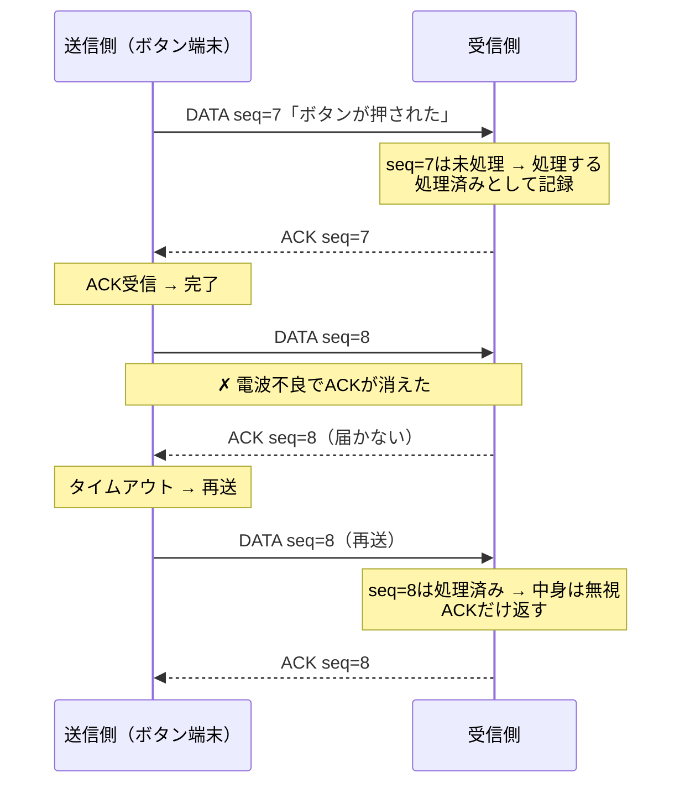

## このページでできるようになること

- 「届かない・遅れる・二重に届く」がESP-NOWで実際に起きる理由を説明できる
- 連番・ACK・再送・重複排除の4点セットの役割と関係を設計できる
- 最終プロジェクト（無線ボタン端末）の通信仕様を考える準備ができる

## 先に結論

TCP（第10部）は「届くまで再送し、順番を並べ直し、重複を捨てる」仕事を全部やってくれました。ESP-NOWにはそれがありません。電波が混んでいればパケットは黙って消えます。だから信頼性が必要なら、**連番（どのパケットか番号を振る）・ACK（受け取ったよと返事する）・再送（返事がなければ送り直す）・重複排除（同じ番号は二度処理しない）**の4点セットを自分のペイロード設計で組み立てます。4つは独立ではなく、「再送するから重複が生まれ、重複を見分けるために連番が要る」という一続きの因果でつながっています。

## 身近なたとえ

友だちに手紙を出すのに、ポストが時々手紙を捨ててしまう町を想像してください。対策はこうなります。手紙に通し番号を書き（連番）、受け取った友だちは「3番受け取ったよ」とハガキを返し（ACK）、ハガキが来なければ同じ手紙をもう一度出します（再送）。すると「3番の手紙が2通届く」ことが起きるので、友だちは番号を見て2通目を捨てます（重複排除）。

ただし実際の通信では、往復は手紙より速いものの、ACK自体も消えることがある点は同じです。「ACKが消えたのか、元のパケットが消えたのか」を送信側は区別できません。だからこそ受信側の重複排除が必須になります。

## 仕組み

### 何も対策しないと何が起きるか

前ページの例はすでに**連番**（4バイトのカウンタ）を積んでいました。examples/10-esp-nowの送信部の抜粋です。

```rust
                counter = counter.wrapping_add(1);
                let mut payload = [0u8; PAYLOAD_LEN];
                payload[..4].copy_from_slice(&counter.to_le_bytes());
                payload[4..].copy_from_slice(mac.as_bytes());

                let status = esp_now.send_async(&BROADCAST_ADDRESS, &payload).await;
```

これは抜粋です。完全なコードは examples/10-esp-now を見てください。2台で長く動かして受信ログの「相手のカウンタ」を眺めると、電子レンジ稼働中や距離を離したときに番号が飛ぶ（例: 41→42→45）ことがあります。これが「黙って消えるパケット」の目撃です。

### 4点セットの設計



| 部品 | 誰が実装 | 役割 | 設計のポイント |
|---|---|---|---|
| 連番（seq） | 送信側 | パケットに通し番号を振る | ペイロード先頭に入れる。`wrapping_add`で一周しても壊れない型（u32など）に |
| ACK | 受信側 | 「seq=Nを受け取った」と返信 | ACK用のパケット種別をペイロード形式に用意する |
| 再送 | 送信側 | 一定時間ACKが来なければ同じseqで送り直す | 待ち時間と再送回数の上限を決める。上限超えは「相手不在」と判断して諦める |
| 重複排除 | 受信側 | 処理済みseqの再送は処理せずACKだけ返す | 送信元MACごとに「最後に処理したseq」を覚えるだけで大半の場合は足りる |

### ペイロード形式を決める

前ページで「ペイロードはただのバイト列。形式は自分の責任」と学びました。4点セットを載せるなら、たとえば次のような形式を**自分で決めて文書化**します。

| バイト位置 | 内容 |
|---|---|
| 0 | 種別（0x01=DATA / 0x02=ACK） |
| 1〜4 | 連番seq（u32、リトルエンディアン） |
| 5〜 | 中身（DATAのみ。ボタン状態など） |

送る側と受ける側でこの表が食い違えば通信は成立しません。第3部で学んだ`enum`と`match`で種別を表現し、第4部の状態機械で「送信中→ACK待ち→完了/諦め」を設計すると、そのままRustの型に落ちます。

### 待ち時間の実装部品はもう持っている

「ACKを待つ、ただし待ちすぎない」は、第6部9ページで学んだ`with_timeout`がそのまま使えます。「受信を待ちながら定期送信もする」は前ページの`select`ループの形です。つまり新しいAPIは不要で、**設計だけが新しい**のがこのページの内容です。実装は第12部の最終プロジェクトで行います。

## よくある失敗

- **ACKを付けたのに重複排除を忘れる** — ACKが消えると送信側は再送します。受信側が重複を捨てないと「ボタン1回で2回動作する」バグになります。再送を入れた瞬間、重複排除は必須です
- **再送回数に上限を付けない** — 相手の電源が切れていたら永遠に再送し続けます。「N回でエラーと確定し、エラー処理（第12部7ページ）へ渡す」上限が必要です
- **ブロードキャストにACKを期待する** — 全員宛てのパケットに全員がACKを返すと衝突します。ACK方式は基本的に1対1（ユニキャスト）で使い、ブロードキャストは「消えてもよい情報」に使い分けます
- **seqをu8にして一周に気づかない** — u8は255の次に0へ戻ります。「最後に処理したseqより大きいものだけ処理」という素朴な比較は一周した瞬間に全パケットを捨てはじめます。番号の一周（wrap）まで考えるか、十分大きい型を使います

## やってみよう

examples/10-esp-nowを2台で動かし、受信側のログを1分間記録して「相手のカウンタ」が飛んだ回数を数えてみましょう。ボード間の距離を変えたり間に体を挟んだりして、損失率がどう変わるか観察してください。信頼性設計の必要性が数字で見えます。

## 確認問題

1. 再送の仕組みを入れると、なぜ重複排除が必須になるのですか。
2. 送信側は「元のDATAが消えた」のと「ACKが消えた」のを区別できますか。それは設計にどう影響しますか。
3. 最終プロジェクトの無線ボタン端末で、ボタン押下の通知に4点セットが必要な理由を説明してください。

<details>
<summary>答え</summary>

1. ACKが消えただけでもDATAは再送されるため、受信側に同じパケットが2回届く状況が仕組み上必ず生まれるから。連番で「処理済み」を見分けて捨てる必要があります。
2. 区別できません。どちらもタイムアウトになるだけです。そのため送信側は安全側に倒して再送し、重複の後始末は受信側の責任にする、という役割分担になります。
3. ボタン押下は一瞬のイベントで、消えたら「押したのに反応しない」、重複したら「1回押したのに2回動く」となり、どちらも使う人には故障に見えるから。確実に1回だけ処理されるよう連番・ACK・再送・重複排除が要ります。

</details>

## まとめ

- ESP-NOWのパケットは黙って消える。信頼性は連番・ACK・再送・重複排除で自作する
- 再送と重複排除は必ずセット。再送には回数上限を付けて諦めを設計する
- 実装部品（select・with_timeout・enum・状態機械）は習得済み。組み立ては最終プロジェクトで行う

## 次のページ

C6にはWi-FiとBLE（Bluetooth Low Energy）のほかに、もうひとつ無線があります。スマートホームを支えるIEEE 802.15.4という物理層を知っておきましょう。

[9. IEEE 802.15.4 →](/embassy-esp32-c6/part11/09-ieee802154/)

---

前: [7. ESP-NOWの基礎](/embassy-esp32-c6/part11/07-espnow-basics/) | 次: [9. IEEE 802.15.4](/embassy-esp32-c6/part11/09-ieee802154/)
