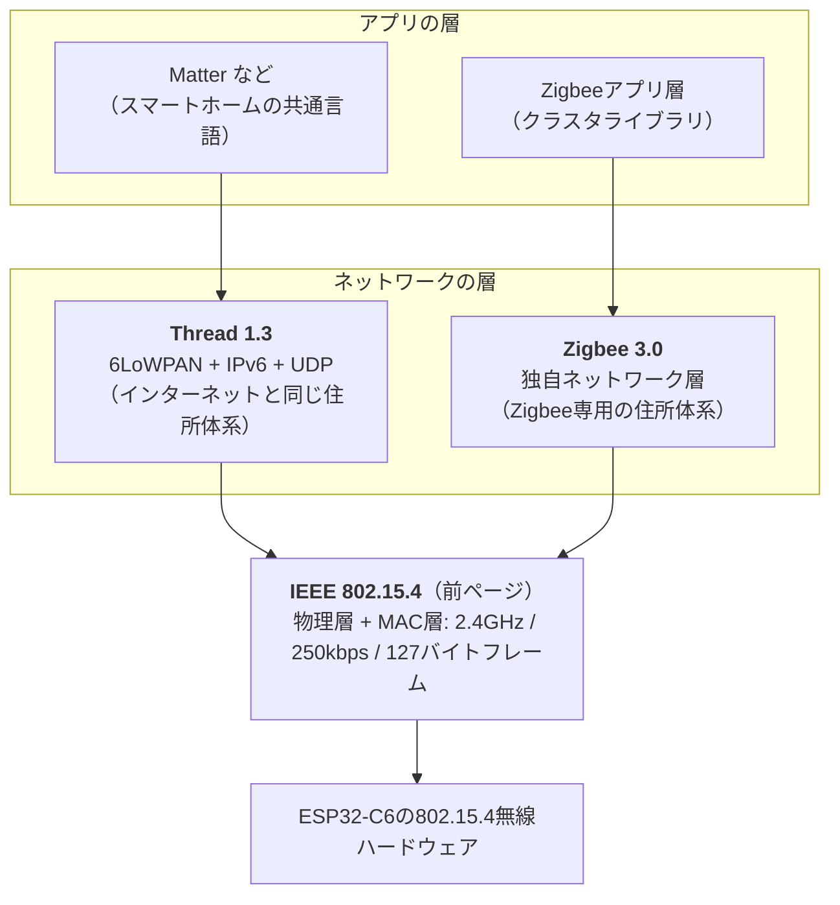

## このページでできるようになること

- ThreadとZigbeeが802.15.4の上に載る関係を図で説明できる
- 2つのプロトコルの設計の違い（IPを使うか使わないか）を説明できる
- ESP32-C6 + Rustでの対応状況（現状は教材対象外）を正しく述べられる

> このページは概念説明のみです。Thread/Zigbeeの動くコードは本教材にはありません。

## 先に結論

ThreadとZigbeeは、どちらもIEEE 802.15.4を土台にしたスマートホーム向けのメッシュネットワークプロトコルです。ESP32-C6はハードウェアとしてThread 1.3とZigbee 3.0の両方に対応しています（データシート記載）。最大の違いは、Threadが**IPv6を載せてインターネットの世界と地続き**なのに対し、Zigbeeは**独自のネットワーク層**を持つ点です。ただしRustで書けるかは別問題で、C6向けの実用的なRustスタックは現状どちらにもなく、**本教材では教材対象外**です。C言語の世界（ESP-IDF）では両方とも公式サポートがあります。

## 身近なたとえ

802.15.4という「道路」の上を走る2種類の「交通システム」がThreadとZigbeeです。Threadは世界共通の住所システム（IPv6）を使うので、道路の外の世界（インターネット）とも住所のやり取りがそのまま通じます。Zigbeeは町内専用の独自住所システムを使うので、外の世界と話すには町の出入口にある翻訳所（ゲートウェイ）が必要です。

ただし実際には、Threadの機器も家庭のWi-Fiネットワークとつながるには「Border Router（境界ルーター）」という中継機器が必要です。住所の仕組みが共通なぶん、翻訳ではなく転送で済む、という違いです。

## 仕組み

### 積み重ねの関係図

第10部で「Wi-Fiの上にIP、その上にTCP、その上にHTTP」と積み上げたのと同じ見方です。土台（802.15.4）は共通で、その上の階が2系統に分かれています。

### ThreadとZigbeeの比較

| 項目 | Thread 1.3 | Zigbee 3.0 |
|---|---|---|
| 土台 | IEEE 802.15.4 | IEEE 802.15.4 |
| ネットワーク層 | IPv6（6LoWPANで圧縮） | 独自 |
| インターネットとの接続 | Border Router経由で住所が地続き | ゲートウェイで変換 |
| ネットワーク形態 | メッシュ | メッシュ |
| 代表的な使われ方 | Matter対応スマートホーム機器 | スマート電球・センサ（普及実績が長い） |

- **メッシュ**: 機器同士が中継し合う網の目状のネットワークです。1台の電波が届かなくても、隣の機器がバケツリレーで届けます
- **Matter**: メーカーの垣根を越えるスマートホーム共通規格で、家庭内の通信路としてThread（とWi-Fi）を使います。近年C6のような「Wi-Fi + Thread両対応」チップが注目される理由です

### ESP32-C6での対応状況（正直な整理）

| 層 | C6ハードウェア | C言語（ESP-IDF） | Rust（本教材の構成） |
|---|---|---|---|
| 802.15.4 | ○ 802.15.4-2015 | ○ | 低レベルドライバのみ（実験的） |
| Thread | ○ Thread 1.3対応 | ○ OpenThread公式対応 | **実用スタックなし → 教材対象外** |
| Zigbee | ○ Zigbee 3.0対応 | ○ 公式SDKあり | **スタックなし → 教材対象外** |

- Threadの実装として有名なOpenThreadはC言語のライブラリです。Rustから呼び出すバインディングの試みはありますが、本教材の方針（検証済み・no_stdの純Rust構成）には現状合わないため対象外とします
- 「ハードウェアが対応している」ことと「今の言語・ライブラリで作れる」ことは別、というのが第11部を通じた最後の教訓です。C6を買えばThread機器がすぐ作れる、とは限りません
- 将来Rustスタックが整えば状況は変わります。esp-rsの開発は活発なので、対応状況表（support-matrix）の更新日を確認する習慣をつけてください

### 本教材の選択

第12部の最終プロジェクトでは、Rustで今日きちんと作れる**ESP-NOW**（ボード間通信）と**BLE（Bluetooth Low Energy）**（スマートフォン連携）を使います。Thread/Zigbeeは「C6の将来性」として頭に入れておけば十分です。

## よくある誤解

- **「ThreadはZigbeeの新バージョン」** — 別団体による別プロトコルです。共通なのは土台の802.15.4だけです
- **「C6はMatter対応チップだからRustでMatter機器を作れる」** — Matter対応はESP-IDF（C言語）の話です。Rustにその対応が来ているとは限りません
- **「メッシュだから設定なしで勝手につながる」** — メッシュへの参加には認証情報（ネットワークの鍵）の受け渡し（コミッショニング）が必要です。「勝手に」ではなく「招待されて」つながります

## やってみよう

家電量販店のサイトでスマートホーム機器を2つ探し、仕様欄の対応規格（Wi-Fi / Bluetooth表記 / Zigbee / Thread / Matter）を書き出してみましょう。「Bluetooth」とだけ書かれた製品が実際はBLEなのか、Threadの機器はどんな中継機器（Border Router）を要求しているのかまで読めたら、第11部の内容は身についています。

## 確認問題

1. ThreadとZigbeeに共通する土台は何ですか。
2. Threadが「インターネットと地続き」と言われる理由を説明してください。
3. 「ESP32-C6でZigbee機器をRustで作りたい」と相談されたら、現状をどう説明しますか。

答え

1. IEEE 802.15.4（物理層とMAC層）です。
2. ネットワーク層にインターネットと同じIPv6（6LoWPANで圧縮）を使っており、Border Routerが住所の変換ではなく転送で外の世界へつなげられるからです。
3. ハードウェアはZigbee 3.0に対応しているが、Rustには現状Zigbeeスタックがないため純Rustでは作れない。今すぐ作るならC言語（ESP-IDF）の公式SDKを使うか、Rustでやるならまず用途を見直してESP-NOWやBLE（Bluetooth Low Energy）で置き換えられないか検討する、と説明します。

## まとめ

- ThreadとZigbeeはどちらも802.15.4の上に載るメッシュプロトコル。ThreadはIPv6、Zigbeeは独自ネットワーク層
- C6のハードウェアは両対応（Thread 1.3 / Zigbee 3.0）だが、Rustスタックは現状なく本教材では対象外
- 最終プロジェクトはRustで確実に作れるESP-NOWとBLEで組む

## 次のページ

無線ボタン端末を電池で長く動かすには、使わない時間に眠る技術が必須です。第12部はLight Sleepから始めます。

[第12部 1. Light Sleep →](/embassy-esp32-c6/part12/01-light-sleep/)

---

前: [9. IEEE 802.15.4](/embassy-esp32-c6/part11/09-ieee802154/) | 次: [第12部 1. Light Sleep](/embassy-esp32-c6/part12/01-light-sleep/)
