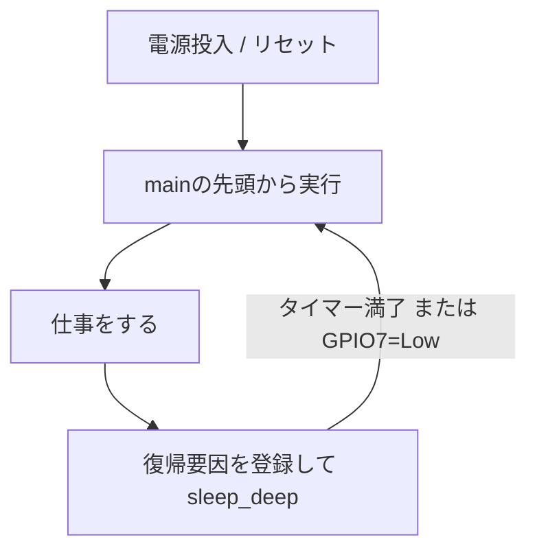

## このページでできるようになること

- Deep-sleepからの復帰が「再起動と何が同じで、何が違うか」を説明できる
- HP SRAM非保持・LP SRAM保持の意味を説明できる
- `Rtc::sleep_deep`でタイマー復帰付きのDeep-sleepに入るコードを書ける

## 先に結論

Deep-sleepはチップの大部分の電源を切るモードで、データシート典型値では7µA（RTCタイマー+LPメモリ有効時。ESP32-C6データシート v1.5 Table 5-11）まで下がります。その代償として**HP SRAM（メインメモリ512KB）は保持されません**。復帰したプログラムは、電源を入れ直したときと同じように**先頭から**実行し直され、変数の値はすべて消えています。ただし普通の再起動と違い、**LP SRAM（16KB）とRTCタイマーは眠っている間も生きています**。そして眠る前に「何に起こしてもらうか」（タイマー、GPIO）を登録してから眠ります。

## 身近なたとえ

Light-sleepが机に突っ伏したうたた寝なら、Deep-sleepは「机の上を全部片づけて家に帰る」ことです。翌朝出社すると机（HP SRAM）は空っぽで、仕事は朝の準備からやり直しです。ただし、金庫（LP SRAM）に入れておいたメモと、壁の時計（RTCタイマー）だけは夜の間も動き続けています。

実際のDeep-sleepがこのたとえと違うのは、「翌朝いつ起きるか」を自分で予約してから眠る点です。眠る前に「10秒後に起こして（タイマー）」「このピンがLowになったら起こして（GPIO）」と復帰要因を登録します。**登録を忘れて眠ると、リセットボタン以外では二度と起きません。**

## 仕組み

### 再起動と何が違うか

Deep-sleepからの復帰は、プログラムから見れば**ほぼ再起動**です。同じ点と違う点を整理します。

| 観点 | 普通の再起動（リセット） | Deep-sleepからの復帰 |
|---|---|---|
| プログラムの開始位置 | 先頭から | 先頭から（**同じ**） |
| HP SRAMの変数・スタック | 当てにできない | 消える（**同じ**） |
| その間の消費電力 | （動作中） | 典型7µA（データシート値） |
| RTCタイマー | — | 眠っている間も進み、復帰時刻を決められる |
| LP SRAM（16KB） | — | 内容が保持される |
| 区別する方法 | `reset_reason()`が電源投入系 | `reset_reason()`が`CoreDeepSleep`になり、`wakeup_cause()`で原因が分かる |



### 消えるもの・残るもの

- **消える**: HP SRAMの内容すべて。つまり通常の変数、`static`変数、スタック、ヒープ、Embassyのtaskの状態、ペリフェラルの設定
- **残る**: LP SRAM（16KB）、RTCタイマーのカウント、そしてフラッシュ（そもそも不揮発なのでプログラム自体は消えません）

「復帰後も残したいデータ」はLP SRAMに置く必要があります。esp-halには変数をリセット後も保持されるRAMに置く属性（`#[ram(persistent)]`など）がありますが、本教材では扱いません。まずは「普通の変数は全部消える」を体で覚えるのが先です。

## RustとEmbassyではどう書くか

examples/12-sleepのコードで確かめます（これは抜粋です。完全なコードはexamples/12-sleepを見てください）。このプログラムは、起動するとリセット要因を表示し、LEDを3回点滅させ、5秒後に10秒間のDeep-sleepへ入ります。

まず起動直後に「なぜ起きたのか」を表示します。

```rust
    // なぜ起動（リセット）したのかを表示する。
    // 電源投入なら PowerOn 系、ディープスリープ復帰なら CoreDeepSleep になる
    info!("リセット要因: {:?}", reset_reason(Cpu::ProCpu));
    // ディープスリープから復帰した場合、その原因（Timer / Ext1 など）が分かる
    info!("復帰要因: {:?}", wakeup_cause());
```

次に復帰要因を登録して眠ります。

```rust
    // --- ウェイクアップ要因の準備 ---
    // 1. RTCタイマー: 10秒経ったら復帰する
    let timer_wakeup = TimerWakeupSource::new(CoreDuration::from_secs(10));

    // 2. EXT1（LP GPIO）: GPIO7がLowレベルになったら復帰する
    let mut wake_pin = peripherals.GPIO7;
    let mut wakeup_pins: [(&mut dyn RtcPinWithResistors, WakeupLevel); 1] =
        [(&mut wake_pin, WakeupLevel::Low)];
    let ext1_wakeup = Ext1WakeupSource::new(&mut wakeup_pins);

    info!("おやすみなさい（10秒タイマー / GPIO7=Lowで復帰）");

    // ディープスリープへ。この関数からは戻らず（戻り値 `!`）、
    // 復帰するとプログラムは最初から実行される
    let mut rtc = Rtc::new(peripherals.LPWR);
    rtc.sleep_deep(&[&timer_wakeup, &ext1_wakeup]);
```

GPIO起床の詳細（なぜGPIO7なのか、`Ext1WakeupSource`とは何か）は[次のページ](/embassy-esp32-c6/part12/03-wakeup/)で掘り下げます。

## コードを一行ずつ読む

- `TimerWakeupSource::new(CoreDuration::from_secs(10))` — 10秒後に起こすタイマーです。引数は`core::time::Duration`で、Embassyの`embassy_time::Duration`とは**別の型**です（12-sleepでは`CoreDuration`という別名でuseしています）
- `Rtc::new(peripherals.LPWR)` — LPWR（低電力管理）ペリフェラルからRtcを作ります。`rtc_cntl`（スリープ関連）はesp-halの**unstable API**で、バージョン更新で変わる可能性があります
- `rtc.sleep_deep(&[&timer_wakeup, &ext1_wakeup])` — 復帰要因を複数登録して眠ります。この関数は**戻ってきません**。復帰後はmainの先頭から実行されるので、「呼び出しの続き」というものが存在しないのです
- LEDの点滅回数を数える変数をどこかに置いても、Deep-sleepのたびに消えます。HP SRAM非保持だからです

## 配線

examples/12-sleepの配線です。

| 接続 | 内容 |
|---|---|
| LED（起動確認用） | GPIO10 → 抵抗330Ω → LEDアノード(+) → LEDカソード(−) → GND |
| 復帰用プルアップ | GPIO7 → 抵抗10kΩ → 3V3 |
| 復帰用ボタン | GPIO7 → タクトスイッチ → GND |

**プルアップ抵抗は必須です。** スリープ中にGPIO7が浮いた（どこにもつながっていない）状態だと、ノイズでLowと誤判定して勝手に復帰してしまいます。ボタンを押すとGPIO7がGNDに落ちてLowになり、復帰します。電圧はすべて3.3V系です。5Vをつながないでください。

## 実行方法

```bash
cd examples
cargo run --release -p sleep
```

期待される動き（シリアルモニタはつないだままで大丈夫です）:

```text
INFO - リセット要因: （電源投入を示す値）
INFO - 復帰要因: （初回は未定義系の値）
（LEDが3回点滅）
INFO - 5秒後にディープスリープに入ります…
INFO - おやすみなさい（10秒タイマー / GPIO7=Lowで復帰）
（約10秒間、静かになる）
INFO - リセット要因: CoreDeepSleep を示す値 ← ここが変わる！
INFO - 復帰要因: Timer を示す値
（また先頭からLED3回点滅…の繰り返し）
```

電源投入時とDeep-sleep復帰時で「リセット要因」の表示が変わること、そして毎回**プログラムが先頭からやり直されている**ことを確認してください。なお、開発ボードはUSBから給電されており、USB-UARTブリッジ等が動いているため、スリープ中もデータシートの7µAにはなりません。

## よくある失敗

1. **「復帰したら続きから動く」と思ってしまう** — Deep-sleepはLight-sleepと違い、HP SRAMが消えるので必ず先頭からです。`sleep_deep`の後ろに書いたコードは実行されません
2. **GPIO7をプルアップせずに浮かせる** — 浮いたピンはノイズでLow/Highが揺れるため、眠った瞬間に復帰したり、押していないのに復帰したりします
3. **スリープ中に書き込みできない** — チップが眠っているとespflashが接続に失敗することがあります。RSTボタンを押して起こすか、BOOTボタン（GPIO9）を押しながらリセットして書き込みモードにしてから書き込みます
4. **`embassy_time::Duration`を`TimerWakeupSource`に渡してコンパイルエラー** — 必要なのは`core::time::Duration`です。同名の型が2つあるので、useをよく見ましょう

## やってみよう

タイマーを`from_secs(10)`から`from_secs(30)`に変えて書き込み、(1) 30秒放置したとき、(2) 途中でGPIO7のボタンを押したとき、それぞれの「復帰要因」表示を見比べてみましょう。同じ「先頭から再実行」でも、原因を区別できることが分かります。

## 確認問題

1. Deep-sleep復帰と普通のリセットの「同じ点」と「違う点」を1つずつ挙げてください。
2. Deep-sleep中も内容が保持されるRAMは何で、容量はいくつですか。
3. `sleep_deep`の呼び出しから「戻ってこない」のはなぜですか。HP SRAMの扱いと関連づけて説明してください。

<details>
<summary>答え</summary>

1. 同じ点: プログラムが先頭から実行し直される（HP SRAMの変数は当てにできない）。違う点: 復帰ではRTCタイマーとLP SRAMが保持されており、`reset_reason()`/`wakeup_cause()`で復帰であることと原因を区別できる（他に「復帰要因を事前に登録して眠る」も可）。
2. LP SRAMで、16KBです。HP SRAM（512KB）は保持されません。
3. Deep-sleepでHP SRAM（スタックを含む）が消えるため、「呼び出した場所の続き」に戻るための情報が残らないからです。復帰は常にプログラムの先頭からなので、この関数の型は「戻らない」ことを表す`!`になっています。

</details>

## まとめ

- Deep-sleepはデータシート典型値7µAまで下がるが、HP SRAMは消え、復帰は必ず先頭から（開発ボード全体ではこの値にはならない）
- LP SRAM（16KB）とRTCタイマーは眠っている間も生きる。ここが「ただの再起動」との違い
- 復帰要因は眠る前に登録する。登録しなければリセットでしか起きない

## 次のページ

「何に起こしてもらうか」は省電力設計の核心です。タイマー起床とGPIO起床の使い分けと、ESP32-C6特有の「Deep-sleepで使えるピンはGPIO0〜7だけ」という制限を学びます。

[3. Wake-upの設計 →](/embassy-esp32-c6/part12/03-wakeup/)

---

前: [1. Light Sleep](/embassy-esp32-c6/part12/01-light-sleep/) | 次: [3. Wake-upの設計](/embassy-esp32-c6/part12/03-wakeup/)
