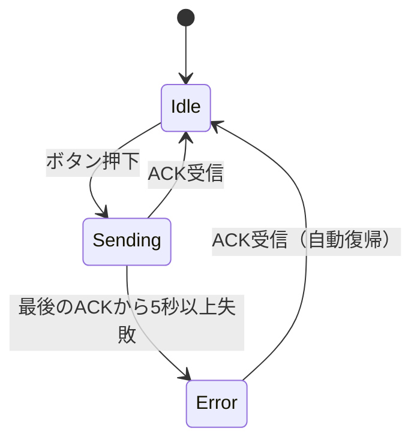

## このページでできるようになること

- リトライ（再送）に上限とタイムアウトを付ける理由を説明できる
- 「壊れたら止まる」ではなく「機能を絞って動き続ける」縮退（degraded）設計ができる
- 人手なしでエラー状態から抜ける「自動復帰」を状態機械で設計できる

## 先に結論

組み込み機器は、フリーズしても誰も再起動してくれません。だからエラー処理の目標は「失敗しないこと」ではなく、**失敗しても自力で立て直すこと**です。設計の型は3段構えです。(1) 一時的な失敗は**リトライ**する。ただし回数上限とタイムアウトを必ず付ける。(2) それでもだめなら**縮退運転**に入る——全停止せず、できる仕事（ハートビート送信、LEDでの異常表示）を続ける。(3) 回復の証拠（ACKの受信）を検出したら**自動復帰**する。最終プロジェクト（examples/final-wireless-button、cargo check済み）はこの3段をそのまま実装しているので、実コードで読み解きます。

## 身近なたとえ

宅配便の配達に似ています。留守なら少し時間を置いて**再配達**します（リトライ）。それでも受け取ってもらえなければ、荷物は営業所預かりにして**他の配達は通常どおり続けます**（縮退運転）。そして「受け取りに行けます」と連絡が来たら、普通の配達に**自動的に戻ります**（復帰）。配達員は一軒の不在で全業務を止めたりしません。

たとえと違うのは、コードの世界では「留守かどうか」を直接知る方法がないことです。**「ACKが期限内に返ってこない」という時間の条件**だけで判断します。だからタイムアウトの設計がすべての起点になります。

## 仕組み

### 3層のエラー処理

無線ボタン端末の送信側は、失敗を3つの階層で扱います。

| 階層 | 失敗の意味 | 対応 | コード上の場所 |
|---|---|---|---|
| 1回の送信 | 電波に乗らなかった／ACKが200ms以内に来ない | すぐ再送 | `send_event_with_retry`のループ |
| 1件のイベント | 最大3回送ってもACKなし | あきらめて`Err(TxError)`を返す（無限に粘らない） | `send_event_with_retry`の戻り値 |
| リンク全体 | 最後のACKから5秒以上経過 | `Error`状態へ。LEDで異常を表示しつつハートビートは送り続ける。ACKが届いたら`Idle`へ自動復帰 | `ack_is_stale` / `enter_error` / ACK受信分岐 |

### 状態機械

送信側のリンク状態は第4部で学んだenumの状態機械です（src/app.rsで定義）。



```rust
#[derive(Debug, Clone, Copy, PartialEq, Eq)]
pub enum LinkState {
    /// 待機中（正常）
    Idle,
    /// イベント送信中（ACK待ち・再送中）
    Sending,
    /// ACKが長時間得られない（LEDを高速点滅して知らせる）
    Error,
}
```

大事なのは、`Error`が「終着駅」ではないことです。**入る条件（5秒ACKなし）と出る条件（ACK受信）が対で定義**されています。出口のない異常状態は、再起動しない機器では設計ミスです。

## RustとEmbassyではどう書くか

以下はすべてexamples/final-wireless-button/src/radio.rsからの抜粋です。完全なコードはそちらを見てください。

### リトライ — 上限とタイムアウト付き

```rust
/// イベントパケットを送り、ACKが返るまで再送するヘルパー。
/// 成功したら「何回目の送信で成功したか」を返す。
async fn send_event_with_retry(
    esp_now: &mut EspNow<'static>,
    packet: &Packet,
) -> Result<u8, TxError> {
    let bytes = packet.to_bytes();
    let want_seq = packet.seq();
    let mut send_failures = 0u8;

    for attempt in 1..=config::MAX_SEND_ATTEMPTS {
        // 送信（電波に乗せる）。失敗したらACK待ちを飛ばして再試行
        if let Err(e) = esp_now.send_async(&BROADCAST_ADDRESS, &bytes).await {
            warn!("[送信] イベント送信エラー（{}回目）: {:?}", attempt, e);
            send_failures += 1;
            continue;
        }

        // ACK待ち（config::ACK_TIMEOUT_MS でタイムアウト → 再送へ）
        let timeout = Duration::from_millis(config::ACK_TIMEOUT_MS);
        match with_timeout(timeout, wait_for_ack(esp_now, want_seq)).await {
            Ok(()) => return Ok(attempt),
            Err(_) => { /* ログを出して次のattemptへ */ }
        }
    }

    // 一度も電波に乗らなかったのか、ACKが来なかったのかを区別して返す
    if send_failures == config::MAX_SEND_ATTEMPTS {
        Err(TxError::SendFailed)
    } else {
        Err(TxError::AckTimeout)
    }
}
```

### エラー状態への遷移と自動復帰

「最後にACKを受け取った時刻」を1つ覚えておくだけで、リンク全体の健康状態を判定できます。

```rust
/// 最後のACKから config::LINK_DOWN_AFTER_MS 以上たっているか
fn ack_is_stale(last_ack: Instant) -> bool {
    last_ack.elapsed() >= Duration::from_millis(config::LINK_DOWN_AFTER_MS)
}
```

復帰は、受信ループでACKを見つけたときに行われます。

```rust
            // --- 3. 受信 → ACKなら「リンク生存」の証拠として記録 ---
            Either3::Third(received) => {
                if let Ok(Packet::Ack { seq: acked }) = Packet::from_bytes(received.data()) {
                    last_ack = Instant::now();
                    if state == LinkState::Error {
                        info!("[送信] ACKが戻ったのでエラー状態から復帰します");
                    }
                    set_state(&mut state, LinkState::Idle, link_state);
                }
            }
```

### 縮退運転 — エラー中も止まらない

`Error`状態になっても、送信taskのループは回り続け、ハートビートは送信され続けます。だから受信側が復活すればACKが届き、上のコードで自動復帰できるのです。異常の表示はLED taskが担当します（src/app.rsより抜粋）。

```rust
            LinkState::Error => {
                // 点滅しながら、状態変化の通知も待つ（先に来た方を処理）
                let blink = Duration::from_millis(config::ERROR_BLINK_MS);
                match with_timeout(blink, LINK_STATE.wait()).await {
                    Ok(new_state) => {
                        state = new_state;
                        if state != LinkState::Error {
                            led.set_low(); // 復帰したら消灯に戻す
                        }
                    }
                    Err(_) => led.toggle(), // タイムアウト＝点滅を続ける
                }
            }
```

## コードを一行ずつ読む

- `for attempt in 1..=config::MAX_SEND_ATTEMPTS` — リトライは必ず**有限回**（ここでは3回）。無限ループのリトライは、taskをそこに閉じ込めて他の仕事を奪います
- `with_timeout(timeout, wait_for_ack(...))` — 第6部で学んだ`with_timeout`が復旧設計の主役です。「待つ」処理には必ず期限を付けます
- `Err(TxError::SendFailed)` / `Err(TxError::AckTimeout)` — 失敗の**理由を型で区別**して返します（src/error.rs）。「送信自体ができない（無線ドライバの問題かも）」と「送れたが返事がない（相手の問題かも）」は、原因調査で意味が違います
- `send_failures == config::MAX_SEND_ATTEMPTS` — 理由の判定に使うため、失敗の内訳を数えています
- `set_state(...)` — 状態が**変わったときだけ**Signalで通知します。LED taskは変化だけ受け取ればよく、毎ループ通知される無駄がありません

## 配線

- 送信側: GPIO10 → 抵抗330Ω → LEDアノード(+) → LEDカソード(−) → GND（エラー表示用）。ボタンはボード上のBOOTボタン（GPIO9）を使うので配線不要
- 受信側: 同じくGPIO10 → 抵抗330Ω → LED → GND（ボタン状態の表示用）

## 実行方法

2台のESP32-C6-DevKitC-1に、送信側と受信側をそれぞれ書き込みます。

```bash
cd examples
# 1台目（送信側）
cargo run --release -p final-wireless-button --bin final-wireless-button
# 2台目（受信側）
cargo run --release -p final-wireless-button --bin receiver
```

復旧の動きを観察する手順です。

1. 両方動いている状態で送信側のBOOTボタンを押す → `[送信] イベント seq=N 送信成功（1回目でACK）`
2. **受信側のUSBを抜く**（故障を疑似的に起こす） → ボタンを押すと再送ログの後に`{}回送ってもACKなし`、約5秒で`エラー状態（LED高速点滅）に入ります`のwarnログ、送信側LEDが高速点滅
3. **受信側のUSBを挿し直す** → 受信側が起動してACKを返し始めると、送信側に`ACKが戻ったのでエラー状態から復帰します`が出てLEDが消灯

「壊す→放っておくと自力で直る」を自分の目で確認してください。誰も再起動していないのに復帰するのがポイントです。

## よくある失敗

1. **上限なしのリトライ** — `loop { 再送 }`と書くと、相手が死んでいる間そのtaskは永遠に抜けられず、後続のボタンイベントが詰まります。上限＋タイムアウト＋あきらめ（`Err`を返す）が3点セットです
2. **エラー状態に「出口」がない** — 入る条件だけ作って満足しがちです。この設計ではACK受信という「回復の証拠」で出ます。出口条件を先に決めてから異常状態を導入しましょう
3. **失敗を全部unwrapで殺す** — 無線の送信失敗は**正常系の一部**です。`unwrap`はここでは「復旧の放棄」を意味します。unwrapしてよいのは起動時の初期化など、失敗が設計上ありえない（起きたら続行不能な）箇所だけです
4. **再送の副作用を考えない** — ACKが失われただけでパケット自体は届いていた場合、再送で同じイベントが2回届きます。リトライは受信側の**重複排除**（seqによる判定）とセットで初めて安全になります

## やってみよう

src/config.rsの`MAX_SEND_ATTEMPTS`を3から1に、`LINK_DOWN_AFTER_MS`を5000から2000に変えて書き込み、受信側を抜いたときの挙動がどう変わるか（あきらめの早さ、エラー状態に入るまでの時間）を観察してみましょう。「調整つまみ」が1ファイルに集まっている効果も体感できます。

## 確認問題

1. リトライに「回数上限」と「タイムアウト」の両方が必要なのはなぜですか。
2. `TxError::SendFailed`と`TxError::AckTimeout`を区別する価値はどこにありますか。
3. この設計で`Error`状態から人手なしに復帰できるのはなぜですか。仕組みを2つの要素で説明してください。

<details>
<summary>答え</summary>

1. タイムアウトがないと1回のACK待ちで永遠に止まり、回数上限がないと再送を永遠に繰り返すからです。どちらが欠けても「そこでtaskが動けなくなる」危険が残ります。
2. 失敗の原因の切り分けです。SendFailedは自分側（無線ドライバや初期化）の問題を、AckTimeoutは相手や電波環境の問題を示唆するので、ログを見たときの調査先が変わります。
3. (1) Error中も送信taskは止まらずハートビートを送り続けるので、相手が復活すればACKが届く。(2) ACK受信の分岐が「Errorであっても」Idleへ戻す遷移を持っている。この2つが揃って自動復帰になります。

</details>

## まとめ

- エラー処理は3段構え: 有限回のリトライ → 縮退運転（止まらない・異常を表示する） → 回復の証拠による自動復帰
- 異常状態には必ず「出口条件」を先に設計する。出口のないErrorは再起動しない機器では致命的
- 失敗の理由は型（enum）で区別して残す。unwrapは復旧の放棄であり、無線の失敗は正常系の一部

## 次のページ

この復旧ロジックがすんなり読めたのは、radio・protocol・configが分かれていたおかげです。次はその「分け方」——責務と依存方向の設計を学びます。

[8. プロジェクトの分割 →](/embassy-esp32-c6/part12/08-project-structure/)

---

前: [6. ログとデバッグ](/embassy-esp32-c6/part12/06-logging-debug/) | 次: [8. プロジェクトの分割](/embassy-esp32-c6/part12/08-project-structure/)
