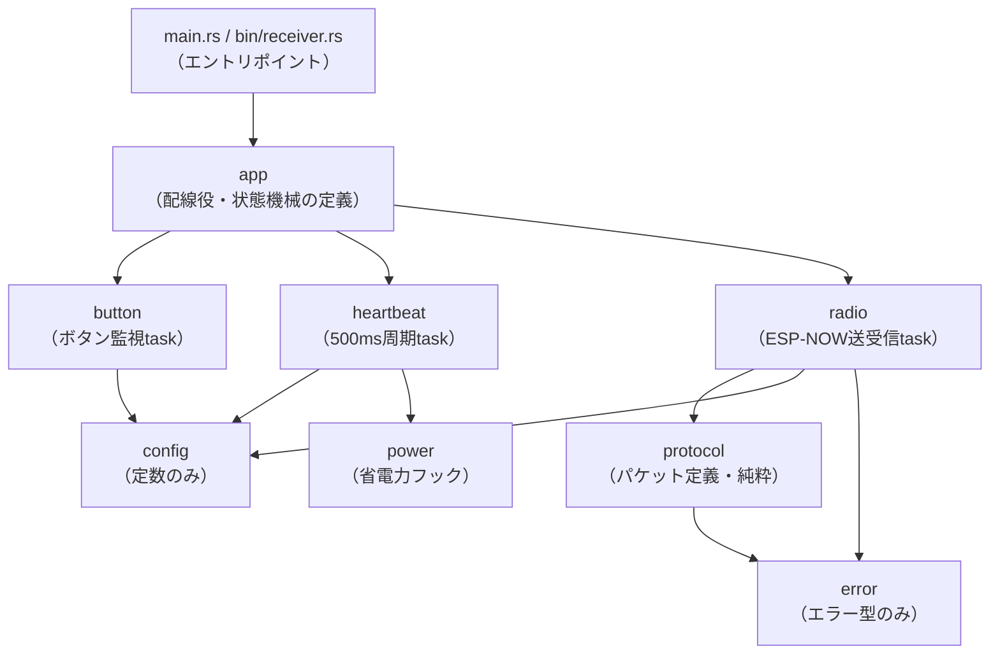

## このページでできるようになること

- 「責務」でモジュールを切り、依存方向を一方向に設計できる
- 「実体は配線役が持ち、taskには口だけ渡す」パターンを説明できる
- 悪い構造の兆候（巨大struct、どこからでもMutex、全部unwrap）を見分けられる

## 先に結論

大きくなったプログラムの敵は行数ではなく、**依存の絡まり**です。最終プロジェクト（examples/final-wireless-button、cargo check済み）は8つのモジュールに分かれ、依存は必ず一方向に流れます。最下層のprotocol・error・configは**何にも依存しない純粋な層**、その上にハードウェアを扱うradio・button・heartbeatがあり、全体の配線図を知っているのは**appだけ**です。エントリポイント（binのmain.rs / receiver.rs）はappしか知りません。チャネルやSignalの**実体はappが持ち、各taskには送受信の「口」だけを引数で渡す**——この一手間が、読める・直せる・テストできるプロジェクトを作ります。

## 身近なたとえ

文化祭の実行委員会を思い浮かべてください。調理係・会計係・放送係はそれぞれ自分の仕事と、共通ルールブック（config）だけを知っていれば動けます。係同士が直接指示し合うのではなく、連絡は決められた連絡票（メッセージ）で行い、全体の割り振り表を持っているのは実行委員長（app）だけ。校長先生（main）は委員長とだけ話します。

ソフトウェアがたとえと違うのは、「誰が誰を知っているか」が`use`宣言としてコードに明記され、**コンパイラが違反を機械的に検出できる**点です。設計図が絵に描いた餅にならず、破ると即コンパイルエラーになります。

## 仕組み

### モジュール構成と依存方向

矢印は「依存する（useする）」方向です。



| モジュール | 責務 | 依存先 |
|---|---|---|
| main.rs / bin/receiver.rs | ハードウェア初期化とtask起動だけ | appのみ |
| app | 配線役。チャネル・Signalの実体を持ち、taskへ口を渡す。`LinkState`の定義 | button / heartbeat / radio / config |
| radio | 電波を扱う処理の集約（送信・再送・ACK・受信・重複排除） | protocol / config / error |
| button / heartbeat | 入力監視／周期通知の各task | config（heartbeatはpowerも） |
| protocol | パケットの定義と変換。**純粋関数のみ** | errorのみ |
| error / config / power | エラー型／定数／省電力フック | **なし** |

依存方向の原則は3つです。

1. **下ほど純粋** — protocol・error・configはesp-halもEmbassyも知らない。だからホストPCでもビルド・テストできる（[次のページ](/embassy-esp32-c6/part12/09-testing/)の主題）
2. **実体は上、口は下へ** — Channel・Signal・AtomicBoolの実体はappが持ち、taskは引数で受け取る。「誰と誰がつながっているか」がapp1ファイルで一望できる
3. **binは薄く** — main.rsはピン初期化と`app::spawn_sender_tasks`呼び出しだけ。送信側と受信側でロジックを共有できるのはこのおかげ

なお1つだけ補足すると、radioはappが定義する`LinkState`**型**を使います（状態の語彙はapp側にあるため）。ただしSignalの**実体**はappが所有し、radioは引数で借りるだけです。

### 実体を持つのはapp、taskは口を受け取る

src/app.rsからの抜粋です（これは抜粋です。完全なコードはexamples/final-wireless-buttonを見てください）。

```rust
/// ボタンtask → radio task へのイベント（容量4のキュー）
static BUTTON_EVENTS: Channel<CriticalSectionRawMutex, ButtonEvent, 4> = Channel::new();

/// リンク状態の通知（radio taskが書き、led taskが読む。最新値のみ保持）
static LINK_STATE: Signal<CriticalSectionRawMutex, LinkState> = Signal::new();

/// 送信側の全taskを配線して起動する。binのmainからはこれを呼ぶだけ
pub fn spawn_sender_tasks(
    spawner: &Spawner,
    button: Input<'static>,
    led: Output<'static>,
    esp_now: EspNow<'static>,
) {
    spawner.spawn(button::button_task(button, BUTTON_EVENTS.sender(), &BUTTON_PRESSED).unwrap());
    // ...radio taskへは receiver() 側の口を渡す...
}
```

`BUTTON_EVENTS.sender()`（送る口）と`.receiver()`（受け取る口）を**別々のtaskに渡す**ので、「このチャネルに書くのはbutton task、読むのはradio taskだけ」が引数リストから読み取れます。staticをどこからでも直接触る設計との決定的な違いです。

### lib.rsとCargo.toml — 構造を支える仕掛け

```rust
// テストビルド（ホストPC）のときだけstdを使い、それ以外はno_std。
#![cfg_attr(not(test), no_std)]

// ハードウェア非依存の純粋モジュール（ホストでもビルド・テスト可能）
pub mod config;
pub mod error;
pub mod protocol;

// ハードウェア依存モジュール（組み込みターゲットのときだけビルドする）
#[cfg(target_os = "none")]
pub mod app;
```

Cargo.tomlは「1つのlib＋2つのbin」構成です。

```toml
[lib]
name = "final_wireless_button"
path = "src/lib.rs"

[[bin]]
name = "final-wireless-button"   # 送信側 (src/main.rs)
path = "src/main.rs"

[[bin]]
name = "receiver"                # 受信側 (src/bin/receiver.rs)
path = "src/bin/receiver.rs"
```

送信側と受信側はprotocolやconfigを完全に共有します。パケット形式を直すとき、2か所を同期させる必要はありません。

### 悪い例との対比

同じ機能は、次のようにも書けてしまいます（本教材の設計ガイドラインが「悪い例」とするパターンです）。

| 悪い例 | 何が起きるか | このプロジェクトでは |
|---|---|---|
| 全ペリフェラルを1つの巨大structに入れて持ち回す | どのtaskが何を触るのか追えない | 各taskは自分に必要なピンだけを引数で受け取る（button taskは`Input`1本だけ） |
| どこからでも共有Mutex/staticへアクセス | 書き込み元の特定に全ファイル捜索が必要 | 実体はappに集約し、口を引数で渡す。書き手と読み手が型で分かる |
| taskが互いの内部状態を直接変更 | 変更の順序やタイミングのバグが温床に | `ButtonEvent`や`HeartbeatTick`という**メッセージ**で依頼する |
| main.rsが初期化・通信・状態管理・復旧を全部やる | 1ファイルが肥大化し、どこも再利用できない | mainは初期化とspawnのみ（送信側main.rsは約70行） |
| Channelをグローバルに無計画に増やす | 配線図が誰にも分からなくなる | チャネルはappに集め、1本ずつ用途をコメントで明記 |
| 状態をu8やboolの組で表現 | ありえない組み合わせ（例: 「エラーかつ送信中」）を型が許す | `enum LinkState`で状態を列挙し、matchで網羅 |
| エラーを全部unwrap | 一時的な無線失敗で全体がパニック | Resultで返し、unwrapは起動時など理由をコメントで書ける箇所だけ |

## 実行方法

このページは読む回ですが、構造が本当に成立しているかはコンパイラに聞けます。

```bash
cd examples
cargo check -p final-wireless-button
```

lib＋2つのbinすべての型検査が通れば、図に描いた依存関係がコード上でも成立している証拠です（`Finished`が出れば成功）。試しにsrc/protocol.rsの先頭へ`use crate::radio;`と書き足してみると、純粋な層からハードウェア層への逆流をコンパイラがどう扱うか観察できます（確認後は元に戻してください）。

## よくある失敗

1. **循環依存を作る** — protocolがradioを知り、radioがprotocolを知る、という相互依存になると、切り離してテストすることが不可能になります。「下は上を知らない」を徹底します
2. **「とりあえずmainに書き足す」を繰り返す** — 動きはしますが、配線と論理が混ざった巨大ファイルになり、受信側と共有もできません。新しい仕事が来たら「どの責務か」を先に決めます
3. **共有したい変数のたびに`static Mutex`を増やす** — 動いているうちはよくても、「これ、誰が書いてるの？」に答えられなくなった時点で保守不能です。まず「メッセージで依頼できないか」を考え、共有するなら実体を配線役に集めます

## やってみよう

「エラー表示のLEDを2個に増やしたい（GPIO10に加えてもう1本）」という変更を想像して、修正が必要なファイルを列挙してみましょう。答え合わせ: ピン初期化（main.rs）と、LEDを受け取るled_taskまわり（app.rs）だけで済み、radio・protocol・button・heartbeatには一切触れません。変更が層をまたいで波及しないことが、この構造のご利益です。

## 確認問題

1. protocol・error・configが「何にも依存しない」ことには、どんな実利がありますか。2つ挙げてください。
2. チャネルの実体をappに置き、taskへ`sender()`/`receiver()`を渡す設計は、staticを直接触る設計と比べて何が優れていますか。
3. 状態を`bool`の組ではなく`enum LinkState`で表す利点は何ですか。

<details>
<summary>答え</summary>

1. （例）ホストPCでビルドできるので単体テストが可能になる。esp-halやesp-radioのバージョン更新の影響を受けない層になり、保守範囲を切り分けられる（他: 受信側・送信側で安全に共有できる、も可）。
2. 「誰が送り、誰が受け取るか」が関数の引数リストに現れ、配線の全体像がapp1ファイルで一望できることです。どこからでも書ける状態を型レベルで防げます。
3. ありえない状態の組み合わせを型が排除でき、matchの網羅性チェックで「新しい状態を足したのに処理を書き忘れた」をコンパイルエラーにできることです。

</details>

## まとめ

- モジュールは責務で切り、依存は一方向に流す。最下層は「何にも依存しない純粋な層」にする
- チャネル・Signalの実体は配線役（app）が持ち、taskには口だけ渡す。binは初期化とspawnだけの薄い層にする
- 巨大struct・無秩序な共有・全部unwrapは絡まりの兆候。メッセージ・enum状態・Resultで置き換える

## 次のページ

「protocolは何にも依存しない」——この設計は美学ではなく、実利に直結します。ホストPCで`cargo test`が走るのです。

[9. テストと保守 →](/embassy-esp32-c6/part12/09-testing/)

---

前: [7. エラーからの復旧](/embassy-esp32-c6/part12/07-error-recovery/) | 次: [9. テストと保守](/embassy-esp32-c6/part12/09-testing/)
