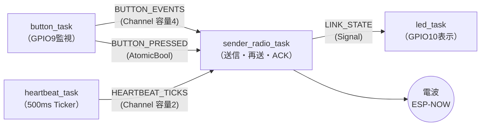
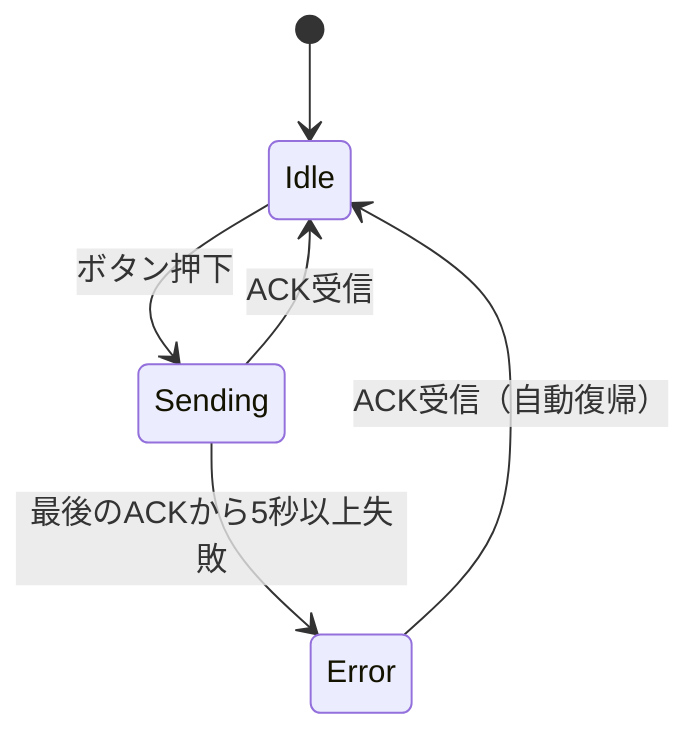

## このページでできるようになること

- 要求仕様 → 通信方式の選定 → 設計 → 実装 という開発の流れを一通り説明できる
- ESP-NOW・BLE・Wi-Fiを比較し、選定理由を根拠付きで述べられる
- 2台のESP32-C6で無線ボタン端末を動かし、各動作を仕様と対応づけられる

## 先に結論

第1部で予告した最終ゴール「無線ボタン端末」を完成させます。ボタンを押すと即座に相手へ届き、500msごとの生存確認で「つながっている」ことを常に確かめ合い、電波の失敗には再送と重複排除で立ち向かい、相手を見失ったらLEDで異常を知らせて自力で復帰する——ここまでの11.5部で学んだ部品（GPIO、task、Channel/Signal、ESP-NOW、状態機械、エラー設計、モジュール分割）だけで作れます。通信方式は比較の結果ESP-NOWを採用します。コードはexamples/final-wireless-button（cargo check済み、純粋ロジックはホストテスト10件成功）です。

## 要求仕様

作りたいものを、検証可能な言葉で先に決めます。

| # | 要求 | 検証方法 |
|---|---|---|
| R1 | ボタン押下を**即時**送信する | 押した瞬間に受信側のログとLEDが反応する |
| R2 | **500ms周期**の生存確認（ハートビート）に現在のボタン状態を載せる | 受信側LEDが「押している間だけ点灯」に追従する |
| R3 | 全パケットに**連番**（seq）を振る | ログのseqが単調に増える |
| R4 | 受信側は**重複を排除**する（ただし重複にもACKは返す） | 再送が起きたとき「重複と判定→ACKのみ」のログが出る |
| R5 | イベントは**ACK必須・最大3回**送信する | 受信側を止めると再送ログの後にあきらめのwarnが出る |
| R6 | 最後のACKから**5秒**で異常状態に入り、LEDを高速点滅。ACKで**自動復帰** | 受信側を抜き差しして点滅→消灯を確認 |
| R7 | 受信側は**2秒**受信がなければ「送信側ロスト」を警告する | 送信側を止めるとwarnログが出る |
| R8 | 処理は**複数task**に分割し、**Channel/Signal**で通信する | コード構造で確認（[8. プロジェクトの分割](/embassy-esp32-c6/part12/08-project-structure/)） |

## 通信方式の選定 — ESP-NOW vs BLE vs Wi-Fi

この教材ではESP32-C6で3つの無線方式を学びました。全部この用途に使えます。だからこそ**比較して選ぶ**練習をします。

| 観点 | ESP-NOW | BLE（Bluetooth Low Energy） | Wi-Fi + TCP |
|---|---|---|---|
| 遅延（ボタン→相手） | 小さい（接続手続きなし） | 接続確立後は小さい | 接続確立後は小さいが上位層の分だけ段数が多い |
| 接続確立 | **不要**（起動直後から送れる） | 必要（Advertising→接続） | 必要（AP接続→DHCP→TCP接続） |
| 消費電力の傾向 | 送る瞬間だけ電波を使える | 間欠動作が得意（規格として省電力志向） | 接続維持のコストが相対的に大きい |
| 到達距離 | Wi-Fiと同等の2.4GHz直接通信 | 同じ2.4GHz帯（一般に近距離向け） | ルーター経由で家中＋インターネットの先まで |
| 再送・ACK | **なし（自分で設計する）** | リンク層に再送あり | TCPが到達保証してくれる |
| 複数台 | MAC宛て/ブロードキャストで多対多が容易 | 接続数に制約 | ルーターの下に何台でも |
| スマホと直接つながるか | ×（Espressif独自方式） | **○**（スマホの標準機能） | ○（同じLAN経由） |
| ルーター要否 | **不要** | 不要 | **必要** |
| 実装難度（この教材の構成で） | 低い（送って受けるだけ） | 中（GATTの構造が必要） | 中〜高（積み重ねる層が多い） |
| Rustライブラリの成熟度 | esp-radioで利用可（unstable feature） | trouble-host 0.6で利用可（発展途上の面あり） | embassy-net + esp-radioで安定して利用可（wifiはstable feature） |

**ESP-NOWを採用した理由**は次の4点です。

1. **接続レスだから「ボタン即時送信」（R1）に最も素直** — 押した瞬間に接続確立の手続きなしで送れます
2. **ルーター不要で2台だけで完結する**（R2〜R7の実験がしやすい）
3. **再送・ACK・重複排除が「ない」ことが学習価値になる** — TCPやBLEが裏でやってくれることを、自分の手で設計します（R3〜R6はまさにそれです）
4. **教材のバージョン構成で無理なく書ける** — esp-radioのESP-NOW APIとEmbassyのselectが素直に組み合わさります

弱点も正直に挙げます。スマホと直接つながらない（スマホ対応が要件ならBLE一択。第11部6で作りました）、Espressif独自方式なので他社チップとは話せない、そして到達保証がないので信頼性は自作です。**要件が変われば正解も変わる**——この表ごと持ち帰ってください。

## 設計

### task構成（送信側）

[第8ページ](/embassy-esp32-c6/part12/08-project-structure/)のモジュール構造の上に、4つのtaskをChannel/Signalで配線します（R8）。



- **即時性（R1）と周期性（R2）は別task** — ボタンとTickerを1つのループに混ぜず、radio taskが`select3`で両方の依頼と受信を待ちます
- **ハートビートは`try_send`** — radio taskがACK待ちで忙しいとき、古い生存確認を積み上げても意味がないので、あふれたら捨てます（第9部で学んだバックプレッシャの実践）
- **状態通知はSignal** — LEDに必要なのは「最新の状態」だけなので、履歴を貯めるChannelではなくSignalを使います

### 状態機械（R6）



復旧の設計は[7. エラーからの復旧](/embassy-esp32-c6/part12/07-error-recovery/)で読んだ通りです。

### パケットフォーマット（R3）

パケットは固定長8バイト。serdeのようなライブラリは使わず、手で組み立てます（src/protocol.rs）。

```text
+--------+--------+-------------------+--------+----------+
| byte 0 | byte 1 | bytes 2..6        | byte 6 | byte 7   |
| MAGIC  | 種別   | seq (u32, LE)     | フラグ | チェック |
| 0xB7   | 1/2/3  | 通し番号          | 0/1    | サム     |
+--------+--------+-------------------+--------+----------+
```

- **MAGIC（0xB7）**: 「このプロトコルのパケットである」印。無関係なESP-NOWパケットを最初の1バイトで弾く
- **種別**: 1=Event（ボタン押下）、2=Heartbeat（生存確認）、3=Ack（受信確認）
- **seq**: 全パケット共通で1ずつ増える通し番号（リトルエンディアンのu32）。受信側の重複判定（R4）とACKの対応付け（R5）の要
- **フラグ**: Heartbeatでは「今ボタンが押されているか」（R2）。他の種別では0
- **チェックサム**: 先頭7バイトのXOR。電波ノイズで壊れたパケットを捨てる簡易検査

この変換ロジックはハードウェア非依存なので、[前ページ](/embassy-esp32-c6/part12/09-testing/)の通りホストで10件のテストに守られています。

### 仕様とコードの対応表

「仕様の言葉がどのファイルに写ったか」を一覧にします。設計とはこの表を作る作業だと言ってもよいくらいです。

| 要求 | 実装箇所 |
|---|---|
| R1 ボタン即時送信 | src/button.rs（エッジ待ち＋デバウンス）→ src/radio.rs の`Either3::First`分岐 |
| R2 500msハートビート | src/heartbeat.rs（Ticker）→ radio taskが`BUTTON_PRESSED`を載せて送信 |
| R3 連番 | src/radio.rs `seq.wrapping_add(1)`（全種別共通で採番） |
| R4 重複排除 | src/protocol.rs `DedupTable`（送信元MACごとに最後のseqを記憶） |
| R5 ACK必須・最大3回 | src/radio.rs `send_event_with_retry`＋src/config.rs `MAX_SEND_ATTEMPTS` |
| R6 5秒で異常・自動復帰 | src/radio.rs `ack_is_stale`/`enter_error`＋src/app.rs `led_task` |
| R7 受信側ロスト警告 | src/radio.rs `receiver_loop`の`with_timeout(HEARTBEAT_LOST_MS)` |
| R8 task分割とChannel/Signal | src/app.rs（実体の所有と配線）、[8ページ](/embassy-esp32-c6/part12/08-project-structure/)参照 |

## RustとEmbassyではどう書くか

本体は全編がこれまでのページで読んできたコードです。ここでは「エントリポイントの薄さ」だけ確認します（src/main.rsから抜粋。完全なコードはexamples/final-wireless-buttonを見てください）。

```rust
    // Wi-Fiドライバを初期化してESP-NOWインターフェースを得る。
    // コントローラはdropすると無線が止まるので変数として保持しておく
    let (_controller, interfaces) =
        esp_radio::wifi::new(peripherals.WIFI, Default::default()).unwrap();
    let esp_now = interfaces.esp_now;

    // 送受信するボード同士は同じWi-Fiチャネルに合わせる必要がある
    esp_now.set_channel(config::WIFI_CHANNEL).unwrap();

    // LED（エラー表示用）とBOOTボタン
    let led = Output::new(peripherals.GPIO10, Level::Low, OutputConfig::default());
    let button_config = InputConfig::default().with_pull(Pull::Up);
    let button = Input::new(peripherals.GPIO9, button_config);

    // アプリ本体のtask群を配線して起動（詳細は src/app.rs）
    app::spawn_sender_tasks(&spawner, button, led, esp_now);
```

mainがやるのは初期化と受け渡しだけ。仕様の中身はすべてライブラリ側のモジュールにあり、受信側（src/bin/receiver.rs）も同じライブラリを共有します。

## 配線

| ボード | 接続 |
|---|---|
| 送信側 | GPIO10 → 抵抗330Ω → LEDアノード(+) → LEDカソード(−) → GND（エラー表示）。ボタンはボード上のBOOTボタン（GPIO9）なので配線不要 |
| 受信側 | GPIO10 → 抵抗330Ω → LEDアノード(+) → LEDカソード(−) → GND（ボタン状態の表示） |

## 実行方法

2台のESP32-C6-DevKitC-1を使います。1台ずつUSBでつないで書き込みます。

```bash
cd examples
# 1台目（送信側）
cargo run --release -p final-wireless-button --bin final-wireless-button
# 2台目（受信側）
cargo run --release -p final-wireless-button --bin receiver
```

両方起動したら、仕様の番号どおりに動作確認します。

1. **R1/R5**: 送信側のBOOTボタンを押す → 送信側`[送信] イベント seq=N 送信成功（1回目でACK）`、受信側`[受信] ボタンイベント! seq=N`とLED点灯
2. **R2**: ボタンを押しっぱなしにする → 受信側LEDが押している間だけ点灯（ハートビートの`pressed`フラグ追従）
3. **R3/R4**: 受信側のログでseqが増え続けることを確認。電波状況次第で`重複パケット seq=N（再送と判定）`が観察できることもあります
4. **R6**: 受信側のUSBを抜く → 約5秒後に送信側LEDが高速点滅。挿し直すと`ACKが戻ったのでエラー状態から復帰します`で消灯
5. **R7**: 逆に送信側を抜く → 受信側に`2000ms以上ハートビートなし → 送信側をロストした可能性`のwarn

## よくある失敗

1. **2台のWi-Fiチャネルが合っていない** — このコードは両方`config::WIFI_CHANNEL`（11）を使うので通常一致しますが、改造してチャネルを変えるときは**必ず両側同時に**変えます。ずれると1バイトも届きません
2. **受信側の「ロスト警告」を故障と勘違いする** — 送信側の電源を切ればwarnが出るのは**仕様どおり**（R7）です。監視機能が働いている証拠です
3. **1台で送受信を兼ねようとする** — このプロジェクトは送信側と受信側で別のバイナリです。1台に両方を書き込むことはできません
4. **LEDが点かない** — アノード/カソードの向きと抵抗の有無を確認してください。ログだけは正しく出ているなら配線の問題です

## やってみよう（発展課題）

5分でできるものから順に並べます。

1. src/config.rsの`HEARTBEAT_PERIOD_MS`を500から100に変えて、ログの流量と応答の変化を見る
2. 送信側をもう1台増やす（3台目があれば）。受信側の`DedupTable`は送信元MACごとにseqを管理するので、そのまま複数台を受けられます（`MAX_PEERS`= 4まで）
3. （挑戦）src/power.rsの`before_idle`フックに、[1〜3ページ](/embassy-esp32-c6/part12/01-light-sleep/)で学んだスリープ設計を入れてみる。「眠っている間はACKを受け取れない」問題とどう折り合うか——これが解ければ本物の電池駆動機器です

## 確認問題

1. この用途でESP-NOWがBLEより有利だった点と、逆にBLEを選ぶべき要件を1つずつ挙げてください。
2. ACK（R5）と重複排除（R4）は、なぜ片方だけでは不十分なのですか。
3. seqがEvent専用ではなく全パケット共通で増えていくのはなぜですか。

<details>
<summary>答え</summary>

1. 有利な点: 接続確立が不要なので、押した瞬間に低遅延で送れる（ルーターも不要）。BLEを選ぶべき要件: スマホと直接つなぎたい場合（ESP-NOWはスマホの標準機能では受けられない）。
2. ACKだけだと、ACKが電波で失われたときに送信側が再送し、受信側で同じイベントが2回処理されてしまいます。重複排除だけだと、送信側は届いたかどうかを知る手段がなく再送の止めどきが分かりません。「届いた保証」はACK、「二重処理の防止」は重複排除と、役割が別なのです。
3. 受信側の重複判定が「送信元ごとに最後に受け取ったseq」との比較で行われるためです。種別ごとに別カウンタにすると、EventとHeartbeatの間でseqの前後関係が壊れ、判定表が正しく機能しません（ACKの対応付けにも同じ番号空間を使っています）。

</details>

## まとめ

- 開発の流れは「検証可能な仕様 → 方式の比較選定 → 仕様を型とtaskに写す設計 → 実装と動作確認」。仕様とコードの対応表が設計の中心にある
- ESP-NOWの採用理由は、接続レスの即時性・ルーター不要・信頼性を自作する学習価値。要件が変われば正解も変わる
- 信頼性は seq＋ACK＋再送＋重複排除＋タイムアウト＋自動復帰 の組み合わせで、すべて自分の手で作った

## 卒業後の道

これでこの教材の120ページはすべて終わりです。ボタンひとつの端末でも、その中には所有権、task、Channel、状態機械、プロトコル設計、エラー復旧、ホストテストまで、実務の設計要素が全部入っています。ここから先は自分の道を選んでください。

- **電池で動かす**: power.rsのフックにスリープを実装し、[4ページ](/embassy-esp32-c6/part12/04-power-measurement/)の考え方で消費を見積もる
- **スマホとつなぐ**: 通信層をBLE（第11部）に載せ替える。protocolとappの分離が効いて、radioの置き換えで済むはずです
- **世界とつなぐ**: Wi-Fi（第10部）でクラウドやMQTTへ。あるいはThread/Zigbee（第11部）のRust対応の成熟を追いかける
- **土台を深める**: esp-halはunstable APIを多く含みます。バージョン更新を追い、コミュニティに参加するのも立派な次の一歩です

分からない言葉に出会ったら、いつでも用語集へ。良い工作を！

[用語集 →](/embassy-esp32-c6/appendix/glossary/)

---

前: [9. テストと保守](/embassy-esp32-c6/part12/09-testing/) | 次: [用語集](/embassy-esp32-c6/appendix/glossary/)
