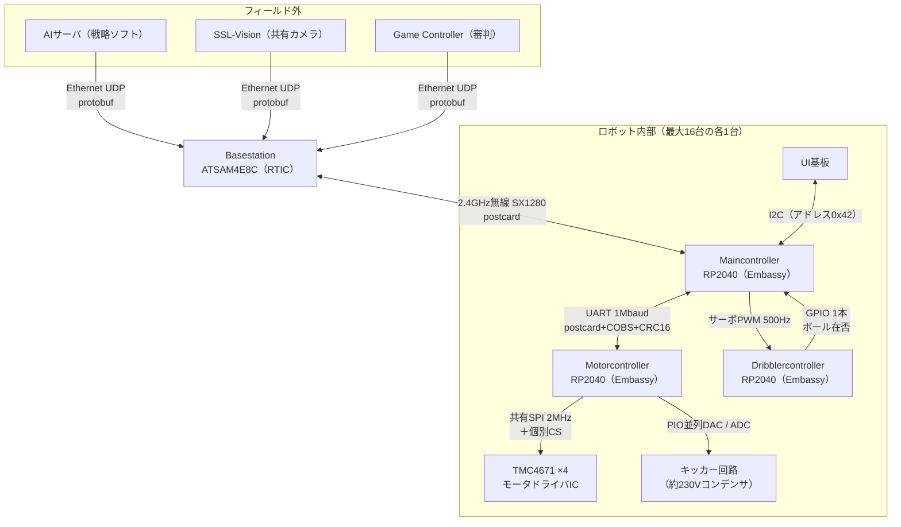

## このページでできるようになること

- 基地局＋ロボット内3枚、計4種類の基板の役割と接続を概念図で描ける
- 各接続の「物理層・プロトコル・流れるデータ」を区別して説明できる
- 「なぜ1つのマイコンに全部入れないのか」を電気・責務・故障の3つの観点で説明できる
- 教材の最終プロジェクト（2台のC6）がこのシステムの最小形だったことを説明できる

## 先に結論

このシステムは、**基地局（Basestation）1枚**と、ロボット1台につき**メイン（Maincontroller）・モータ（Motorcontroller）・ドリブラー（Dribblercontroller）の3枚**、計4種類の基板でできています。基地局はEthernetでフィールド外のAIとつながり、2.4GHz無線で最大16台のロボットと話します。ロボットの中では、メイン基板とモータ基板がUART（1Mbaud）で結ばれ、モータ基板がSPIで4つのモータドライバICを、メイン基板がPWMでドリブラー基板を従えます。**接続ごとに物理層もプロトコルも違う**——この「つなぎ方の使い分け」を読み取ることが、このページの目的です。そしてもう1つの問いは「なぜ基板を分けるのか」。答えは性能ではなく、**電気的分離・責務分離・故障隔離**にあります。

## 身近なたとえ

このシステムは**病院**に似ています。受付（基地局）が外部からの連絡をすべて受けて院内に取り次ぎ、院内では総合案内（メイン基板）が各診療科（モータ基板・ドリブラー基板）へ仕事を割り振ります。外部との電話（無線）、院内内線（UART）、診療科から検査機器への指示（SPI）——**相手と用途によって連絡手段が違う**のがポイントです。

——ただし実際の技術では、連絡手段の違いは「格式」ではなく物理的な要件で決まります。距離（フィールド越しか、基板上の数cmか）、速度、ノイズ耐性、配線数。このページの後半で、接続ごとにその理由を見ます。

## システム概念図

ファームウェアのリポジトリには、開発者自身が描いた通信の全体図がコメントとして残っています（luhsoccer_firmware (luhbots, MIT) libs/intra-comms/src/lib.rs）:

```text
Server                Vision                  Game Controller
   |                     |                           |
   | Protobuff           | Protobuff                 | Protobuff
   |                    \/                           |
   \-------------> Basestation <---------------------/
                        |
                        | Postcard
                       \/            Postcard
                 Maincontroller <----------------> Motorcontroller
```

これをロボット内部まで含めて広げると、次の図になります。



「1本のボール」はどこにいるかというと、ドリブラー基板の赤外線ライトバリア（光の遮断でボールの有無を検出するセンサ）が見ています。ボールの在否はGPIO 1本でメイン基板へ伝わり、無線のテレメトリ（ロボットからの状態報告）で基地局まで届きます。ボールを「蹴ってよいか」の最終判断にもこの信号が使われます（9ページ目）。

## エッジごとの分解 — 物理層・プロトコル・データ

概念図の各矢印（エッジ）を、第10部で学んだ「層の分離」で分解します。**物理層（電気的にどう運ぶか）とプロトコル（意味をどう表すか）と、流れるデータ（何を伝えるか）は別のもの**です。

| 区間 | 物理層 | プロトコル | 流れるデータ |
|---|---|---|---|
| AI/Vision/GC → 基地局 | Ethernet（UDP、DHCPでアドレス取得） | protobuf（prost） | 各ロボットへの指令、ビジョン情報、審判コマンド |
| 基地局 ⇄ ロボット0〜15 | 2.4GHz無線 SX1280（FLRC 1.3Mb/s）、ロボット別の32bit同期語 | postcard | 下り: 速度・キック・ドリブラー指令 / 上り: テレメトリ |
| メイン ⇄ モータ | UART 1Mbaud（RTS/CTSフロー制御） | postcard＋COBS＋CRC16 | 下り: 走行・キック指令 / 上り: 実測速度・コンデンサ電圧 |
| メイン → ドリブラー | RCサーボ式PWM（500Hz、パルス幅1〜2ms） | パルス幅=速度 | ドリブラーモータの目標速度 |
| ドリブラー → メイン | GPIO 1本 | H/L | ボール在否（赤外線、2kHzでADC監視） |
| メイン ⇄ UI基板 | I2C（メインがマスタ、UIはアドレス0x42） | 独自 | ボタン・表示 |
| モータ → TMC4671×4 | 共有SPI 2MHz＋チップセレクト4本 | TMC4671レジスタ | トルク目標、エンコーダ値 |
| モータ → キッカー | GPIO＋PIOによる10bit並列DAC、ADC | 電圧値 | 充電目標電圧、コンデンサ電圧の監視 |

読み取ってほしいパターンが3つあります。

**1. 遠くて不確かなリンクほど、プロトコルが厚い。** 無線とUARTには「メッセージをバイト列にする仕組み（postcard）」があり、UARTにはさらに区切り（COBS）と誤り検出（CRC16）が重ねてあります（7ページ目で詳読）。一方、基板上数cmのSPIやPWMは生の値に近い形で流します。信頼性の道具はタダではないので、**必要な場所にだけ**積む——最終プロジェクトでACK・再送を「必要なイベントにだけ」付けたのと同じ判断です。

**2. 情報量が少ない接続は、線も細い。** ボール在否は1bitなのでGPIO 1本。ドリブラー速度は1つの数値なのでPWM 1本。UARTやSPIを使うまでもありません。ちなみにドリブラー基板は「PWMが20Hzを下回ったらモータ停止」というフェイルセーフを持っていて、**信号線1本にも途絶検出がある**ことは覚えておいてください（10ページ目）。

**3. CANバスは使われていない。** 第10部でTWAI（CAN）を学びましたが、このロボットの基板間は全部UART・PWM・GPIO・I2C・SPIです。そのぶん、フレーム化・誤り検出・アドレス指定をファームウェアが自作しています（postcard+COBS+CRC16がまさにそれです）。CAN/TWAIならこの多くをハードウェアがやってくれます。どちらが正しいという話ではなく、「**バスを選ぶことは、誰がその仕事をするかを選ぶこと**」という見方を持ってください。

## なぜ基板を分けるのか

RP2040は1枚でもGPIO・PWM・SPI・UARTを全部持っています。性能だけ見れば「全部入り1枚」も作れそうです。それでもこのロボットは3枚（＋基地局）に分かれています。理由を3つの観点で読み解きます。

### 観点1: 電気的分離

このロボットには**約230Vまで充電されるキッカー用コンデンサ**と、モータへ流れる大電流が載っています。キッカーの放電は強烈なノイズ源で、モータのPWMも電源を揺らします。繊細なロジック回路（マイコン、センサ）と同じ基板・同じ電源系に同居させるほど、誤動作のリスクが上がります。基板を分ければ、電源とグラウンドの設計を高電圧系・大電流系・ロジック系で分離しやすくなります。実際、2022年の機体では基板のハードウェア不良でモータドライバを壊した経験がTDPに率直に書かれており、電気設計はこのチームにとって教訓の領域です。

### 観点2: 責務分離

第12部で「モジュールは責務で切る」と学びました。ここでは**基板が責務で切られています**。

- **メイン基板**: 外界との窓口（無線）、電源・電池管理、ドリブラーとUIの世話
- **モータ基板**: 1kHzの運動制御ループとキッカー——**時間に厳しい仕事**専門
- **ドリブラー基板**: ドリブラーモータの駆動とボールセンサだけの小さな専門店

特に効いているのが「時間に厳しい仕事の隔離」です。1kHzで回る制御ループ（8ページ目）は、1ミリ秒たりとも周期を外したくない仕事です。無線待ちやUSBログのような「いつ終わるか分からない仕事」と同じチップに住まわせるより、基板ごと分けてしまえば干渉の心配が根本からなくなります。第9部で学んだ「優先度で守る」のさらに強硬な形、「**ハードウェアで守る**」です。

### 観点3: 故障隔離

キッカー回路が故障してもメイン基板は生きているので、「キッカー異常」を無線で報告しながら安全に停止できます。メイン基板が固まっても、ドリブラー基板はPWM途絶（20Hz未満）を自力で検出してモータを止めます。**どこか1枚の死が、システム全体の暴走にならない**ようにできているのです。1枚の基板に全部入っていたら、そのマイコンの死は即、全機能の死です。

もちろん、分けることには代償があります。基板間の通信プロトコルを自作し、途絶を検出し、バージョンを合わせ、配線コネクタという物理的な故障点も増えます。この応用編の7ページ目と10ページ目は、まさに「その代償をどう払ったか」を読むページです。

## 最終プロジェクトは最小の分散システムだった

教材の最終プロジェクト（第12部10）を思い出してください。送信側C6と受信側C6の2台が、ESP-NOWで結ばれ、共有のprotocol.rsでメッセージを定義し、ハートビートの途絶を検出しました。

| 最終プロジェクト | このロボットシステム |
|---|---|
| C6 × 2台 | 基地局1枚＋ロボット3枚 ×最大16台 |
| 共有クレートprotocol.rsでメッセージ定義 | 共有クレートintra-commsでメッセージ定義 |
| seq＋ACK＋再送＋重複排除 | postcard＋COBS＋CRC16＋キープアライブ |
| 2000msハートビート途絶でwarn | 50ms無線途絶で全出力ゼロ |

つまりあの最終プロジェクトは、**ノード2つの最小の分散システム**でした。ノードが増え、リンクの種類が増え、途絶時の動作が「警告表示」から「安全停止」に格上げされただけで、設計の骨格は同じです。「2台のC6で作ったあれ」を頭に置いて読み進めれば、このシステムは怖くありません。

## よくある誤解

- **「基板が多いほど高性能」** — 分けた理由は性能ではありません。電気・責務・故障の分離です。通信の手間という代償を払ってでも分離が欲しかった、という設計判断として読んでください
- **「基板間通信は1種類に統一すべき」** — この設計はあえてUART・PWM・GPIO・I2C・SPIを使い分けています。情報量1bitにUARTは過剰で、走行指令にGPIO 1本は不足です。接続ごとに要件が違うのだから手段も違う、が実戦の答えです
- **「AIからの指令はロボットのメイン基板が受けて考える」** — メイン基板は戦略を考えません。指令を検証してモータ基板へ中継し、状態を報告する「窓口」です。頭脳は最後までフィールドの外にあります

## 設計を考える

1. ドリブラー基板とメイン基板の間は「PWM 1本（下り）＋GPIO 1本（上り）」という最小限の接続です。もしここをUART（postcard+COBS+CRC16）に置き換えたら、何が得られ、何を失いますか。

<details>
<summary>考え方の例</summary>

得られるのは拡張性と信頼性です。速度以外の情報（温度、電流、エラーコード）を運べ、CRCで化けも検出できます。失うのは単純さです。ドリブラー基板側にデシリアライズ処理とプロトコルのバージョン管理が必要になり、「PWMが止まったら停止」というシンプルで確実なフェイルセーフも作り直しになります。現状の情報量（下り: 速度1つ、上り: ボール在否1bit)なら、最小限の接続で足りる——「将来必要になったら厚くする」で良い、という判断が読み取れます。

</details>

2. あなたがESP32-C6でこのロボットを再設計するとします。C6は1チームに1つの無線（Wi-Fi/802.15.4）を内蔵しています。「基地局⇄ロボット」の区間を外付け無線チップなしで作れるとしたら、それでも基板を分ける理由は残りますか。

<details>
<summary>考え方の例</summary>

残ります。無線が内蔵になっても、キッカーの高電圧・モータの大電流という電気的な事情、1kHz制御ループの時間的な事情、故障隔離の事情は消えません。C6は単一コアなので、「制御ループと無線スタックの同居」はRP2040の2コア構成よりさらに厳しく、むしろ基板（チップ）を分ける動機は強まる可能性があります。無線の内蔵は「基地局側の設計」を変えますが、「ロボット内部を分ける理由」はほぼそのまま残る、と考えられます。

</details>

## まとめ

- システムは基地局（ATSAM4E8C＋RTIC）とロボット内3枚のRP2040（Embassy）で構成され、接続ごとに物理層とプロトコルが使い分けられている
- 遠く不確かなリンクほどプロトコルが厚い（postcard+COBS+CRC16）。近く単純なリンクは細い（PWM、GPIO 1本）。CANは使わず、その分の仕事をファームウェアが自作している
- 基板を分ける理由は電気的分離・責務分離・故障隔離。最終プロジェクトの2台のC6は、この構図の最小形だった

## 次のページ

まず外側から攻めます。基地局はこのプロジェクトで唯一Embassyでは**ない**基板です。RTICというもう1つの並行処理フレームワークとの出会いから、Embassyの設計思想を逆照射します。

[3. 基地局 — EmbassyではなくRTICという選択](/embassy-esp32-c6/robot/03-basestation/)

---

前: [1. 実戦のロボットファームウェアを読む](/embassy-esp32-c6/robot/01-intro/) | 次: [3. 基地局 — EmbassyではなくRTICという選択](/embassy-esp32-c6/robot/03-basestation/)
