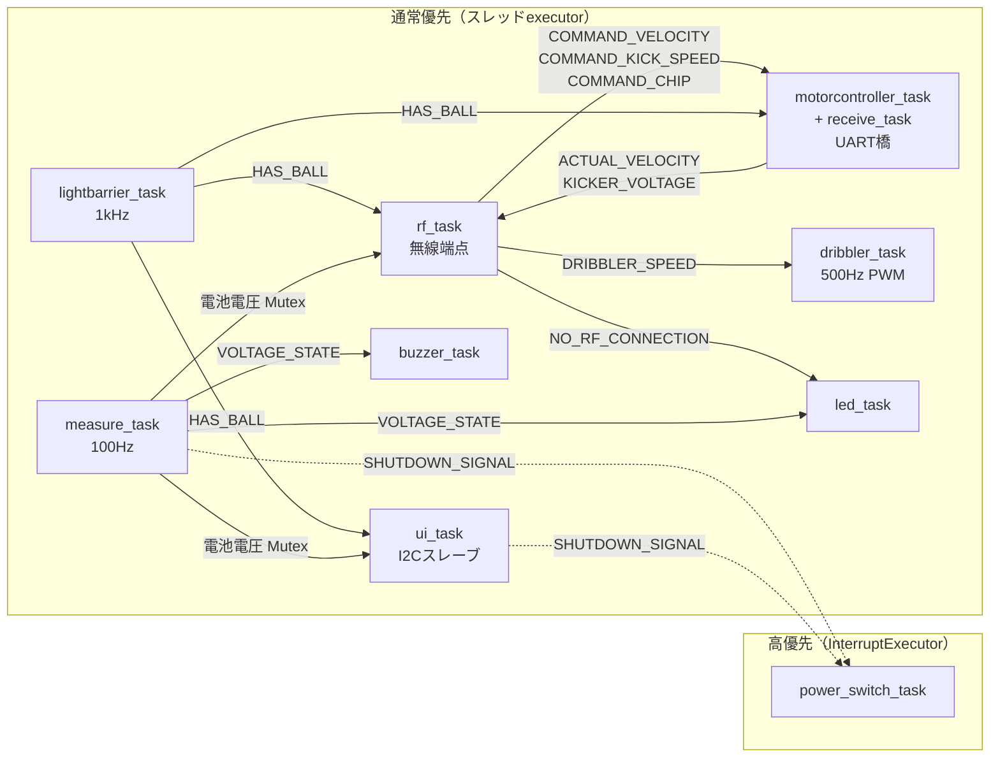

## このページでできるようになること

- メイン基板の`main.rs`から、11個のtaskの役割と、taskどうしの配線を読み取れる
- 「spawnリストがそのまま配線図になっている」設計の価値を説明できる
- InterruptExecutor（高優先）とスレッドexecutor（通常優先）の2層構成を説明できる
- measure_task・lightbarrier_task・dribbler_taskの「実戦の工夫」を1つずつ挙げられる

## 先に結論

メイン基板のファームウェアは、**11個のtaskの集まり**です。無線・モータ基板とのUART・電池監視・ボールセンサ・ドリブラー・UI・ブザー・LED・設定保存・ウォッチドッグ・電源ボタン。それぞれが独立したtaskで、taskどうしは`static`に置いた`Observable`（次ページで読む自作の同期プリミティブ）と`Signal`だけでつながります。そして重要なのは、**この配線のすべてが`main.rs`のspawnリストに書いてある**ことです。どのtaskがどのデータを見て、どのデータを書くのか、217行の`main.rs`を読むだけで全体像がつかめます。電源ボタンだけは、他のtaskがどれだけ忙しくても反応が遅れないよう、割り込み駆動のexecutor（InterruptExecutor）に載せてあります。

## 身近なたとえ

文化祭の実行委員会を思い浮かべてください。会計係・放送係・照明係・受付係……と11の係があり、各係は自分の仕事だけをします。係どうしの連絡は直接の伝言ではなく、**廊下の掲示板**に最新の情報を貼る方式です。「いま電池残量は◯◯」「ボールを保持中」と掲示し、必要な係だけがそれを見に来ます。そして職員室の壁には**係の名簿と担当掲示板の一覧表**が貼ってあり、それを見れば委員会全体の情報の流れが分かります。この名簿が`main.rs`です。

たとえと違うのは、11個のtaskが11人の人間のように同時に動くわけではないことです。CPUは1つ（このtask群が載るコアは1つ）で、Embassyのexecutorが「いま進められるtask」を順に選んで走らせます。`.await`で待ちに入ったtaskはCPUを手放すので、11個あっても無駄にCPUを食いません（第9部参照）。

## spawnリストがそのまま配線図になっている

まず本物の`main.rs`の骨組みを見ます。以下はMITライセンスで公開されているluhsoccer_firmwareからの抜粋です（出典: `maincontroller/src/main.rs`。読みやすさのため一部省略）。

まず、taskどうしをつなぐ「掲示板」が`static`でずらりと宣言されます。

```rust
// 抜粋: luhsoccer_firmware maincontroller/src/main.rs（MIT）
static SHUTDOWN_SIGNAL: Signal<CriticalSectionRawMutex, ()> = Signal::new();
static SAVE_CONFIG_SIGNAL: Signal<CriticalSectionRawMutex, ()> = Signal::new();
static DRIBBLER_SPEED: Observable<CriticalSectionRawMutex, u16, 8> = Observable::new(0);
static HAS_BALL: Observable<CriticalSectionRawMutex, lightbarrier::LightBarrierState, 8> =
    Observable::new(lightbarrier::LightBarrierState::NoBall);
static VOLTAGE_STATE: Observable<CriticalSectionRawMutex, BatteryState, 8> =
    Observable::new(BatteryState::Nominal);
static COMMAND_VELOCITY: Observable<CriticalSectionRawMutex, LocalVelocity, 8> =
    Observable::new(LocalVelocity { forward: 0, left: 0, counterclockwise: 0 });
static NO_RF_CONNECTION: Observable<CriticalSectionRawMutex, bool, 8> = Observable::new(true);
// ほかに COMMAND_KICK_SPEED / COMMAND_CHIP / ACTUAL_VELOCITY /
// KICKER_VOLTAGE / VOLTAGE_MUTEX / CONFIG が続く
```

次に、taskを起動する部分。**どのtaskがどの掲示板を受け取るかが、引数として全部書いてある**のがポイントです。

```rust
// 抜粋: luhsoccer_firmware maincontroller/src/main.rs（MIT）
let spawner = EXECUTOR_HIGH.start(Interrupt::SWI_IRQ_0);   // 高優先executor
spawner.must_spawn(power_switch_task(p.PIN_13, p.PIN_12, &SHUTDOWN_SIGNAL));

let executor = EXECUTOR_LOW.init(Executor::new());          // 通常優先executor
executor.run(|spawner| {
    spawner.must_spawn(watchdog_task(p.WATCHDOG));
    spawner.must_spawn(dribbler_task(p.PIN_20, p.PWM_CH2, &DRIBBLER_SPEED));
    spawner.must_spawn(lightbarrier_task(p.PIN_15, &HAS_BALL));
    spawner.must_spawn(rf_task(/* SPIピン類, */ &CONFIG, &VOLTAGE_MUTEX,
        &HAS_BALL, &DRIBBLER_SPEED, &COMMAND_VELOCITY, &COMMAND_KICK_SPEED,
        &COMMAND_CHIP, &ACTUAL_VELOCITY, &KICKER_VOLTAGE, &NO_RF_CONNECTION));
    spawner.must_spawn(motorcontroller_task(/* UARTピン類, */ &HAS_BALL,
        &COMMAND_VELOCITY, &COMMAND_KICK_SPEED, &COMMAND_CHIP,
        &ACTUAL_VELOCITY, &KICKER_VOLTAGE, spawner));
    spawner.must_spawn(ui_task(/* I2Cピン類, */ &CONFIG, &SAVE_CONFIG_SIGNAL,
        &VOLTAGE_MUTEX, &HAS_BALL, &COMMAND_KICK_SPEED, &DRIBBLER_SPEED,
        &SHUTDOWN_SIGNAL));
    spawner.must_spawn(buzzer_task(sm0, &VOLTAGE_STATE));
    spawner.must_spawn(config_task(p.FLASH, &CONFIG, &SAVE_CONFIG_SIGNAL));
    spawner.must_spawn(measure_task(p.PIN_29, p.ADC, &SHUTDOWN_SIGNAL,
        &VOLTAGE_STATE, &VOLTAGE_MUTEX));
    spawner.must_spawn(led_task(leds, &VOLTAGE_STATE, &NO_RF_CONNECTION));
});
```

これは抜粋です。完全なコードはGitHubの`maincontroller/src/main.rs`を見てください。

この書き方の価値は、**設計図とコードが同じもの**だという点にあります。「電池の状態は誰が作って誰が使うのか」を知りたければ、`&VOLTAGE_STATE`を受け取っているtaskを探すだけです（作るのはmeasure_task、使うのはbuzzer_taskとled_task）。関数の引数リストが長くなる代わりに、隠れた依存が1つもありません。第12部8ページで学んだ「依存を明示する」の徹底版です。

## task一覧表 — 11個の分業

`main.rs`でspawnされる11個のtaskに、motorcontroller_taskが起動する子のreceive_taskを加えて整理します。周期や工夫は各モジュールのソースから読み取ったものです。

| # | task | executor | 周期・起点 | 主な入力 | 主な出力 | 役割 |
|---|---|---|---|---|---|---|
| 1 | power_switch_task | **高優先** | ボタンエッジ待ち | 電源ボタン、SHUTDOWN_SIGNAL | 電源保持ピン | 電源ボタン監視と電源断の実行 |
| 2 | watchdog_task | 通常 | 500ms | - | ハードウェアWDT | WDT開始（750ms）と定期給餌 |
| 3 | rf_task | 通常 | 無線パケット受信 | HAS_BALL、ACTUAL_VELOCITY、KICKER_VOLTAGE、電池電圧 | COMMAND_VELOCITY、COMMAND_KICK_SPEED、COMMAND_CHIP、DRIBBLER_SPEED、NO_RF_CONNECTION | SX1280無線の端点。受信50ms途絶で各指令をゼロ化 |
| 4 | motorcontroller_task | 通常 | 購読値の変化＋1Hz再送 | HAS_BALL、COMMAND_VELOCITY、COMMAND_KICK_SPEED、COMMAND_CHIP | （UART送信） | モータ基板へのUART送信。子のreceive_taskをspawn |
| 5 | (receive_task) | 通常 | UART受信 | （UART受信） | ACTUAL_VELOCITY、KICKER_VOLTAGE | モータ基板からの実測値を掲示板へ |
| 6 | dribbler_task | 通常 | 500Hz | DRIBBLER_SPEED | サーボ式PWM | ドリブラーESCへのPWM。スルーレート制限つき |
| 7 | lightbarrier_task | 通常 | 1kHz | 赤外線センサGPIO | HAS_BALL | ボール在否の判定。ローパス＋ヒステリシス |
| 8 | measure_task | 通常 | 100Hz | 電池ADC | VOLTAGE_STATE、電池電圧、SHUTDOWN_SIGNAL | 電池監視の状態機械。Criticalで自己シャットダウン |
| 9 | ui_task | 通常 | I2C（アドレス0x42） | 電池電圧、HAS_BALL、CONFIG | SAVE_CONFIG_SIGNAL、SHUTDOWN_SIGNAL | UI基板との窓口。設定保存やテスト操作の入口 |
| 10 | buzzer_task | 通常 | VOLTAGE_STATE変化 | VOLTAGE_STATE | ブザー（PIO） | 電池警告音など |
| 11 | led_task | 通常 | 状態変化 | VOLTAGE_STATE、NO_RF_CONNECTION | WS2812 LED | 状態の可視化 |
| 12 | config_task | 通常 | SAVE_CONFIG_SIGNAL | CONFIG | フラッシュ | 設定の不揮発保存 |

「11個」と数えるときはmotorcontroller_taskとその子のreceive_taskをUART橋として1組に数えます。receive_taskは`main.rs`ではなく**motorcontroller_taskが自分のSpawnerで起動する**子taskで、taskが更にtaskを産む例にもなっています。さらに`#[cfg(feature = "test_dribbler")]`が付いたテスト専用taskもあり、featureフラグでtaskを足し引きする実例です（応用編3の11ページで扱います）。

## データフロー図 — Observableの矢印で結ぶ

spawnリストの引数を矢印に起こすと、次の1枚になります。矢印のラベルが`static`変数名、実線がObservable、点線がSignalです（読みやすさのためwatchdog_taskとconfig系の一部は省いています）。



この図は`main.rs`から機械的に作れます。**図を描くために設計資料を探す必要がない**——それが「spawnリスト＝配線図」の意味です。

データの主流路も読み取れます。無線で届いた速度指令は rf_task → COMMAND_VELOCITY → motorcontroller_task → UART → モータ基板 と流れ、逆に実測速度は モータ基板 → receive_task → ACTUAL_VELOCITY → rf_task → 無線 で基地局へ帰ります。メイン基板は「考える」よりも「中継して見張る」基板です。

## 2層のexecutor — 電源ボタンだけ特等席

taskは2つのexecutorに分かれて載っています。

- **EXECUTOR_HIGH（InterruptExecutor）**: RP2040のソフトウェア割り込み`SWI_IRQ_0`で駆動される高優先のexecutor。載っているのはpower_switch_taskただ1つ
- **EXECUTOR_LOW（スレッドexecutor）**: 残り全部

InterruptExecutorのtaskは割り込みコンテキストで走るため、通常優先のtaskが何をしていても割り込んで実行されます。「電源ボタンを押したのに切れない」は絶対に避けたい事態なので、電源だけを特等席に置いたわけです。逆に言えば、**それ以外の10個は同じ優先度で足りる**という判断でもあります。優先度を増やすほど設計は難しくなるので、「本当に譲れないものだけを上に置く」のは良いお手本です。

なお、これはRP2040＋embassy-rpでの作り方です。教材のESP32-C6環境ではexecutorの管理をesp-rtosが担うため同じコードにはなりませんが、「優先度の高い専用executorを1枚足す」という考え方自体は持ち帰れます。

## 読みどころ1: measure_task — 電池監視は状態機械

`power.rs`のmeasure_taskは100HzでADCを読み、電圧を6状態の状態機械に落とします。状態は`Usb / Critical / Low / Nominal / Full / Over`。面白いのは各状態に**わざと重なり合う電圧範囲**を持たせていることです（出典: `maincontroller/src/power.rs`）。

```rust
// 抜粋: luhsoccer_firmware maincontroller/src/power.rs（MIT）
/// The ranges might overlap to prevent fast switching between states.
const fn range(self) -> RangeInclusive<U16F16> {
    match self {
        Self::Usb => U16F16::MIN..=U16F16!(5.0),
        Self::Critical => U16F16!(5.0)..=U16F16!(19.4),
        Self::Low => U16F16!(19.2)..=U16F16!(20.5),
        Self::Nominal => U16F16!(20.0)..=U16F16!(24.0),
        Self::Full => U16F16!(23.0)..=U16F16!(25.3),
        Self::Over => U16F16!(25.2)..=U16F16::MAX,
    }
}
```

LowとNominalの境目は19.2〜20.5Vと20.0〜24.0Vで重なっています。電圧が20.1V付近をふらふらしても、いまLowならLowのまま、いまNominalならNominalのままでいられる——第6部で学んだ**ヒステリシス**を、`match`1つで表現しています。ループ本体は「現在の状態の範囲に電圧が収まるまで、隣の状態へ1段ずつ動かす」だけです。

そしてもう1つの見どころが、`Critical`に落ちたときの動作です。

```rust
// 抜粋: luhsoccer_firmware maincontroller/src/power.rs（MIT）
if state == BatteryState::Critical {
    warn!("Battery critically low");
    shutdown.signal(());
}
```

電池監視taskが`SHUTDOWN_SIGNAL`を発火し、それを高優先のpower_switch_taskが受けて電源を切る。**ロボットは過放電でリポバッテリーを傷める前に自分で電源を落とします**。「測るtask」と「切るtask」が分かれていて、Signal1本でつながっているのが、ここまで学んだ分業スタイルそのものです。

## 読みどころ2: lightbarrier_task — 1kHzのローパスとヒステリシス

ボールセンサ（赤外線の遮光検知）はただのGPIO入力ですが、生の値をそのまま使いません。1kHzで読み、ボール有りを+1・無しを-1に変換してPT-3ローパスフィルタ（3次のなめらかな平均化）に通し、**+0.3を超えたら「ボール有り」、-0.3を下回ったら「ボール無し」**と判定します（出典: `maincontroller/src/lightbarrier.rs`）。閾値を2つに分けているのはここでもヒステリシスです。ボールがセンサの境目でチラチラしても、HAS_BALL掲示板の値はバタつきません。第6部のチャタリング対策（デバウンス）の、アナログ寄りの実戦版と言えます。

## 読みどころ3: dribbler_task — スルーレート制限

ドリブラー（ボールに回転をかけるローラー）のモータはESC（RCカー用のモータドライバ）で回します。dribbler_taskは500HzでPWMのデューティ比を更新しますが、指令値へ一気に飛ばず、**1周期あたりの変化量を制限**します（出典: `maincontroller/src/dribbler.rs`）。

```rust
// 抜粋: luhsoccer_firmware maincontroller/src/dribbler.rs（MIT）
// 0→最大まで約3秒かけて変化する量に制限（RAMPは1周期分の変化量）
if speed.abs_diff(config.compare_a) <= RAMP {
    config.compare_a = speed;
} else if config.compare_a < speed {
    config.compare_a += RAMP;
} else {
    config.compare_a -= RAMP;
}
```

これをスルーレート制限（変化率の制限）と呼びます。モータに急な指令を入れると突入電流が流れ、電源が揺れて他の回路まで巻き込むことがあります。「指令は即座に、実際の変化はなめらかに」——Observableが最新指令を保持してくれるので、taskは自分のペースで追いかければよいのです。

## 教材の最終プロジェクトと比べる

第12部の最終プロジェクト（無線ボタン端末）の`app.rs`も、実は同じ形をしています。

| | 最終プロジェクト（教材） | luhsoccer メイン基板 |
|---|---|---|
| task数 | 4（button / heartbeat / radio / led） | 11＋子task |
| 配線の置き場 | `app.rs`のstatic＋spawnリスト | `main.rs`のstatic＋spawnリスト |
| 使う部品 | Channel、Signal、AtomicBool | Observable（自作）、Signal、Mutex |
| 優先度 | 1層 | 2層（電源ボタンのみ高優先） |

規模が3倍になっても、**「staticで共有部品を置き、spawnの引数で配線する」構造は変わりません**。教材で学んだ形がそのまま実戦のスケールまで通用する、という確認がこの応用編の狙いの1つです。違いは部品選びです。彼らは「最新値を複数のtaskへ配る」用途が非常に多いため、Channelでもsignalでもない自作のObservableを軸にしました。それが次ページの主役です。

## よくある誤解

- **「taskが11個あると、11倍重い」**: taskは待ちに入るとCPUを使いません。1kHzのlightbarrier_taskのような周期taskを除けば、ほとんどのtaskはほぼ常に`.await`で眠っています。task1個あたりのコストは主にメモリ（それぞれのステートマシンの分）です。
- **「spawnの順番が優先度」**: 同じexecutor内のtaskに順位はありません。優先度を付けたければ、このコードのように**executorそのものを分けます**。
- **「引数が多すぎるのは悪い設計」**: rf_taskは10個以上の参照を受け取ります。確かに長いですが、これは「rf_taskがそれだけ多くの情報を中継する」事実の正直な表現です。グローバル変数を関数の中で直接触れば引数は減りますが、配線図としての価値が消えます。トレードオフを理解した上での選択です。

## 確認問題

1. 電池の状態（VOLTAGE_STATE）を作るtaskと、使うtaskをすべて挙げてください。何を見れば分かりますか？

<details>
<summary>答え</summary>

作るのはmeasure_task、使うのはbuzzer_taskとled_task。`main.rs`のspawnリストで`&VOLTAGE_STATE`を受け取っているtaskを探せば分かります。ソースコード全体を検索する必要はありません。

</details>

2. power_switch_taskだけがInterruptExecutorに載っているのはなぜですか？

<details>
<summary>答え</summary>

電源ボタンへの反応は、他のtaskがどんな状態でも遅れてはならないからです。InterruptExecutorのtaskは割り込みで駆動されるため、通常優先のexecutorが忙しくても割り込んで実行されます。逆に、それ以外の10個は同一優先度で成立しています。

</details>

3. BatteryStateの電圧範囲がわざと重なっているのは何のためですか？教材で学んだ用語で答えてください。

<details>
<summary>答え</summary>

ヒステリシスのためです。境界付近で電圧が揺れたとき、状態が高速に行き来（チャタリング）してブザーやLEDがバタつくのを防ぎます。「上がるときの境界」と「下がるときの境界」をずらすのがヒステリシスです。

</details>

## まとめ

- メイン基板は11個のtaskの分業で、配線は`static`のObservable/Signalを**spawnの引数として渡す**ことで全部`main.rs`に現れる
- 優先度は2層だけ。「絶対に遅らせられない電源ボタン」だけをInterruptExecutorに隔離した
- measure_taskのヒステリシス状態機械と自己シャットダウン、lightbarrier_taskのローパス＋ヒステリシス、dribbler_taskのスルーレート制限は、教材の基礎（ADC・デバウンス・PWM）の実戦形

## 次のページ

11個のtaskをつないでいた掲示板`Observable`は、embassy-syncには（当時）存在しなかった自作の部品です。わずか131行のソースを実際に読み、「自分のプロジェクト専用の同期プリミティブを作る」とはどういうことかを学びます。

[6. Observableを読む — 131行の自作同期プリミティブ](/embassy-esp32-c6/robot/06-observable/)

前のページ: [4. 無線リンク — 50ミリ秒で止まる設計](/embassy-esp32-c6/robot/04-radio/)
