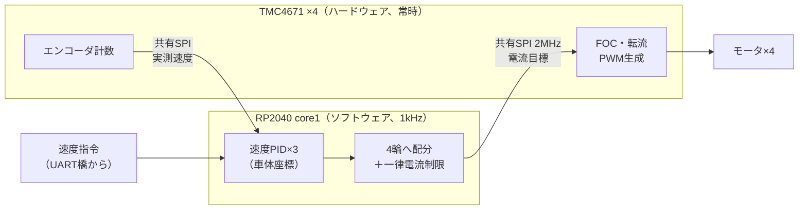

## このページでできるようになること

- 起動時セルフテスト（開ループ1回転→エンコーダ検証→失敗なら停止）の流れと意図を説明できる
- 1kHzの制御ループの中身（PID・移動平均・4輪への配分・電流制限）を順に追える
- floatではなく固定小数点を選ぶ理由と、「FOCはハードICに任せる」カスケード構造を説明できる
- `with_timeout`で`ticker.next()`を包む「lost wakeup」検出を、自分のコードに応用できる

## 先に結論

モータ基板の心臓部は`odometry.rs`のmotors_taskです。RP2040の**2つ目のコア（core1)を専有する専用executor**に載り、1kHzのTickerで回り続けます。起動時にはいきなり走らず、各モータを開ループでちょうど1回転させてエンコーダの数を検証し、失敗したモータがあれば**全モータを安全停止して二度と動かしません**。本番ループでは、車体座標の速度PID×3（I16F16固定小数点）→4輪への配分→**どれかが電流上限を超えるなら4輪一律に縮める**（進行方向を保つため）→モータドライバIC TMC4671へSPIで電流目標を渡す、を毎ミリ秒繰り返します。ループの足元では、`with_timeout`が「1周期以内に起こされなかった」ことを検知し、ログは満杯なら捨てる`try_send`で制御を絶対に止めません。第9部で学んだ部品が、そのまま実戦の1kHzを支えています。

## 身近なたとえ

旅客機のパイロット（motors_task）を想像してください。離陸前には必ず点検走行があり、計器が1つでも狂っていれば**その日は飛ばない**と決まっています。飛行中は1秒に1000回、計器を読み→操縦桿を微調整、を繰り返します。エンジンの燃料噴射そのもの（超高速の制御）はエンジン制御装置（TMC4671）に任せ、パイロットは「どれくらいの推力が欲しいか」だけを伝えます。飛行記録はレコーダに書きますが、**記録が追いつかないからといって操縦は止めません**。

たとえと違うのは、taskは判断に疲れも直感もなく、1kHzの1周期＝1msの中で毎回同じ計算を最後まで終える必要があることです。この「毎回、締切内に終える」がリアルタイム制御の本体で、このページで読む工夫のほとんどはそのためにあります。

## 置き場所 — core1を専有する

モータ基板の`main.rs`は、メイン基板と同じ「static＋spawnリスト」構造ですが、executorが3つあります。

| executor | 載っているtask | 狙い |
|---|---|---|
| core1の専用executor | motors_taskのみ | 1kHz制御ループを他の仕事から隔離 |
| InterruptExecutor（高優先） | kicker_task | キッカー（次ページ）の応答性 |
| core0のスレッドexecutor | UART橋・設定・WDT・USBログ | その他すべて |

```rust
// 抜粋: luhsoccer_firmware motorcontroller/src/main.rs（MIT）
spawn_core1(
    p.CORE1,
    unsafe { &mut *addr_of_mut!(CORE1_STACK) },
    move || {
        let executor = EXECUTOR_CORE1.init(Executor::new());
        executor.run(|spawner| {
            spawner.must_spawn(motors_task(/* SPIと4本のCS, */ &MOVEMENT_SETPOINT,
                &WHEEL_SPEEDS, &CONFIG, LOG_CHANNEL.sender()));
        })
    },
);
```

RP2040は2コアなので、「1kHzを邪魔しない」最も強い方法として**コアごと分ける**選択ができます。ESP32-C6は1コアなので同じ手は使えませんが、代わりに優先度の高いexecutorへ隔離するという同型の解があります。大事なのは手段ではなく「**締切のある仕事を、締切のない仕事から隔離する**」という原則です。なお通信はここでもObservable経由です。UART橋のtaskが`MOVEMENT_SETPOINT`に指令を書き、core1のmotors_taskがそれを読む——コアをまたいでも配線の作法は変わりません（だから`CriticalSectionRawMutex`が選ばれています）。

## 起動時セルフテスト — 飛ぶ前に計器を疑う

motors_taskは走り出す前に、4つのモータを並行して（`join4`で）初期化します。各モータの`init_encoder`が行うのは、実質的な**自己診断**です（出典: `motorcontroller/src/odometry.rs`）。

1. エンコーダのカウンタを0に合わせる（モータを磁気的に0位置へ吸着させ、静止を1kHzで128回連続確認してから0リセット）
2. 開ループ（エンコーダを使わない強制転流）で、**ちょうど機械角1回転**をゆっくり回す
3. エンコーダの計数値を読む。1回転は4000パルスのはずなので、誤差が**8パルス（1000分の2）** を超えたら失敗と判定する

```rust
// 抜粋: luhsoccer_firmware motorcontroller/src/odometry.rs（MIT）
let encoder = self.inner.decoder_count().await? as i16;
let abs_encoder = encoder.abs();
let error = abs_encoder.abs_diff(ENCODER_PPR_I);
if u32::from(error) > ENCODER_MARGINE {
    error!("encoder didn't move to expected position");
    return Err(tmc4671::nonblocking::Error::CalibrationValidation);
}
// 計数が負なら配線が逆 → 方向フラグを反転して以後は正しく数える
if encoder.signum() == -1 {
    info!("detected reverse encoder");
    self.direction = Direction::Negative;
    self.inner.set_decoder_direction(self.direction).await?;
}
```

このテストが同時に検出できる故障を数えてみると、感心します。エンコーダの断線（計数0）、ホイールのロック（回りきらない）、配線の逆接続（計数が負→**故障ではなく設定で吸収**）、エンコーダの仕様違い。そして1つでも失敗すれば`full_stop`——モータドライバを停止モードにし、PWMを惰性回転（フリーラン）に落として、**motors_taskはループに入らず終わります**。速度指令がどれだけ来ても動かない機体は、試合では敗因でも、暴走する機体よりずっとましです。「異常時にどう振る舞うか」を起動の段階で決めておくのは、第12部7ページの縮退運転の考え方そのものです。

## 1kHzループの中身 — 毎ミリ秒、この順番

セルフテストを通ると、`Ticker::every(Duration::from_hz(1000))`のループに入ります。1周期の仕事を順に並べます。

1. **PIDゲインを設定から読み直す**（毎周期。だから走行中にゲインを変えられる）
2. `setpoint.get()`で最新の速度指令を読む（Observableなので待たずに現在値）
3. 4つのモータの実測速度をSPIで読み、±256rad/sにクランプ
4. 4輪の速度から車体の速度（前後・左右・回転）を復元する。ここで3×4の定数行列（`Matrix3x4`、擬似逆行列）が登場
5. 復元した車体速度を**8サンプルの移動平均**（`HistoryBuffer<_, 8>`）でならす
6. 車体座標の**PID×3**（前後・左右・回転で独立）が、目標との差から「欲しい加速の強さ」を出す
7. それを4輪の電流目標に配分し、**電流制限**をかける（次節）
8. 4つのモータへSPIで電流目標を送る
9. `actual_speeds.set_if_different(...)`で実測をUART橋へ掲示（前ページの`Motor2Main::MotorVelocity`になってメイン基板へ帰る）
10. 4周期に1回、ログをChannelへ`try_send`
11. `ticker.next()`で次のミリ秒を待つ——ただし裸では待たない（後述）

読みどころを3つ拾います。

**固定小数点I16F16**。このループの数値はほぼすべて`I16F16`型（32ビットを整数部16・小数部16に割った固定小数点。第6部で触れた表現です）。RP2040のCortex-M0+はFPU（浮動小数点ユニット）を持たず、floatの計算はソフトウェアエミュレーションで数十〜数百サイクルかかります。固定小数点なら整数演算そのものなので**速く、実行時間が読める**——1msの締切がある世界ではこれが効きます。この事情はESP32-C6も同じで、C6のRISC-Vコア（RV32IMAC）にもFPUはありません。教材のtargetが`riscv32imac`である（Fが入っていない）ことに気づいていた人は鋭い。1kHz制御をC6で書くなら、fixedクレートの固定小数点は同じように第一候補になります。さらに彼らはホットパスの関数に`#[no_panic]`（panicしうるコードが混入したらコンパイルを落とす属性）を付け、「1msの中で絶対にpanicしない」を機械的に保証しています。

**移動平均**。エンコーダ由来の速度はノイズを含み、そのままPIDのD項（差分）に入れるとノイズが増幅されます。8サンプル（8ms分）の移動平均は、位相遅れを最小限にしつつ高周波ノイズを削る、実戦での定番の妥協点です。

**PIDは車体座標で3つ**。「モータごとに4つのPID」ではなく、「前後・左右・回転の3つのPID」を回してから4輪へ配分しています。制御したい量（ロボットがどう動くか）とアクチュエータ（4つのモータ）を分離する、見通しのよい構成です。

## 電流制限 — 4輪一律スケーリングが方向を守る

配分した4輪の電流目標は、そのままでは上限（電池とドライバの保護値）を超えることがあります。ここでの制限のかけ方が秀逸です。

```rust
// 抜粋: luhsoccer_firmware motorcontroller/src/odometry.rs（MIT）
let max_current = currents.iter().map(|v| v.raw().abs()).max().unwrap_or(I16F16!(0));
let scaling = (max_current / config.motor_current_limit.get()).max(I16F16!(1));

self.motors.0.regulate(currents[0] / scaling, motor_speeds[0]).await // 4輪すべて同じscalingで割る
```

どれか1輪でも上限を超えるなら、**4輪すべてを同じ倍率で縮めます**。超えた輪だけを個別に頭打ち（クリップ）してはいけません。4輪の電流の**比率**こそが進行方向を決めているからです。1輪だけ削ると比率が崩れ、「全力で左前へ」のつもりが明後日の方向へ滑ります。一律スケーリングなら、出せる力は減っても**方向は指令のまま**。「性能は落としてよいが、意味は変えない」——縮退の設計として覚えておく価値のある一手です。

## カスケード構造 — FOCはハードICに任せる

このループが1kHzで済んでいるのは、モータ制御の最下層を**TMC4671という専用IC**（モータ1つに1個、計4個）に委ねているからです。



FOC（Field Oriented Control、磁界方向制御）はブラシレスモータの各相の電流をロータの角度に同期させて流す制御で、本来は数十kHzの計算を要求します。それをICに任せ、ソフトウェアは「電流（トルク）をどれだけ欲しいか」を1kHzで告げるだけ。**速いループは下の層へ、賢いループは上の層へ**というカスケード（多段）構造です。4個のICは1本のSPIバスを共有し、embassy-embedded-halの`SpiDevice`（第8部8ページで学んだ共有バスの部品）とCSピン4本で行儀よく相乗りしています。

## lost wakeup検出 — 「遅れたこと」に気づくループ

ループの末尾、`ticker.next()`の待ち方が第9部10ページの実戦版です。

```rust
// 抜粋: luhsoccer_firmware motorcontroller/src/odometry.rs（MIT）
if with_timeout(Duration::from_hz(u64::from(CONTROL_RATE)), ticker.next())
    .await
    .is_err()
{
    warn!("lost wakeup");
    ticker.reset();
}
```

Tickerは「毎ミリ秒起こしてくれる」約束ですが、executorが他の仕事で詰まっていれば起床は遅れます。制御ループにとって周期の乱れは制御品質の劣化そのものなのに、**裸の`ticker.next().await`は遅れたことを教えてくれません**。そこで待ち自体を`with_timeout`（1周期分）で包む。時間内に起こされなければ`Err`が返り、警告ログを出して`ticker.reset()`で周期を仕切り直します。異常を直せなくても、**まず観測できるようにする**——第9部10ページで「詰まりの検知」として学んだ発想が、そのまま1kHzの現場で使われています。

## ログは捨ててもよい — try_sendのバックプレッシャ

PID調整には波形データが要ります。しかしログ書き込みで制御ループを待たせては本末転倒です。彼らの答えは第9部10ページのバックプレッシャ設計そのものでした。

```rust
// 抜粋: luhsoccer_firmware motorcontroller/src/odometry.rs（MIT）
if pid_logger.try_send(loop_data).is_err() {
    error!("data logging channel full");
}
```

容量128の`Channel`へ、4周期に1回（250Hz）`try_send`。受け手のpid_logger_taskはcore0でUSB経由でPCへ流します。USBが遅くてChannelが満杯なら、**ログを捨てて制御を続けます**。目標値・実測・PID出力・積分項が届くので、PCでゲインを変え（ゲインは毎周期設定から読み直されるため反映は即座）、応答波形を見て追い込む——USBテレメトリによるライブ調整環境まで含めて「制御ループ」なのです。捨てられないデータ（速度指令）はObservableとキープアライブで確実に届け、捨ててよいデータ（ログ）はtry_sendで捨てる。**データの重要度が搬送方法を決める**好例です。

## よくある失敗

- **`Timer::after(1ms)`のループで周期を作る**: 処理時間の分だけ毎周期ずれが積もり、1kHzが990Hzになります。周期は`Ticker`で作り、遅れの検知は`with_timeout`で行うのがこのコードの型です（第9部6ページ）。
- **制御ループ内で`send().await`でログを送る**: Channelが満杯になった瞬間、制御ループがログの空きを待って止まります。締切のあるループの中では、ブロックしうる`.await`を1つずつ疑ってください。
- **電流制限を輪ごとのクリップで済ませる**: 上限は守れますが4輪の比率が崩れ、旋回や斜め移動が指令とずれます。「上限を守る」と「意味を守る」は別の要求です。

## 確認問題

1. 起動時セルフテストが「エンコーダの計数が負」を故障扱いしないのはなぜですか？

<details>
<summary>答え</summary>

計数が負になるのは配線・取り付けの向きが逆なだけで、情報としては完全だからです。方向フラグを反転して以後の読みを補正すれば正常に使えます。壊れているのではなく「向きが違う」だけのものは、止めずに吸収する——組み立てのばらつきをソフトが飲み込む設計です。

</details>

2. `with_timeout`に渡すタイムアウトが、ちょうど1周期（1ms）なのはなぜ妥当なのですか？

<details>
<summary>答え</summary>

`ticker.next()`は正常なら必ず1周期以内に完了するはずのFutureだからです。1周期を超えて待たされた時点で「起床が1回分遅れた（lost wakeup）」と断定でき、誤検知なく検出できます。

</details>

3. ESP32-C6で1kHzの制御ループを書くとき、このページから直接持ち帰れる要素を3つ挙げてください。

<details>
<summary>答え</summary>

例: (1) `Ticker`＋`with_timeout`による周期生成と遅れ検知、(2) FPUのないRV32IMACでの固定小数点（fixedクレート）演算、(3) ログはChannelに`try_send`して満杯なら捨てるバックプレッシャ設計。ほかに起動時セルフテスト、一律スケーリングによる制限、Observable的な最新値共有（Watch）も可。dual coreだけはC6にないため、優先度分離で代替します。

</details>

## まとめ

- motors_taskは「締切のある仕事」としてcore1に隔離され、起動時セルフテストに合格しない限り一切動かない。失敗時の答えは常に`full_stop`
- 1kHzループは固定小数点PID×3→4輪配分→**一律スケーリングの電流制限**→TMC4671へ、という構成。速いFOCはハードICに任せるカスケードで、1msの締切を守る
- `with_timeout`で包んだ`ticker.next()`が周期の乱れを観測し、ログは`try_send`で「捨ててでも制御を守る」。第9部10ページの道具立ての、そのままの実戦形

## 次のページ

モータの隣には、ボールを蹴るために**約230Vまで昇圧したコンデンサ**が載っています。高電圧を積んだロボットが「安全に蹴る・安全に蹴らない」をどう作り込んでいるか、キッカーの安全設計を読みます。

[9. 230Vを積んだロボットの安全設計](/embassy-esp32-c6/robot/09-kicker-safety/)

前のページ: [7. 基板間UARTプロトコル — postcard+COBS+CRC16](/embassy-esp32-c6/robot/07-uart-protocol/)
