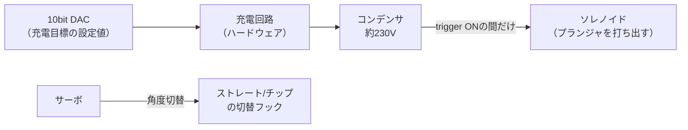

## このページでできるようになること

- 高電圧を扱うファームウェアの安全原則（発射条件の多重化、既定値を安全側に置く設計）を実コードで説明できる
- kicker_taskがInterruptExecutor（高優先の実行器）に置かれている理由を説明できる
- ヒステリシス付きの状態機械で電池電圧を監視する設計を読める

## 先に結論

このロボットは、ボールを蹴るために**コンデンサへ約230Vをためて、ソレノイド（電磁石の一種）に一気に流す**という物理を積んでいます。これは本物の危険物です。だからkicker_task（キッカーを担当するtask）は、「蹴れ」と言われても**ボールがセンサに触れているときしか発射しない**、**電圧0Vの指令は充電停止ではなく放電**、**発射後は2秒間なにもしない**、という安全条件を何重にも重ねています。さらに電池監視は6状態のヒステリシス付き状態機械で、Critical（危険域）に落ちたらロボットが自分で電源を切ります。安全は「気をつける」ではなく、**コードの構造として作り込む**ものだ、というのがこのページの主題です。

**警告: この教材はキッカー回路の製作手順を扱いません。** コンデンサにためた230Vは、電池を抜いた後でも回路内に残り続け、触れると感電して命に関わります。市販の開発ボードとLEDの世界とはまったく別の危険度です。読者のみなさんが真似してよいのは「安全をコードの構造にする考え方」だけで、高電圧回路そのものは、専門知識を持つ大人の指導と適切な設備なしに絶対に作らないでください。

## 身近なたとえ

昔の使い捨てカメラのフラッシュに似ています。フラッシュは小さな電池からコンデンサへ数百Vをため、一瞬で放電して光らせます。分解した人が電池を抜いた後のコンデンサに触れて感電する事故は有名で、「電源を切れば安全」が通用しない代表例です。

たとえと違うのは、カメラのフラッシュは人がボタンを押した瞬間に光るだけなのに対し、このロボットのキッカーは**無線で飛んでくる指令をソフトウェアが解釈して**発射する点です。人の指の代わりにコードが引き金を握っているので、コードの側に「撃ってよい条件」を厳密に書く責任が生まれます。

## キッカーの物理を1分で

出典はすべて [luhbots/luhsoccer_firmware](https://github.com/luhbots/luhsoccer_firmware)（MITライセンス）です。回路の流れはこうです。



- **充電**: RP2040にはDAC（Digital to Analog Converter、デジタル値を電圧に変える回路）がないため、PIOで作った10bitの並列DACが「何Vまで充電するか」の目標値を充電回路へ渡します。マイコンが高電圧を直接制御するのではなく、**ハードウェアの充電回路に目標値を伝えるだけ**です
- **発射**: `trigger`ピンをONにしている時間だけコンデンサからソレノイドへ電流が流れ、プランジャ（可動鉄芯）がボールを打ちます。ON時間がキック速度を決めます
- **切替**: サーボでフックを上下し、まっすぐ蹴る（ストレート）か、ボールを浮かせる（チップ）かを切り替えます

RoboCup SSLのルールでは、キック速度は最大6.5m/sに制限されています。時速23km超のゴルフボールが飛ぶ機械だと考えると、この設計の緊張感が伝わるはずです。

## 安全設計を読む

kicker_taskの本体は `motorcontroller/src/kicker.rs` にあります。5つの安全装置を順に見ます。

### 1. ボールがあるときしか発射しない

taskの中心はselect_biased!で5つのObservable（前ページまでに読んだ自作の同期プリミティブ）の変化を待つループです。発射直前に、こう書かれています。

```rust
// 抜粋: motorcontroller/src/kicker.rs
if (speed == 0 && raw_duration == Duration::MIN) || !has_ball.get() {
    continue;
}
```

速度指令が0なら発射しないのは当然として、重要なのは `!has_ball.get()` です。`has_ball`はドリブラー基板のIRライトバリア（赤外線の光を遮ったかでボールを検出するセンサ）から届く「ボールがいま目の前にある」という情報で、**これがtrueでない限り、どんな発射指令も無視されます**。空中に向かって蹴る、人の手に向かって蹴る、という事故をコードの構造で防いでいます。

### 2. 発射後は2秒間ロックアウト

```rust
// 抜粋: motorcontroller/src/kicker.rs
async fn kick(&mut self, time: Duration) {
    warn!("kicking!!!");
    self.trigger.set_high();
    Timer::after(time).await;
    self.trigger.set_low();
    // wait do be sure the plunger is back in its resting position. Making sure the plunger is
    // in its resting position is a hard requirement when using a servo to select chiping. When
    // The plunger is not in its resting position and the servo lowers down to select chiping,
    // the plunger destroys the hook or doesn't return to it's resting position.
    Timer::after_secs(2).await;
}
```

原文コメントを訳すと「プランジャが定位置に戻ったことを確実にするために待つ。チップ切替にサーボを使う場合、これは絶対条件である。**プランジャが定位置にないままサーボが下りてくると、プランジャがフックを破壊するか、定位置に戻れなくなる**」。連射させないための時間ではなく、**機構が壊れる具体的なシナリオ**から逆算された2秒です。`kick()`がasync関数なので、この2秒の間taskは自然に「次の指令を処理しない」状態になり、ロックアウトがコードの流れそのものとして実現されています。

### 3. 0V指令は「充電をやめる」ではなく「放電する」

```rust
// 抜粋: motorcontroller/src/kicker.rs
if voltage == Volt::new(0) {
    kicker.discharge();
} else {
    // ...充電処理...
}
```

`discharge()`はDACを0にし、充電回路を止め、トリガも下ろします。「0V」という指令に**能動的にエネルギーを捨てる**意味を持たせているのがポイントです。もし「0V=充電しないだけ」だったら、コンデンサには230Vが残ったままロボットが停止し、回収しに近づいた人が危険にさらされます。

### 4. 充電はDACの設定値経由のみ、しかも校正付き

充電の指令は必ず`charge(value)`を通り、`value`は「230V時のDAC値」という設定値からの比例計算で決まります。

```rust
// 抜粋: motorcontroller/src/kicker.rs
let value_230v = config.kicker_cap_dac_230v.get();
```

抵抗の個体差で理論値とずれるため、実測した電圧から`kicker_cap_dac_230v`を補正するコマンド（`CalibrateCapVoltage`）まで用意されています。マイコンのコードは「何Vにしたいか」を言うだけで、実際の充電制御はハードウェアが行う——**ソフトのバグが暴走充電に直結しない**構造です。

### 5. 充電するかどうかは基地局が決める — ChargeHint

いつ充電し、いつ放電するかの大方針は、基板間UARTプロトコル（7ページ）のメッセージ`ChargeHint`で基地局側から届きます。

```rust
// 抜粋: motorcontroller/src/maincontroller.rs
Main2Motor::ChargeHint(hint) => {
    let voltage = match hint {
        KickerChargeHint::Charge | KickerChargeHint::DontCare => {
            config.kicker_charge_voltage.get()
        }
        KickerChargeHint::Discharge => Volt::new(0),
    };
    // ...
}
```

`KickerChargeHint`は`Charge`/`Discharge`/`DontCare`の3値です。試合が止まってロボットを回収するとき、人が近づく前に基地局から`Discharge`を送れば、各ロボットは安全装置3の経路でコンデンサを空にします。**「人がロボットに触る前に放電する」という運用手順が、プロトコルの型として存在している**わけです。

### なぜInterruptExecutorに置くのか

`motorcontroller/src/main.rs`を見ると、kicker_taskは通常のtaskと違う場所にspawnされています。

```rust
// 抜粋: motorcontroller/src/main.rs
let spawner = EXECUTOR_HIGH.start(Interrupt::SWI_IRQ_0);
// ...
spawner.must_spawn(kicker_task(/* ... */));
```

`EXECUTOR_HIGH`はInterruptExecutor、つまり**割り込みの優先度で動く実行器**です。安全装置2で見たとおり、キック速度はトリガのON時間で決まります。もしkicker_taskが低優先の実行器にいたら、他のtaskの重い処理でトリガを下ろすタイミングが遅れ、意図より強いキックが出てしまう。**時間の正確さがそのまま安全性能である処理は、高優先の実行器に隔離する**——第8部・第9部で学んだ実行器の使い分けの、これが実戦の姿です。

## 電池も状態機械で守る

安全設計はキッカーだけではありません。メイン基板の`maincontroller/src/power.rs`では、電池電圧を6状態の状態機械で監視しています。

```rust
// 抜粋: maincontroller/src/power.rs
pub enum BatteryState {
    Usb,
    Critical,
    Low,
    Nominal,
    Full,
    Over,
}
```

各状態には電圧範囲が定義されていて、原文コメントに「範囲は状態の高速な切り替わりを防ぐために重なってよい（The ranges might overlap to prevent fast switching between states）」とあります。たとえば`Critical`は5.0〜19.4V、`Low`は19.2〜20.5V。**19.2〜19.4Vの重なりがヒステリシス**で、境界上で電圧がわずかに揺れても状態がパタパタと往復しません。第4部の状態機械と、ADC測定にヒステリシスを入れる考え方（第8部）の合わせ技です。

そして最重要の1行がこれです。

```rust
// 抜粋: maincontroller/src/power.rs
if state == BatteryState::Critical {
    warn!("Battery critically low");
    shutdown.signal(());
}
```

Criticalに落ちたら、電源管理taskへSignalを送り、**ロボットは自分で電源を切ります**。LiPo電池（リチウムポリマー電池）は過放電すると発火の危険があるため、「動き続けること」より「安全に死ぬこと」を選ぶ設計です。

## ハードの不具合と付き合うコードの現実

このファームウェアには、実プロジェクトならではの正直なコメントが残っています。同じ`power.rs`の電圧測定にはこうあります。

```rust
// 抜粋: maincontroller/src/power.rs
// ignore this for now because the PCB designer did a bad job and made the opamp positive
// feedback
```

訳すと「基板設計者がオペアンプを正帰還にしてしまったので、これは当面無視する」。また`kicker.rs`の充電処理には、一度DACを0にしてから設定し直す処理に「This is a hotfix.（これは応急処置だ。本来は電圧変更コマンドがなくても定期的・自動的に行われるべきだ）」というコメントが付いています。世界大会に出るロボットでも、基板の設計ミスをソフトで回避し、応急処置と正直に書き残しながら戦っている——**完璧なハードウェアを前提にしないこと、そして妥協をコメントで記録すること**も、安全設計の一部です。

## よくある誤解

- **「ソフトで守っているから安全」**: 逆です。ソフトの安全条件は何層もある防御の一部にすぎず、放電抵抗などの回路設計、SSLルールの速度制限、人が近づく前に放電する運用が重なって初めて安全になります。ソフトは「最後の層のひとつ」であって、感電対策そのものは回路と運用の仕事です
- **「2秒のロックアウトは性能のムダ」**: このコードの2秒は「プランジャがフックを壊す」という具体的な故障シナリオから来ています。安全のための待ち時間には必ず物理的な理由があり、理由ごとコメントに書くから、後の人が安易に削れなくなります
- **「0V指令なんてわざわざ実装しなくても、充電をやめれば同じ」**: 充電をやめてもコンデンサの電荷は長時間残ります。「止める」と「捨てる」は別の操作で、危険なエネルギーには「捨てる」経路が必須です

## 確認問題

1. kicker_taskは発射指令を受け取っても発射しないことがあります。コード上の条件を2つ挙げてください。

<details>
<summary>答え</summary>

`speed == 0 && raw_duration == Duration::MIN`（発射の強さの指令がない）のとき、そして`!has_ball.get()`（ライトバリアがボールを検出していない）のときです。特に後者は、どんな指令が来ても物理的にボールが目の前になければ発射しない、という安全条件です。

</details>

2. `BatteryState`の電圧範囲がわざと重ねてあるのはなぜですか。

<details>
<summary>答え</summary>

ヒステリシスのためです。境界ちょうどの電圧で測定値がわずかに揺れると、範囲が重なっていない場合は状態が高速に往復してしまいます。重なり（例: Critical上端19.4VとLow下端19.2V）があると、一度Lowに上がった後は19.2Vを下回るまでCriticalに戻らず、状態が安定します。

</details>

3. kicker_taskがInterruptExecutorに置かれている理由を「キック速度」という言葉を使って説明してください。

<details>
<summary>答え</summary>

キック速度はトリガピンをONにしている時間で決まります。低優先の実行器では他のtaskの処理でトリガを下ろすのが遅れ、意図より強いキックになる可能性があります。時間精度が安全性能に直結するため、割り込み優先度で動くInterruptExecutorに隔離しています。

</details>

## まとめ

- 発射には「指令がある」だけでなく「ボールがそこにある」ことが必要で、0V指令は放電、発射後は2秒ロックアウト——安全条件はコードの構造として多重化されている
- 充電はDAC設定値経由のみ・方針は基地局のChargeHint（Charge/Discharge/DontCare）で決まり、人が近づく前に放電できる
- 電池は6状態のヒステリシス状態機械で監視され、Criticalではロボットが自分で電源を切る。ハードの不具合への応急処置も正直にコメントに残されている

## 次のページ

キッカーの安全装置は、実はロボット全体に張り巡らされた「止める仕組み」の一部にすぎません。次のページでは、無線からWatchdogまで**7層のフェイルセーフ**を1枚の表にまとめて読み解きます。

[10. 多層フェイルセーフ — 止まれることが強さ](/embassy-esp32-c6/robot/10-failsafe/)

---

前のページ: [8. 1kHzの制御ループ — モータ基板を読む](/embassy-esp32-c6/robot/08-motion/)
