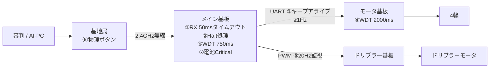

## このページでできるようになること

- 1台のロボットに仕込まれた7層のフェイルセーフを、層ごとに「何を見張り、何をするか」で説明できる
- 無条件給餌のWatchdogが「何を検出でき、何を検出できないか」を正確に言える
- panic後に「エラー報告だけをする縮退アプリ」として起動し直す設計を説明できる

## 先に結論

RoboCup SSL（小型ロボットリーグ）のルールには「Halt（停止）命令から2秒以内に全ロボットが止まること」とあります。金属とモータの塊が高速で走り回り、最大6.5m/sでボールを蹴るフィールドでは、**確実に止まれることがルール上の義務であり、チームの強さ**です。luhsoccer_firmwareを通しで読むと、「止める仕組み」が少なくとも7層あることが分かります。無線が50ms途切れたら止まる。審判がHaltと言えば止まる。基板間の通信が守られなくても止まる。ソフトが固まっても止まる。信号線が死んでも止まる。人がボタンを押せば止まる。電池が減りすぎたら自分で電源を切る。どれか1層が壊れても、別の層が受け止める——この**多層防御**が本ページの主題です。さらにpanic（回復不能なエラー）への備えとして、「次回起動時はエラー報告だけをする縮退アプリになる」という徹底ぶりまで見ます。

## 身近なたとえ

エレベーターに似ています。エレベーターにはブレーキが何系統もあり、ロープが切れても非常止めが効き、停電してもかごは落ちず、扉が開いていれば動きません。どれか1つの安全装置が壊れても事故にならないよう、**独立した仕組みを重ねる**のが安全設計の定石です。

たとえと違うのは、エレベーターの安全装置の多くが純粋な機械式なのに対し、ロボットの7層の大半はソフトウェアで実装されている点です。ソフトの層は「そのソフト自身が固まったら効かない」という弱点を持つので、最後にハードウェアのWatchdog（番犬タイマー）と物理ボタンが控えています。

## 7層を1枚の表に

出典はすべて [luhbots/luhsoccer_firmware](https://github.com/luhbots/luhsoccer_firmware)（MITライセンス）です。

| 層 | 見張るもの | 発動条件 | 動作 | 実装場所 |
|---|---|---|---|---|
| ① 無線RXタイムアウト | 基地局からの電波 | 受信が50ms途絶える | 速度・キック・ドリブラーを全ゼロ、`NO_RF_CONNECTION`セット | maincontroller/src/rf.rs |
| ② GameState::Halt | 審判の停止命令 | Haltを受信 | 速度・キック・ドリブラーを全ゼロ | maincontroller/src/rf.rs |
| ③ UARTキープアライブ | メイン→モータ基板の指令 | 値に変化がなくても最低1Hzで再送 | モータ基板が常に最新指令を持つ（途絶を検出できる） | maincontroller/src/motorcontroller.rs |
| ④ HW Watchdog | executor（実行器）の生死 | 給餌がmain 750ms / motor 2000ms途絶える | チップをハードウェアリセット | 両基板のwatchdog.rs |
| ⑤ ドリブラーPWM監視 | メイン→ドリブラー基板の信号線 | PWMが20Hz未満に落ちる | ドリブラーモータ停止 | dribblercontroller/src/servo.rs |
| ⑥ 物理非常停止ボタン | 人間の判断 | 基地局のボタン押下 | 全ロボットへ停止 | basestation（ATSAM4E側） |
| ⑦ 電池Critical | 電池電圧 | ヒステリシス状態機械がCriticalへ | ロボットが自分で電源断 | maincontroller/src/power.rs |

信号の流れの上に重ねると、各層が**別々の区間**を守っていることが見えます。



無線区間が死ねば①、その先のUARTが死ねば③＋モータ基板側の対応、PWM線が抜ければ⑤、ソフト全体が固まれば④、と**どの区間の故障にも担当の層がいる**構図です。

## 各層をコードで確認する

### ① 電波が50ms途切れたら止まる

```rust
// 抜粋: maincontroller/src/rf.rs
if irq.is_set(IrqBit::RxTxTimeout) {
    warn!("timeout while receiving packet");
    command_velocity.set(LocalVelocity {
        forward: 0,
        left: 0,
        counterclockwise: 0,
    });
    command_kick_speed.set(crate::KickSpeed::Velocity(0));
    dribbler_speed.set(0);
    sky_outer = Some(sky.into_sleep_mode2());
    no_connection.set(true);
    continue;
}
```

無線チップSX1280の受信タイムアウトは50msに設定されています（4ページ）。届かなくなった瞬間、rf_taskは自分の判断で速度・キック・ドリブラーのObservableをゼロにします。「最後に受け取った指令で走り続ける」ことを許さない設計です。

### ② 審判のHaltは問答無用

```rust
// 抜粋: maincontroller/src/rf.rs
GameState::Halt => {
    let halt = async {
        command_kick_speed.set(crate::KickSpeed::Velocity(0));
        command_velocity.set(LocalVelocity {
            forward: 0,
            left: 0,
            counterclockwise: 0,
        });
    };
    if with_timeout(Duration::from_millis(5), halt).await.is_err() {
        error!("timeout sending HALT to motorcontroller");
    }
    command_dribbler_speed.set(0);
}
```

パケットに含まれる`GameState`がHaltなら、パケットの他の内容（速度指令など）に関係なく全ゼロです。しかもゼロ化の処理自体に5msのタイムアウトを付けて、万一詰まってもエラーログが出るようにしています。SSLルールの「Halt後2秒以内に停止」という要求が、この分岐の存在理由です。**ルール（外部要求）がコードの形を決めている**、設計のよい見本です。

### ③ 変化がなくても送り続ける — キープアライブ

メイン基板からモータ基板への指令は、Observableの変化があったときに送るのが基本ですが、**変化がなくても最低1Hzで再送**されます。

```rust
// 抜粋: maincontroller/src/motorcontroller.rs
const MAX_TIME_BETWEEN_SENDS: Duration = Duration::from_hz(1);
// ...
let value = (with_timeout(MAX_TIME_BETWEEN_SENDS, velocity_sub.next_value()).await)
    .unwrap_or_else(|_| command_velocity.get());
```

`with_timeout`で「変化を待つ」を包み、1秒待って変化がなければ現在値をそのまま送る。この定期送信があるから、モータ基板側は「一定時間何も届かない＝上流が死んだ」と判定できます。速度・ボール有無・キックの3系統がjoin3で並行にこれをやっています（この構造は次ページで詳しく見ます）。

### ④ Watchdogの正直な限界

```rust
// 抜粋: maincontroller/src/watchdog.rs（モータ基板は2000ms/500ms）
watchdog.start(Duration::from_millis(750));

loop {
    Timer::after(Duration::from_millis(500)).await;
    watchdog.feed();
}
```

メイン基板は750ms、モータ基板は2000msでハードウェアWatchdogを起動し、専用taskが500msごとに給餌（feed）します。ここで[第6部10ページ](/embassy-esp32-c6/part06/10-watchdog/)の議論を思い出してください——**無条件に給餌するWatchdogは、アプリの健全性を検出しません**。このtaskは他のtaskが正しい値を計算しているかを一切見ずに餌をやり続けます。検出できるのは「executorが完全に固まって、この単純なtaskすら回らなくなった」ときだけです。教材で「タイマー割り込みからの無条件給餌はWDTを骨抜きにする」と学びましたが、実戦のコードもまさにこの割り切りをしています。彼らにとってWDTは**executor凍結の検出器**であり、アプリのロジック異常は①〜③の層が受け持つ、という分担です。

### ⑤ 信号線そのものを疑う

ドリブラー基板は、メイン基板からRCサーボ式PWM（パルス幅で値を伝える方式）で速度指令を受けます。その受信コードは、パルスの来る頻度を監視しています。

```rust
// 抜粋: dribblercontroller/src/servo.rs
// minimum frequency of the signal. If the frequency signal falls below this it is
// considered disconnected and the motor is stopped.
const MIN_RATE: Duration = Duration::from_hz(20);
```

原文コメントのとおり、PWMが20Hz未満になったら「線が抜けた」とみなしてモータを止めます。ケーブルの断線・コネクタの抜けという**物理故障**まで、受信側の設計でカバーしているわけです。

### ⑥⑦ 人間とエネルギー源

⑥の物理非常停止ボタンは基地局（RTICで書かれたATSAM4E基板、3ページ）にあり、ソフトの状態にかかわらず人間が全ロボットを止められます。⑦の電池Criticalでの自己シャットダウンは前ページで読んだとおりです。走行の安全とは別に、LiPo電池の過放電=発火リスクを断つ層です。

## panicしたら「報告だけする別のアプリ」になる

7層で止まった後、原因調査のための仕掛けがもう一段あります。モータ基板のpanic経路です（`motorcontroller/src/panic.rs`）。

1. panicが起きると、panicハンドラがメッセージを**リセットで消えないRAM領域に保存**し（panic-persistクレート）、Watchdogで自分をリセットします
2. 次回起動時、`main()`の最初でそのRAM領域を確認します

```rust
// 抜粋: motorcontroller/src/main.rs
if let Some(buf) = get_panic_message_bytes() {
    let executor = EXECUTOR_LOW.init(Executor::new());
    executor.run(|spawner| spawner.must_spawn(panic_main(spawner, p, buf)));
}
```

panicメッセージが残っていたら、モータもキッカーも無線も**一切起動しません**。代わりに`panic_main`という「USBシリアルでpanicメッセージを1秒ごとに送信し続けるだけのアプリ」として立ち上がります。[第12部7ページ](/embassy-esp32-c6/part12/07-error-recovery/)で学んだ縮退運転の、これは極端な形です——できる仕事を「事故報告」1つまで絞り、原因が分かるまで危険な機能を二度と動かさない。ケーブルをつなげばエラーメッセージが読める、現場で本当に助かる設計です。

なおキッカーの重要関数には`#[no_panic]`属性（panicする可能性のあるコードが混入するとコンパイルエラーにするクレート）が付いていて、**そもそもpanicさせない**努力と、**panicしても安全に倒れる**準備の両輪になっています。

## 第12部7ページとの対比 — 「動き続ける」と「止まる」

同じ「フェイルセーフ」でも、教材の最終プロジェクト（無線ボタン端末）とは方向が逆です。

| | 最終プロジェクト（第12部7） | luhsoccer_firmware |
|---|---|---|
| 機器の性質 | 測定・通知端末。止まっても物は壊れない | モータと高電圧を積んで走り蹴る。動き続ける方が危険 |
| 異常時の目標 | **機能を絞って動き続ける**（縮退運転・ハートビート継続） | **とにかく安全に止まる**（全ゼロ・電源断） |
| リトライ | 再送3回＋タイムアウトで粘る | 粘らない。50ms届かなければ即ゼロ |
| 回復 | ACK検出で自動復帰 | 電波・Haltが正常化すれば次の指令で自然に再開。panic後は人間が調査するまで縮退のまま |
| 共通する原則 | 異常の「入る条件」と「出る条件」を対で設計する。異常を隠さず表示する（LED / USB報告） | |

フェイルセーフの正解は機器によって違います。**「この機械にとって安全な状態はどこか」を先に決め、そこへ落ちる経路を何層も用意する**——これが両者に共通する本質です。

## よくある誤解

- **「Watchdogがあるからソフトのバグは大丈夫」**: このファームのWDT給餌は無条件なので、検出できるのはexecutorの完全凍結だけです。「計算を間違え続けるが動いてはいる」バグはWDTを素通りします。だから①〜③のような、意味のレベルで見張る層が別に必要なのです
- **「7層は過剰。どうせ①だけでほぼ守れる」**: 各層は守る区間が違います。①は無線区間しか見ていないので、UARTケーブルの断線は③と⑤の担当、ソフト凍結は④の担当です。層を削ると、その区間の故障だけが素通りになります
- **「panicはバグなのだから、ユーザに見せず即再起動して隠すべき」**: 隠すと同じpanicで再起動を無限に繰り返し、しかも原因が永遠に分かりません。このファームは逆に、panic後は危険機能を全部止めてメッセージ報告に専念します。異常は隠さず、安全に見せるものです

## 確認問題

1. 無線RXタイムアウト（①）とUARTキープアライブ（③）は、それぞれどの区間の故障を守っていますか。

<details>
<summary>答え</summary>

①は基地局→メイン基板の無線区間です。50ms受信が途絶えるとメイン基板が指令を全ゼロにします。③はメイン基板→モータ基板のUART区間です。変化がなくても最低1Hzで再送することで、モータ基板側が「届かなくなった＝上流の異常」を検出できるようにしています。

</details>

2. このファームのWatchdog taskが検出**できない**異常の例を1つ挙げ、その異常をどの層が受け持つか答えてください。

<details>
<summary>答え</summary>

例: rf_taskが論理バグで間違った速度を流し続ける、あるいは特定のtaskだけがデッドロックする場合。給餌taskは他のtaskの状態を見ずに500msごとに餌をやるので、executor全体が凍結しない限りWDTは発動しません。こうした「意味のレベルの異常」は、①のタイムアウトや②のHalt、⑥の人間のボタンなど他の層が受け持ちます。

</details>

3. panic後の再起動で通常アプリを起動しないのはなぜですか。

<details>
<summary>答え</summary>

panicの原因が分からないまま通常アプリを起動すると、同じpanicと再起動を繰り返す上に、230Vのキッカーやモータという危険な機能を異常原因を抱えたまま動かすことになるからです。代わりにUSBでpanicメッセージを報告するだけの縮退アプリとして起動し、人間が原因を調査できるようにしています。

</details>

## まとめ

- 「止める仕組み」は7層。無線タイムアウト・Halt・UARTキープアライブ・HW Watchdog・PWM監視・物理ボタン・電池自己遮断が、それぞれ**別の区間・別の故障**を守る
- 無条件給餌のWDTはexecutor凍結の検出器であって、アプリ健全性の検出器ではない——第6部10の議論そのままの割り切りが実戦でも行われている
- panic後はエラー報告専用の縮退アプリとして起動する。「動き続ける」機器と「止まる」機器でフェイルセーフの正解は逆になるが、安全状態を先に決めて多層で落とす原則は共通

## 次のページ

止まる仕組みを何層も足せたのは、この設計が「taskを足すこと」に強いからです。次のページでは、ユーザ視点でいちばん重要な問い——**なぜasyncだと機能追加が楽なのか**——を、このファームの実例4つで検証します。

[11. アプリ追加=task追加 — asyncが効く理由](/embassy-esp32-c6/robot/11-extensibility/)

---

前のページ: [9. 230Vを積んだロボットの安全設計](/embassy-esp32-c6/robot/09-kicker-safety/)
