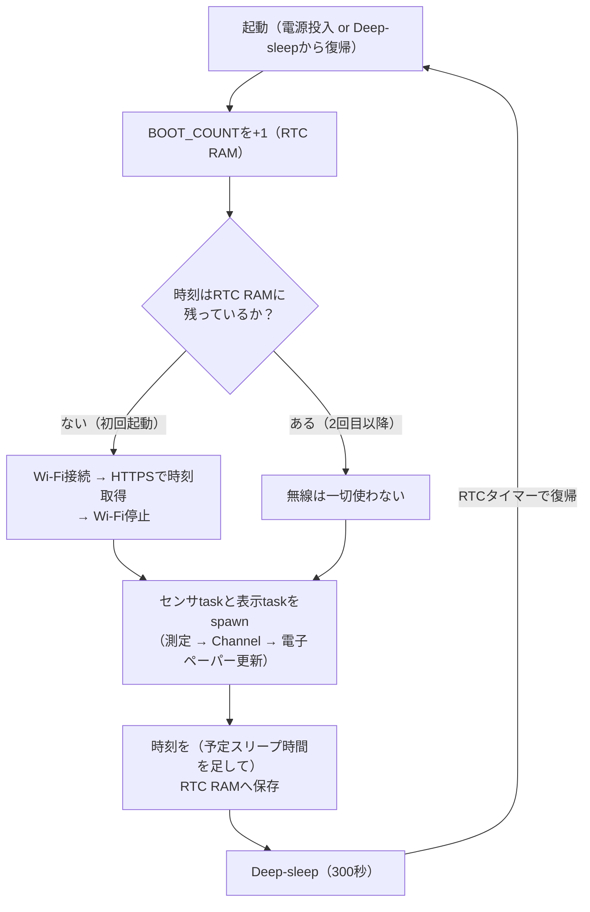

## このページでできるようになること

- この応用編の題材（esp32c3-embassy気象ステーション）の概要と、教材との関係を説明できる
- 「キーボードを作る視点」との違い（入力デバイス vs テレメトリ、BLE vs Wi-Fi、常時給電 vs 電池）を説明できる
- 電池駆動センサ端末の基本形「デューティサイクル」（起動→計測→保存→sleep）の全体像を図で説明できる

## 先に結論

2つ目の応用編では、**電池で動く測定端末（センサノード）**を読み解きます。題材はClaudio Mattera氏の**esp32c3-embassy**——BME280センサで温度・湿度・気圧を測り、電子ペーパーに表示する、ESP32-C3用のEmbassy製気象ステーションです。READMEが「主に参照・例・出発点として意図している（mostly meant as a reference / example / starting point）」と明言している、**読まれるために作り込まれた**プロジェクトで、今もメンテナンスが続いています。ライセンスは**MIT OR Apache-2.0**なので、出典を明記すればコードを引用・移植できます。しかも使っているクレートの世代が**本教材とほぼ同じ**です。私たちはこのプロジェクトの核心部分をESP32-C6へ翻訳し、cargo check済みのexamples/16-sensor-nodeとして用意しました。この前半5ページでは、公開ドライバクレートの使い方、Deep-sleepを生き残るRTC RAM、そして平均電流を桁で下げるデューティサイクル設計を学びます。

## 身近なたとえ

キーボード応用編が「ベテランの運転を助手席から観察する路上教習」だったとすれば、今回は**山小屋の百葉箱**を見学するようなものです。百葉箱は誰も見ていない場所で、毎日決まった時刻に気温を記録し続けます。派手さはありませんが、「電気も人手も限られた場所で、確実に測り続ける」ための工夫が詰まっています。

たとえと違うのは、私たちの百葉箱は自分で眠り、自分で起きる点です。測定の合間はチップの電源の大部分を自分で切り（Deep-sleep）、時間が来たら自分で目を覚まして測定を再開します。この「眠りの設計」こそが今回の主役です。

## 題材の紹介

- **リポジトリ**: [claudiomattera/esp32c3-embassy](https://github.com/claudiomattera/esp32c3-embassy)（主リポジトリは[GitLab](https://gitlab.com/claudiomattera/esp32c3-embassy)）
- **ライセンス**: MIT OR Apache-2.0。キーボード応用編の題材と違ってライセンスが明記されているので、この応用編では**元のコードを出典付きでそのまま引用**できます
- **内容**: ESP32-C3で、BME280（I2C接続の温湿度気圧センサ）を読み、WaveShare 1.54インチ電子ペーパー（SPI接続）に表示する気象ステーション。測定データのアップロードはせず、Wi-Fi（とHTTPS）は**時刻合わせだけ**に使います
- **活動状況**: 現役メンテ中です。v0.8.0が2026年2月に出ています

このプロジェクトが教材として優れている理由は2つあります。

**1つ目は、作者自身が「読まれること」を目的にしていること。** READMEには「Rust + ESP32 + Embassyのエコシステムはまだ若く、全部を組み合わせて完全なアプリケーションにするのに苦労した。このプロジェクトが他の初心者の役に立てば」とあります。つまり、動けばよいコードではなく、**人に見せるための参照実装**です。

**2つ目は、クレートの世代が本教材とほぼ同一であること。** ネット上のESP32+Embassyのコードの多くは、esp-wifi 0.x時代やesp-hal 0.2x時代の「旧世代」で、そのままでは本教材の環境で動きません。ところがこのプロジェクトはv0.8.0（2026年2月）で最新世代へ移行済みです。

| | esp32c3-embassy v0.8.0 | 本教材 |
|---|---|---|
| esp-hal | 1.0.0（esp32c3, unstable） | ~1.1.0（esp32c6, unstable） |
| esp-rtos | 0.2.0 | 0.3.0 |
| esp-radio | 0.17.0（wifi） | 0.18.0 |
| embassy-executor / time | 0.9.1 / 0.5 | 0.10.0 / 0.5 |
| main関数 | `#[esp_rtos::main]` + `esp_rtos::start(...)` | 同じパターン |

しかもCHANGELOGには「esp-hal-embassyを削除」「esp-wifiをesp-radioに置き換え」「esp-rtosを追加」という**移行の記録**がバージョンごとに残っています。教材の第9部・第10部で使ってきた構成が、現実のプロジェクトではどういう歴史を経て今の形になったのか——CHANGELOG自体が生きた教材です。

## キーボード応用編との対比

この応用編は、[キーボードを作る視点](/embassy-esp32-c6/keyboard/01-intro/)と**対**になるように設計されています。同じEmbassyでも、作る物が違うと設計の重心がまったく変わります。

| 観点 | キーボード | センサ端末（今回） |
|---|---|---|
| 装置の役割 | 入力デバイス（人間→PC） | テレメトリ（環境→記録。テレメトリ=遠隔測定） |
| 無線 | BLE（HIDプロファイル） | Wi-Fi（HTTPSで時刻同期のみ） |
| 電源 | 常時給電が基本 | **電池**。平均電流が寿命を決める |
| 時間の単位 | ミリ秒（指の速さに追従） | 分（測定周期）。遅延はほぼ問題にならない |
| 最重要の資源 | 応答の速さ・取りこぼしゼロ | **平均電流**・眠りをまたぐデータ |
| 題材のチップ | RP2040（別メーカー、翻訳が必要） | ESP32-C3（同じespファミリ、翻訳はごく小さい） |
| ライセンス | 表記なし（転載不可、独自に書き直し） | MIT OR Apache-2.0（出典付きで引用可） |

キーボードでは「1msでも速く、1打も落とさない」ことに全力を注ぎました。センサ端末は逆で、「起きている時間を1秒でも短く」がすべてです。同じフレームワークの上で、正反対の最適化をする——2つの応用編を読み終えると、Embassyの設計の幅が体感できるはずです。

## デューティサイクルの全体像

このプロジェクトの心臓部は「デューティサイクル」です。デューティサイクルとは、**起きて仕事をする短い時間と、眠る長い時間を繰り返す**動かし方のことです。esp32c3-embassyの1周期はこう動きます。

[第12部2ページ](/embassy-esp32-c6/part12/02-deep-sleep/)で学んだとおり、Deep-sleepからの復帰は「先頭からやり直し」です。つまりこのプログラムは、**毎回mainの最初から実行される短命なプログラム**を、RTC RAMに残した少しのデータでつなぎ合わせて、1つの長寿命な測定端末に見せています。この構造を、前半5ページで内側から順に読み解きます。

## 教材各部との対応マップ

| センサ端末の部品・機能 | 教材の章 |
|---|---|
| I2Cでセンサを読む | [I2C基礎](/embassy-esp32-c6/part08/03-i2c-basics/)、[I2Cセンサを読む](/embassy-esp32-c6/part08/04-i2c-sensor/) |
| ドライバクレートとtraitの互換性 | [embedded-hal](/embassy-esp32-c6/part05/10-embedded-hal/) |
| task分割とChannel | [task — 仕事を分割する](/embassy-esp32-c6/part09/04-task/)、[Channel・Signal・Mutex](/embassy-esp32-c6/part09/09-channel-signal-mutex/) |
| Wi-Fi接続（STA）とHTTP | [Stationとして接続する](/embassy-esp32-c6/part10/02-station/)、[HTTP](/embassy-esp32-c6/part10/09-http/) |
| Deep-sleepと復帰要因 | [Deep Sleep](/embassy-esp32-c6/part12/02-deep-sleep/)、[Wake-upの設計](/embassy-esp32-c6/part12/03-wakeup/) |
| 消費電力の考え方 | [Light Sleep](/embassy-esp32-c6/part12/01-light-sleep/)、[消費電力の測り方](/embassy-esp32-c6/part12/04-power-measurement/) |
| センサ故障時の継続（劣化運転） | [エラーからの回復](/embassy-esp32-c6/part12/07-error-recovery/) |
| 電子ペーパー（SPI + DMA） | [SPI基礎](/embassy-esp32-c6/part08/06-spi-basics/)、[SPIデバイスを使う](/embassy-esp32-c6/part08/07-spi-device/) |

## この応用編の読み方

- 教材の対応するC6コードは**examples/16-sensor-node**（cargo check済み）です。BME280の測定、RTC RAMの履歴、Deep-sleepのサイクルという核心部分を、ESP32-C6向けに簡略化して1ファイルにまとめてあります。参照元のC3コードと見比べながら読みます
- 前半（このページ〜5ページ）は無線なしで完結します。**ドライバクレート → センサ測定 → RTC RAM → デューティサイクル設計**の順に、内側から外側へ進みます
- 後半（6ページ〜）で時計の維持、Wi-Fi、HTTPSといった「外の世界とつながる部分」へ進みます
- キーボード応用編と同じく、目的は「設計判断を読み取る」ことです。「なぜ2回目以降はWi-Fiを使わないのか」「なぜ履歴はRTC RAMなのか」と問いながら読んでください

## よくある誤解

- **「ESP32-C3の話だからC6には関係ない」** — C3もC6も同じespressifのRISC-Vチップで、esp-halの同じ世代でサポートされています。移植の差分は、featureとターゲット指定、ピン番号、クレートのマイナーバージョン程度です。RP2040からの翻訳が必要だったキーボード応用編より、はるかに「そのまま」持って来られます
- **「気象ステーションだから気象の話」** — 主役はBME280ではなく、**電池で長く動かすための構造**です。センサを土壌水分計に、出力をMQTT送信に置き換えても、デューティサイクルとRTC RAMの設計はそのまま使えます

## 確認問題

1. キーボードとセンサ端末で「最重要の資源」はそれぞれ何でしたか。
2. デューティサイクルの図で、2回目以降の起動でWi-Fiのステップが丸ごとスキップされるのはなぜですか（この時点では推測で構いません）。

答え

1. キーボードは応答の速さと入力の取りこぼしゼロ、センサ端末は平均電流（と、眠りをまたいで残すデータ）です。
2. Wi-Fiの用途が時刻合わせだけであり、時刻はRTC RAMに保存されてDeep-sleepを生き残るからです。時刻が既に手元にあるなら、消費電力の大きいWi-Fiを起動する理由がありません（詳しくは[5ページ](/embassy-esp32-c6/sensor-node/05-duty-cycle/)で扱います）。

## まとめ

- 題材はesp32c3-embassy。参照実装として意図的に作り込まれ、現役メンテ中で、クレート世代が本教材とほぼ同一。MIT OR Apache-2.0なので出典付きで引用できる
- キーボード（入力・BLE・常時給電）と正反対の設計重心（テレメトリ・Wi-Fi・電池）を持つ、対になる応用編
- 核心は「起動→計測→保存→sleep」のデューティサイクル。毎回先頭から実行される短命なプログラムを、RTC RAMのデータでつなぎ合わせる

## 次のページ

最初の設計判断は「センサのドライバを自分で書くか、クレートを使うか」です。第8部で自前で叩いたSHT30と、クレートに任せるBME280を正面から比べます。

[2. ドライバクレートを使うという選択](/embassy-esp32-c6/sensor-node/02-driver-crates/)

前のページ: [キーボード応用編 10. エコシステムと次の一歩](/embassy-esp32-c6/keyboard/10-ecosystem/)
