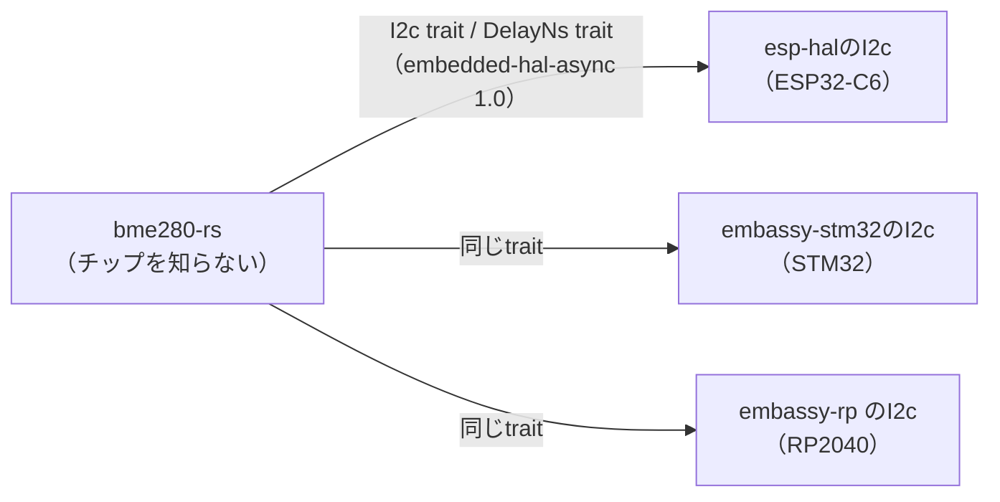

## このページでできるようになること

- 「センサを自前でレジスタ叩きする」場合と「公開ドライバクレートを使う」場合の利点・欠点を、実際のコードで比べて説明できる
- embedded-hal-async 1.0準拠のドライバが「esp-halでもほかのHALでもそのまま動く」理由を説明できる
- crates.ioでセンサドライバを探すとき、何を確認して選べばよいかが分かる

## 先に結論

第8部では、SHT30温湿度センサをデータシート片手に**自前で**叩きました。コマンドのバイト列を送り、生のバイト列を受け取り、変換式を自分で書く——仕組みが全部見える代わりに、全部自分の責任でした。esp32c3-embassyは逆の選択をしています。BME280の読み取りを**bme280-rs**という公開ドライバクレートに任せ、アプリ側は「温度・湿度・気圧のf32」だけを受け取ります。これが成り立つのは、bme280-rsが[第5部10ページ](/embassy-esp32-c6/part05/10-embedded-hal/)で学んだ**embedded-hal-async 1.0のtrait**にだけ依存して書かれているからです。esp-halのI2Cはこのtraitを実装しているので、ドライバはesp32c6を知らないまま、C6の上で動きます。この応用編のexamples/16-sensor-nodeも同じ選択をしました。両方のコードを並べて、選択の意味を確かめます。

## 身近なたとえ

自前のレジスタ叩きは「小麦粉からパンを焼く」、ドライバクレートは「パン屋でパンを買う」に似ています。自分で焼けば材料も工程も全部分かりますが、時間がかかり、失敗も自分持ちです。パン屋のパンはすぐ食べられますが、中の工程は見えません。

たとえと違うのは、ドライバクレートは**中身を見られる**ことです。crates.ioのクレートはソースコードが公開されていて、docs.rsやリポジトリでいつでも読めます。「買ったパンのレシピが必ず公開されている」パン屋だと思ってください。使うか読むかを選べるのが、オープンソースの利点です。

## 2つのコードを並べる

### 自前で叩く（第8部・examples/04-i2c）

SHT30から温湿度を1回読む部分を再掲します（これは抜粋です。完全なコードはexamples/04-i2cを見てください）。

```rust
// 単発測定コマンド 0x2C06（クロックストレッチ有効・高再現性）を送る
i2c.write_async(SHT30_ADDR, &[0x2C, 0x06]).await?;
// 測定完了を待つ（高再現性測定の最大所要時間は15ms。余裕を見て20ms）
Timer::after(Duration::from_millis(20)).await;

// 測定結果6バイト: [温度上位, 温度下位, 温度CRC, 湿度上位, 湿度下位, 湿度CRC]
let mut data = [0u8; 6];
i2c.read_async(SHT30_ADDR, &mut data).await?;
let raw_temp = u16::from_be_bytes([data[0], data[1]]);

// データシートの変換式: 温度[℃] = -45 + 175 × 生値 / 65535
let temp = -45.0 + 175.0 * (raw_temp as f32) / 65535.0;
```

コマンドの値、待ち時間、バイトの並び、変換式——すべてSHT30のデータシートから自分で拾ってきた知識です。

### クレートに任せる（examples/16-sensor-node）

同じ「温湿度（+気圧）を読む」が、bme280-rsクレートではこうなります（これは抜粋です。完全なコードはexamples/16-sensor-nodeを見てください）。

```rust
use bme280_rs::{AsyncBme280, Configuration, Oversampling, SensorMode};

let mut sensor = AsyncBme280::new(i2c, Delay);

// ソフトリセット＋キャリブレーション係数の読み出し
sensor.init().await?;

// 3項目ともオーバーサンプリング1倍・Normalモード（連続測定）に設定
sensor
    .set_sampling_configuration(
        Configuration::default()
            .with_temperature_oversampling(Oversampling::Oversample1)
            .with_pressure_oversampling(Oversampling::Oversample1)
            .with_humidity_oversampling(Oversampling::Oversample1)
            .with_sensor_mode(SensorMode::Normal),
    )
    .await?;

Timer::after(Duration::from_millis(10)).await;
let sample = sensor.read_sample().await?;  // 温度・湿度・気圧のf32が返る
```

レジスタ番号もバイト列も変換式も出てきません。設定は`with_...`をつなげる**ビルダー式**で、間違った値は型レベルで書けないようになっています。

### 決定的な差: 校正処理

「自前でもたいして変わらないのでは？」と思うかもしれません。SHT30なら実際そうでした。しかしBME280は違います。BME280の測定値は生のままでは使えず、**チップごとに工場で書き込まれた校正係数（temperatureで3個、pressureで9個、humidityで6個）を不揮発メモリから読み出し、データシートに載っている数十行の整数補正計算を通す**必要があります。この処理を自前で書くのは、書けなくはないが確実に骨が折れる作業です。

bme280-rsではこの全部が`init()`（係数の読み出し）と`read_sample()`（補正計算）の**内部**に隠れています。アプリケーションは物理量だけを受け取ります。ドライバクレートの価値が最も分かりやすく出る例です。

## なぜesp-halを知らないドライバがC6で動くのか

bme280-rsのソースコードには、esp-halもESP32も一度も出てきません。依存しているのは`embedded-hal-async`の`I2c` traitと`DelayNs` traitだけです。ドライバは「I2Cで読み書きできて、待てる何か」を型引数として受け取ります。



[第5部10ページ](/embassy-esp32-c6/part05/10-embedded-hal/)で「traitが接続の規格になる」と学びました。あれは理屈の話でしたが、ここでその実益が現れます。**esp32c3-embassyの作者がC3用に選んだドライバを、私たちはC6でコードを1文字も変えずに使えました**し、同じドライバはSTM32でもRP2040でも動きます。キーボード応用編で見た「チップ非依存の部分を見分ける」話の、ドライバ版です。

なお、bme280-rsの作者はesp32c3-embassyの作者本人です。「アプリを書いていてドライバがなかったので、汎用ドライバとして切り出して公開した」——エコシステムが育つ典型的な流れも見て取れます。

## それぞれの利点・欠点

| 観点 | 自前レジスタ叩き | ドライバクレート |
|---|---|---|
| 仕組みの見通し | コマンドから変換式まで全部見える | 内部はドライバ任せ（読もうと思えば読める） |
| 書く量・難度 | データシート読解と実装が全部自分持ち | 初期化と読み取りの数行 |
| 校正・補正処理 | 自分で実装（BME280ではかなり複雑） | ドライバ内部で完結 |
| 移植性 | 使ったHALのAPIに直接依存 | embedded-hal準拠なら他チップでもそのまま |
| 不具合時の調査 | 全部自分のコードなので追いやすい | ドライバの中まで読む必要が出ることがある |
| 継続性 | 自分がメンテナ | クレートのメンテが止まるリスクがある |

どちらが正解、ではありません。第8部で自前で叩いた経験があるからこそ、`init()`の裏で何が起きているか想像でき、ドライバがおかしいときに中を読んで調べられます。**一度は自前で叩き、実務ではクレートを使う**——この順番に意味があります。

## crates.ioでドライバを見極める

「センサ名 + driver + rust」で探すと、たいてい複数のクレートが見つかります。選ぶときの確認項目です。

1. **embedded-hal 1.0系か**: いちばん重要です。Cargo.toml（またはdocs.rsの依存関係）で`embedded-hal = "1"`を確認します。`0.2`系依存の古いドライバは、今のesp-halとはそのままつながりません
2. **async対応か**: `embedded-hal-async`に依存しているか、`async` featureがあるか。ブロッキング版しかないドライバも使えますが、Embassyのtaskの中で他の仕事を止めてしまいます
3. **メンテ状況**: 最終リリース日、リポジトリの最近のコミット、Issueへの反応。esp-halのように動きの速いエコシステムでは、放置されたクレートはすぐ時代遅れになります
4. **docs.rsの充実度**: 使用例付きのドキュメントがあるか。docs.rsのページはAPIだけ列挙されていて例がゼロ、というクレートは苦労します
5. **no_std対応とライセンス**: `#![no_std]`で使えるか。MIT/Apache-2.0系のライセンスか

bme280-rs（0.3系）はこの全部を満たします: embedded-hal 1.0系、`async` featureで`AsyncBme280`を提供、no_std、現役メンテ、docs.rsに使用例あり。examples/16のワークスペースでは次のように指定しています。

```toml
bme280-rs = { version = "0.3", default-features = false, features = ["async"] }
```

## よくある失敗

1. **embedded-hal 0.2系のドライバを混ぜてコンパイルエラー** — 同じ「embedded-hal」でも0.2と1.0はまったく別のtraitです。esp-halの今の世代は1.0を実装しているため、0.2用ドライバの`I2c`境界を満たせません。エラーメッセージにバージョンの違う同名traitが出てきたら、これを疑ってください
2. **ブロッキング版のドライバをasync taskで使って他のtaskが止まる** — 型としては動きますが、測定待ちの間`await`しないので、Executorがその間ほかのtaskを進められません。`Async...`型やasync featureの有無を確認しましょう
3. **スター数だけで選ぶ** — 人気があっても0.2時代のまま更新が止まったクレートは多くあります。人気よりも「今のtrait世代に追従しているか」が先です

## やってみよう

[docs.rs/bme280-rs](https://docs.rs/bme280-rs)を開き、`AsyncBme280`のページで(1)型引数が何か（どんなtrait境界が付いているか）、(2)`read_sample()`の戻り値の型、の2つを確認してください。次のページで読むexamples/16のコードが、そのまま答え合わせになります。

## 確認問題

1. bme280-rsのコードにesp-halが一度も出てこないのに、ESP32-C6で動くのはなぜですか。
2. SHT30は自前で叩けたのに、BME280でドライバクレートの価値が特に大きいのはなぜですか。
3. crates.ioでドライバを選ぶとき、スター数より先に確認すべきことを2つ挙げてください。

<details>
<summary>答え</summary>

1. bme280-rsはembedded-hal-async 1.0の`I2c`/`DelayNs` traitにだけ依存していて、esp-halのI2Cがそのtraitを実装しているからです。trait（接続の規格）を介しているので、ドライバは具体的なチップを知る必要がありません。
2. BME280はチップごとの校正係数を読み出して複雑な補正計算を通さないと使える値にならないからです。この処理がドライバの`init()`と`read_sample()`の内部に隠れています（SHT30の変換式は1行で済む単純さでした）。
3. （例）embedded-hal 1.0系に対応しているか、async対応か。ほかにメンテ状況、no_std対応、ライセンスも確認します。

</details>

## まとめ

- 自前レジスタ叩きは仕組みが全部見えるが全部自分持ち。ドライバクレートは物理量だけ受け取れるが中身はドライバ任せ。一度自前でやった経験が、クレートを「読める」力になる
- embedded-hal-async 1.0準拠のドライバはチップを知らない。だからC3用に選ばれたbme280-rsが、C6でもSTM32でも無修正で動く（第5部10の回収）
- ドライバ選びはtrait世代（1.0系か）→async対応→メンテ状況→docs.rs→no_std/ライセンスの順で確認する

## 次のページ

選んだドライバを実際に使います。examples/16-sensor-nodeのセンサ部分を、初期化から`Option<f32>`の取り出し、センサ故障時の「劣化運転」まで一行ずつ読みます。

[3. BME280を読む — examples/16の前半](/embassy-esp32-c6/sensor-node/03-sensor-c6/)

前のページ: [1. 電池で動く測定端末という応用](/embassy-esp32-c6/sensor-node/01-intro/)
