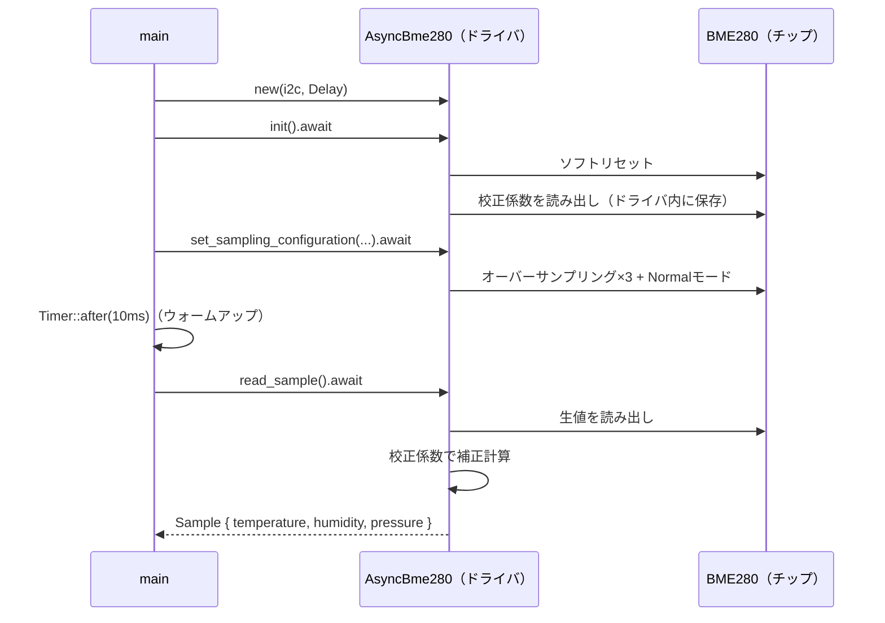

## このページでできるようになること

- `AsyncBme280`の初期化から測定までの流れ（new → init → 設定 → 待ち → read_sample）を説明できる
- `Sample`のフィールドが`Option<f32>`である理由を説明し、matchで安全に取り出せる
- センサが故障してもサイクルを止めない「劣化運転」の設計意図を説明できる
- BME280モジュールを配線し、I2Cアドレス0x76/0x77を見分けられる

## 先に結論

examples/16-sensor-nodeのセンサ部分は、`AsyncBme280::new(i2c, Delay)`で作り、`init()`でソフトリセットと校正係数の読み出しを行い、ビルダー式の`Configuration`でオーバーサンプリングと`SensorMode::Normal`を設定し、10ms待ってから`read_sample()`で読む——この5手です。返ってくる`Sample`の温度・湿度・気圧は**それぞれ`Option<f32>`**です。設定で無効化した項目は`None`になるからで、matchで取り出します。そして大事な設計判断がもう1つ。**センサが読めなくてもプログラムを止めず、NaN（非数）を記録してサイクルを続けます**。電池駆動の測定端末では、1回の測定失敗より「サイクルが止まって二度と眠らない・起きない」ことのほうがずっと深刻だからです。

## 身近なたとえ

毎朝の健康観察を思い浮かべてください。体温計が電池切れでも、健康観察カードの提出はやめず、体温欄に「—」と書いて出します。空欄の理由は後で分かればよく、提出のリズムを崩さないことが大切です。examples/16のNaNは、この「—」にあたります。

たとえと違うのは、マイコンには「後で先生が気づいてくれる」保証がないことです。だからログに`error!`で失敗の理由も残します。値の欄には「—」、連絡欄には理由——両方書くのがこのコードの流儀です。

## 全体の流れ

examples/16のセンサ部分は、`measure()`という1つの関数にまとまっています。



## コードを読む — measure関数

まずI2Cの準備です。第8部と同じGPIO6/GPIO7を使います（これは抜粋です。完全なコードはexamples/16-sensor-nodeを見てください）。

```rust
// I2C0を100kHzで初期化し、SDA=GPIO6 / SCL=GPIO7 を割り当てて非同期モードへ
let i2c_config = I2cConfig::default().with_frequency(Rate::from_khz(100));
let i2c = I2c::new(peripherals.I2C0, i2c_config)
    .expect("I2Cの設定が不正です")
    .with_sda(peripherals.GPIO6)
    .with_scl(peripherals.GPIO7)
    .into_async();

let mut sensor = AsyncBme280::new(i2c, Delay);
```

参照元のesp32c3-embassyは同じ箇所を**25kHz**で動かしています（「低速だが確実」という選択。esp32c3-embassy (Claudio Mattera, MIT OR Apache-2.0) src/main.rs より）。教材のexampleは第8部と条件をそろえるため標準の100kHzにしました。配線が長い・ノイズが多い環境では、参照元のようにクロックを落とすのは実用的な手です。

測定の本体はこうです。

```rust
/// BME280を初期化し、温度・湿度・気圧を1回測定する
async fn measure(sensor: &mut AsyncBme280<I2c<'static, Async>, Delay>) -> Result<Sample, I2cError> {
    // ソフトリセット＋キャリブレーション係数の読み出し
    sensor.init().await?;

    // 3項目ともオーバーサンプリング1倍・Normalモード（連続測定）に設定
    sensor
        .set_sampling_configuration(
            Configuration::default()
                .with_temperature_oversampling(Oversampling::Oversample1)
                .with_pressure_oversampling(Oversampling::Oversample1)
                .with_humidity_oversampling(Oversampling::Oversample1)
                .with_sensor_mode(SensorMode::Normal),
        )
        .await?;

    // 設定反映と最初の測定完了を待つ（ウォームアップ）
    Timer::after(Duration::from_millis(10)).await;

    sensor.read_sample().await
}
```

一行ずつ確認します。

- **`sensor.init().await?`** — ソフトリセットを送り、前ページで話した**校正係数をチップから読み出してドライバ内部に保存**します。以降の`read_sample()`はこの係数を使って補正計算をします。initを忘れると補正されていないでたらめな値が返るので、必ず最初に呼びます
- **`Oversampling::Oversample1`** — オーバーサンプリングとは、1回の測定値を出すためにチップ内部で複数回測って平均する機能です。回数を増やすとノイズが減る代わりに時間と電力を使います。ここでは最小の1倍。この設定を`Skipped`にした項目は**測定されなくなります**（これが後述のOptionの伏線です）
- **`SensorMode::Normal`** — チップが一定間隔で自動的に測定を繰り返すモードです。ほかに、1回測って眠る`Forced`モードもあります。実は「30秒ごとに1回しか読まない」examples/16の使い方には`Forced`のほうが理にかなうのですが、ここでは参照元（esp32c3-embassy src/sensor.rs）の設定をそのまま踏襲しました。マイコン側ごとDeep-sleepしてしまうため、実用上の差はわずかです
- **`Timer::after(Duration::from_millis(10))`** — 設定が反映され、Normalモード最初の測定が終わるまでの短い待ちです。参照元も同じ10msを「ウォームアップ」として入れています。待たずに読むと、まだ値がそろっていないことがあります
- **`sensor.read_sample().await`** — 生値の読み出しと補正計算をして`Sample`を返します

## SampleはなぜOption\<f32\>なのか

`read_sample()`が返す`Sample`は、次の形をしています。

```rust
pub struct Sample {
    pub temperature: Option<f32>, // ℃
    pub pressure: Option<f32>,    // Pa
    pub humidity: Option<f32>,    // %RH
}
```

なぜ素直な`f32`ではないのでしょうか。**オーバーサンプリング設定で`Skipped`にした項目は測定自体が行われない**からです。測定していない値を0.0や-273.0のような「それらしい数値」で返すと、本物の測定値と区別できません。[第3部で学んだ](/embassy-esp32-c6/part03/02-enum/)とおり、「値がないかもしれない」はRustではOptionで型にするのが流儀です。ドライバは「3項目全部設定したなら全部Someのはず」というアプリ側の事情を知らないので、正直にOptionで返します。

examples/16では、3項目とも設定しているので基本は全部Someです。それでもmatchで確かめてから使います。

```rust
match (sample.temperature, sample.humidity, sample.pressure) {
    (Some(t), Some(h), Some(p)) => {
        // 気圧はPa単位で返るので、なじみのあるhPaに直して表示
        info!("温度: {:.2} C / 湿度: {:.1} %RH / 気圧: {:.1} hPa", t, h, p / 100.0);
        t
    }
    (t, h, p) => {
        warn!("一部の測定値が取得できません: {:?} {:?} {:?}", t, h, p);
        // 温度だけでも取れていればそれを使う
        t.unwrap_or(f32::NAN)
    }
}
```

3つのOptionをタプルにして一度にmatchする書き方です。全部そろった腕と、そろわなかった腕の2つに分かれます。気圧は**Pa（パスカル）単位**で返るため、天気予報でおなじみのhPaにするには100で割ります（約1013hPa前後なら正常です）。

## 劣化運転 — 失敗してもサイクルを守る

`measure()`の呼び出し側は、エラーで`panic!`したり`loop {}`で止まったりしません。

```rust
let temperature_c: f32 = match measure(&mut sensor).await {
    Ok(sample) => { /* 上のmatchで温度を取り出す */ }
    Err(e) => {
        // センサ未接続・配線ミスなどでもサイクルは継続する（劣化運転）
        error!("BME280の測定に失敗: {:?}（プレースホルダ値で続行）", e);
        f32::NAN
    }
};
```

失敗したら**NaN**（Not a Number、非数。f32が持つ「数ではない」特別な値）を記録して先へ進みます。理由は端末の性格にあります。

- この端末の使命は「30秒ごとのサイクルを守り続けること」です。測定に失敗した回があっても、次の周期で復活できるかもしれません。ここで止まると、Deep-sleepにも入らず電池を消費し続け、履歴も二度と増えません
- NaNを選んだのは、**本物の測定値と絶対に混ざらない**からです。0.0を入れると「氷点の0.0℃」と区別できません。[第12部7ページ](/embassy-esp32-c6/part12/07-error-recovery/)で学んだ「エラーでも動き続ける設計」の実例です

参照元のesp32c3-embassyも同じ思想で、測定に失敗すると「ランダムなダミー値」を作って表示を続けます（esp32c3-embassy (Claudio Mattera, MIT OR Apache-2.0) src/sensor.rs より。`Sample::random(rng)`）。電子ペーパーの表示ではNaNよりそれらしい値のほうが画面のレイアウト確認に役立つ、という事情の違いで、「止めない」という判断は同じです。

## 配線

| BME280モジュール | 接続先 | 備考 |
|---|---|---|
| VCC | 3.3V | 5V専用モジュールでない限り3.3Vへ |
| GND | GND | |
| SDA | GPIO6 | 第8部と同じピン |
| SCL | GPIO7 | 第8部と同じピン |

多くのモジュールはI2Cのプルアップ抵抗を内蔵しています。ない場合は、SDA/SCLをそれぞれ10kΩで3.3Vへプルアップしてください。

**I2Cアドレスは2種類あります。** BME280はチップのSDOピンの接続で、GND接続なら**0x76**、VDD接続なら**0x77**になります。bme280-rsの既定値は0x76で、`AsyncBme280::new`はこれを使います。手元のモジュールが0x77の場合は`AsyncBme280::new_with_address(i2c, 0x77, Delay)`に変えてください。自分のモジュールがどちらか分からないときは、第8部で作ったI2Cバススキャン（examples/04-i2c）をつないで実行すれば一発で分かります——自前で叩いた道具が、クレートを使うときの診断ツールとして役立ちます。

## 実行方法

```bash
cd examples
cargo run --release -p sensor-node
```

期待される出力（1回の起動分）:

```text
INFO - リセット要因: （初回は電源投入を示す値）
INFO - 復帰要因: （初回は未定義系の値）
INFO - 起動回数: 1
INFO - 温度: 26.54 C / 湿度: 58.3 %RH / 気圧: 1009.8 hPa
INFO - 温度履歴（直近1件・古い順）:
INFO -   [0] 26.54 C
INFO - 3秒後に30秒間のディープスリープへ入ります…
（約30秒静かになり、また先頭から。起動回数と履歴が増えていく）
```

30秒ごとに起動回数が増え、履歴が伸びていけば成功です。この「増えていく」仕組み（RTC RAM）は次のページの主役です。

## よくある失敗

1. **`AcknowledgeCheckFailed`エラーが出る** — アドレス違い（0x76/0x77）か配線ミスが大半です。SDOピンの接続を確認し、examples/04-i2cのバススキャンでアドレスを特定してください
2. **温度が異常に高い（数℃上振れ）** — BME280は自己発熱します。マイコンの近くに密着させたり、Normalモードで高頻度測定を続けたりすると顕著です。基板から離す・測定頻度を下げると改善します
3. **`init()`を呼び忘れてでたらめな値が返る** — 校正係数が読み込まれていないためです。エラーにならず「変な値が返る」ので気づきにくい失敗です
4. **BMP280モジュールだった** — 見た目がほぼ同じBMP280（湿度なし）が「BME280」として売られていることがあります。その場合`humidity`は取得できません。`Sample`がOptionである意味がここでも効きます

## やってみよう

`Oversampling::Oversample1`を温度だけ`Oversampling::Skipped`（測定しない）に変えて実行してみてください。`sample.temperature`が`None`になり、matchの2番目の腕（警告を出してNaNで続行）が動くことを確認できます。Optionの設計が「作りごと」ではないことが体感できます。

## 確認問題

1. `init()`は内部で何をしていますか。2つ挙げてください。
2. `Sample`のフィールドが`Option<f32>`なのはなぜですか。
3. 測定に失敗したときNaNで続行するのは、panicで止まるのと比べて何がよいのですか。

<details>
<summary>答え</summary>

1. ソフトリセットと、チップ内の校正係数の読み出し（ドライバ内部への保存）です。
2. オーバーサンプリング設定で`Skipped`にした項目は測定自体が行われないからです。測定していない値を偽物の数値で返さないため、「ないかもしれない」を型で表しています。
3. サイクル（測定→記録→Deep-sleep）が止まらないことです。止まると電池を消費し続け、以降の測定もすべて失われます。NaNなら「その回は欠測」と後から区別でき、次の周期で復活の機会もあります。

</details>

## まとめ

- BME280はnew → init（リセット+校正読み出し）→ ビルダー式設定 → 10ms待ち → read_sampleの5手で読める。アドレスはSDOピンで0x76/0x77が決まる
- `Sample`のOptionは「設定で無効化した項目は測定されない」の型表現。matchで取り出し、単位（気圧はPa）に注意する
- 失敗してもNaNで続行する劣化運転。電池駆動の端末では、1回の欠測よりサイクル停止のほうが致命的

## 次のページ

出力に出てきた「起動回数」と「温度履歴」は、Deep-sleepでメインメモリが消えるのになぜ増え続けるのでしょうか。RTC RAMと`#[ram(unstable(rtc_fast))]`の仕組みに踏み込みます。

[4. Deep Sleepを生き残るデータ — RTC RAM](/embassy-esp32-c6/sensor-node/04-rtc-ram/)

前のページ: [2. ドライバクレートを使うという選択](/embassy-esp32-c6/sensor-node/02-driver-crates/)
