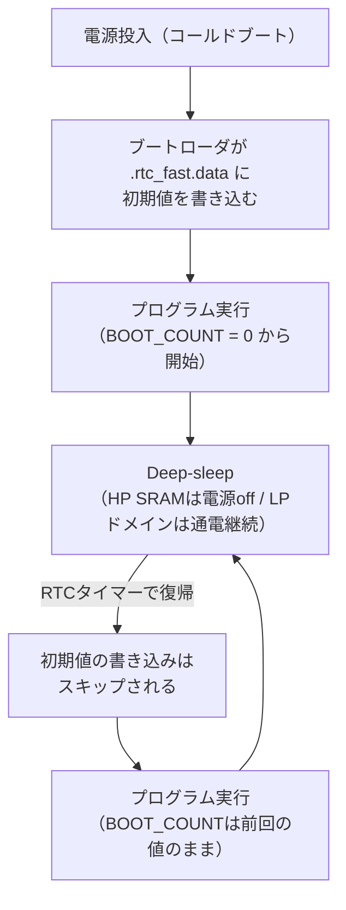

## このページでできるようになること

- `#[ram(unstable(rtc_fast))]`がなぜDeep-sleepをまたいで値を残せるのか、メモリと初期化の仕組みで説明できる
- `static mut`と`&raw mut`を使ったコードのSAFETYコメントを読み、「何が保証されているから安全なのか」を説明できる
- 起動カウンタとリングバッファ履歴の実装を読み、自分の端末に応用できる
- RTC RAMに「残るもの・残らないもの」（Deep-sleepは残る、電源断は消える）を区別できる

## 先に結論

[第12部2ページ](/embassy-esp32-c6/part12/02-deep-sleep/)で「Deep-sleepでHP SRAMは消えるが、LP SRAM（16KB）は保持される。ただし属性の話は本教材では扱わない」と保留にしました。ここで回収します。esp-halでは、static変数に`#[ram(unstable(rtc_fast))]`を付けると、その変数はリンカによって**RTC fast RAM**（ESP32-C6ではLPドメイン側の16KB SRAM）の専用セクション（`.rtc_fast.data`）に配置されます。この領域は、**電源投入時にはブートローダが初期値を書き込みますが、Deep-sleepからの復帰時にはこの書き込みがスキップされる**ため、眠る前の値がそのまま残ります。examples/16はこの仕組みで、起動回数カウンタと直近8回分の温度履歴を「毎回先頭からやり直すプログラム」の間で受け渡しています。ただしこれは通電が前提です。**USBを抜けば消えます**。

## 身近なたとえ

第12部2ページのたとえの続きです。Deep-sleepは「机の上（HP SRAM）を全部片づけて家に帰る」ことでした。RTC RAMは、そのオフィスにある**夜間も施錠されない小さなメモボード**です。帰宅前にボードへ「今日は3日目」「今週の気温メモ」と書いておけば、翌朝出社したとき机は空っぽでも、ボードの字は残っています。

たとえと違うのは、ボードの字が残る条件が「ビルの電気が通じていること」だという点です。停電（電源断）すればボードは白紙に戻ります。しかも面積は16KBと小さく、大事なものを選んで書く必要があります。

## 仕組み

### 初期化が「スキップされる」から残る

普通のstatic変数がなぜ毎回初期値に戻るのかを思い出しましょう。[第5部](/embassy-esp32-c6/part05/06-static/)で見たとおり、static変数の初期値はフラッシュ上のプログラムに焼き込まれていて、起動時にスタートアップ処理がRAMへコピーします（0初期化の変数は0で埋めます）。Deep-sleep復帰は「先頭からやり直し」なので、このコピーも毎回行われ、HP SRAM上の変数は必ず初期値に戻ります。

`#[ram(unstable(rtc_fast))]`を付けた変数は話が変わります。



ポイントは2つです。

- **場所**: この変数はHP SRAMではなく、Deep-sleep中も通電され続けるLPドメインのRAM（RTC fast RAM。C6では16KB）に置かれます。属性は、リンカスクリプト上の`.rtc_fast.data`という専用セクションへ変数を割り当てることで、これを実現しています
- **初期化のタイミング**: 初期値が書かれるのは**電源投入時だけ**です。Deep-sleep復帰時はこの書き込みがスキップされるので、「通電され続けたRAMに、前回の値が残ったまま」プログラムが先頭から走り始めます

つまり「値が残る」の正体は、魔法ではなく**（1）電源が切れない場所に置く（2）復帰時に上書きしない**、の組み合わせです。なお`rtc_fast`はesp-halの**unstable API**です。名前が示すとおり将来変わる可能性があります。

### examples/16のRTC RAM変数

```rust
/// 何回目の起動かを数えるカウンタ（電源投入時のみ0に戻る）
#[ram(unstable(rtc_fast))]
static mut BOOT_COUNT: u32 = 0;

/// 過去の温度[℃]を保持するリングバッファ
#[ram(unstable(rtc_fast))]
static mut TEMP_HISTORY: [f32; HISTORY_SIZE] = [0.0; HISTORY_SIZE];

/// これまでに履歴へ書き込んだ総回数
#[ram(unstable(rtc_fast))]
static mut TEMP_COUNT: u32 = 0;
```

u32が2つとf32が8個、合計40バイト。16KBの領域には十分収まります。参照元のesp32c3-embassyは同じ領域に、起動カウンタに加えて**96件の測定履歴**（時刻+温湿度気圧のリングバッファ`HistoryBuf`）と起動時刻を置いています——16KBは、選んで使えば意外とたくさん入ります。

## static mutとSAFETYコメントの読み方

上のコードには、この教材でずっと避けてきた`static mut`が登場します。static mutが危険なのは、**プログラムのどこからでも可変参照を作れてしまい、「可変参照はただ1つ」というRustの約束をコンパイラが検査できなくなる**からです。だからstatic mutに触る操作はすべてunsafeで、安全性の証明は人間の仕事になります。examples/16の該当箇所を読みます。

```rust
// RTC RAM上のstatic変数への可変参照をここで1回だけ作る。
//
// SAFETY: ESP32-C6はシングルコアで、このプログラムではタスクも割り込み
// ハンドラもこれらのstaticに触らない。可変参照を作るのがこの1箇所だけ
// なので、Rustの「可変参照はただ1つ」のルールを破らず安全に使える。
// （複数タスクから共有する場合はMutexなどの同期機構が必要になる）
let boot_count: &mut u32 = unsafe { &mut *(&raw mut BOOT_COUNT) };
```

- **`&raw mut BOOT_COUNT`** — edition 2024では、static mutから`&mut BOOT_COUNT`のように直接参照を作ることは許されません（うっかり複数作る事故が多発したためです）。代わりに`&raw mut`でまず**生ポインタ**（`*mut u32`）を作ります。生ポインタを作るだけなら安全で、危険なのはそれを参照に変える瞬間です
- **`unsafe { &mut *(...) }`** — 生ポインタから可変参照を作ります。ここがunsafeブロックである理由は、「この参照がただ1つであること」をコンパイラが確認できないからです
- **SAFETYコメント** — unsafeを書くときは、「なぜ安全と言えるのか」の根拠を必ずコメントで残します。ここでの根拠は3つ。（1）ESP32-C6はシングルコアで、別のCPUが同時に触ることはない（2）このプログラムでは、他のtaskも割り込みハンドラもこのstaticに触らない（3）可変参照を作るのはプログラム全体でこの1箇所だけ。**このどれか1つでも崩れたら（例えば履歴を別taskからも書くようにしたら）、このunsafeは嘘になります**。SAFETYコメントは「読者への説明」であると同時に、「将来の変更者への警告」です

### 参照元はSyncUnsafeCellを使う

同じ問題を、参照元のesp32c3-embassyは少し違う書き方で解いています。static mutの代わりに、`UnsafeCell`を包んだ自作の型を**mutではない**staticに置く方法です（esp32c3-embassy (Claudio Mattera, MIT OR Apache-2.0) src/cell.rs より抜粋）。

```rust
/// An `UnsafeCell` that implements `Sync`
pub struct SyncUnsafeCell<T> {
    inner: UnsafeCell<T>,
}

// SAFETY:
// There is only one thread on a ESP32-C3.
unsafe impl<T: Sync> Sync for SyncUnsafeCell<T> {}
```

```rust
#[ram(unstable(rtc_fast))]
static BOOT_COUNT: SyncUnsafeCell<u32> = SyncUnsafeCell::new(0);
```

見た目は違いますが、安全性の根拠はexamples/16と**同じ**です。「シングルコア（スレッドが1つ）だから、同時アクセスは起きない」——それを、examples/16は参照を作る場所のSAFETYコメントで宣言し、参照元は`unsafe impl Sync`のSAFETYコメントで宣言しています。static mutを避けてUnsafeCellに寄せるのは、「unsafeの理由を型の定義1箇所に集める」現代的なスタイルです。教材のexampleでは、仕組みがそのまま見える`static mut` + `&raw mut`を採りました。どちらを読んでも「人間が何を保証しているのか」を読み取れるようになってください。

## リングバッファ履歴を読む

温度履歴は「直近8件だけ残す」リングバッファです。配列を輪のように使い、9件目は最古の1件目を上書きします。

```rust
// --- 温度をリングバッファへ追記 ---
let index = (*temp_count as usize) % HISTORY_SIZE;
temp_history[index] = temperature_c;
*temp_count += 1;
```

`temp_count`は「これまでに書いた総回数」です。書き込み位置は`総回数 % 8`。0,1,2,...,7と進み、8回目でまた0に戻って上書きします。表示側は少し頭を使います。

```rust
let valid = (*temp_count as usize).min(HISTORY_SIZE);
for i in 0..valid {
    // バッファが一周した後は、次に書き込む位置(temp_count % 8)が
    // いちばん古いデータの位置になる
    let pos = if (*temp_count as usize) <= HISTORY_SIZE {
        i
    } else {
        ((*temp_count as usize) + i) % HISTORY_SIZE
    };
    info!("  [{}] {:.2} C", i, temp_history[pos]);
}
```

- まだ一周していないうち（総回数≦8）は、配列の先頭から`valid`件をそのまま古い順に読めます
- 一周した後は、「次に書き込む位置」＝「いちばん古いデータの位置」です。例えば総回数10なら次の書き込み位置は10%8=2で、そこにある値が最古（3回目の起動の値）。だから`(総回数+i) % 8`で古い順にたどれます

参照元はこの管理を自分で書かず、heapless製の`HistoryBuf`型（同じ発想のリングバッファ）に任せています。仕組みを一度手で書いておくと、`HistoryBuf`のドキュメントを読んだとき「ああ、あれか」と分かります。

## 残るもの・残らないもの

| 事象 | `#[ram(unstable(rtc_fast))]`の値 |
|---|---|
| Deep-sleep → RTCタイマーで復帰 | **残る** |
| リセットボタン・espflashによる再書き込み後の再起動 | 初期化の扱いはリセットの種類に依存します。examples/16で実際に試して確認してください（下の「やってみよう」） |
| USBを抜く（電源断） | **消える**（次の電源投入で初期値から） |

電源断でも残したいデータ（設定値、積算した測定データなど）は、RTC RAMではなく**フラッシュ**に保存する必要があります（[第12部5ページ](/embassy-esp32-c6/part12/05-flash-config/)の話題です）。RTC RAMは「眠りはまたぐが、停電はまたがない」短期の記憶と覚えてください。

似た名前の属性に`#[ram(persistent)]`があります。こちらは**HP SRAM上**の変数を「リセット時にゼロ初期化しない」ようにするもので、ソフトウェアリセットをまたいで値を残す用途です。しかしDeep-sleepでは**HP SRAMの電源自体が切れる**ため、Deep-sleepをまたぐ用途には使えません。「どの電源ドメインに置かれるか」と「いつ初期化されるか」の2軸で区別しましょう。

## よくある失敗

1. **普通のstaticに履歴を置いて「毎回消える」** — HP SRAM上の変数は、Deep-sleep復帰のたびにスタートアップ処理が初期値へ戻します。属性を付けた変数だけが生き残ります
2. **`&mut BOOT_COUNT`と直接書いてコンパイルエラー** — edition 2024ではstatic mutへの直接参照は拒否されます。`&raw mut`で生ポインタを経由してください。エラーメッセージ自体が`&raw mut`を提案してくれます
3. **可変参照を複数箇所で作る** — コンパイルは通ってしまうことがありますが、未定義動作です。SAFETYコメントの「この1箇所だけ」が守られているか、コードを変更するたびに確認が必要です。触る場所が2つ以上に増えるなら、設計をMutexなどの同期機構へ変えるべき合図です
4. **USBを抜き差しして「値が消えた！」** — 仕様どおりです。RTC RAMは通電が前提です。書き込み直後に0から始まるのも、電源投入相当の初期化が走るためです

## やってみよう

examples/16を書き込んで数サイクル動かしたあと、（1）ボードのRSTボタンを押す（2）USBを抜き差しする、の2通りを試し、それぞれで「起動回数」の表示がどうなるか観察してください。リセットの種類によってRTC RAMの扱いが違うことが、`リセット要因:`の表示と合わせて確認できます。

## 確認問題

1. `#[ram(unstable(rtc_fast))]`の変数がDeep-sleepをまたいで値を保てる理由を、「場所」と「初期化」の2つの観点で説明してください。
2. examples/16のSAFETYコメントが挙げている安全性の根拠を3つ挙げてください。
3. 「一周した後のリングバッファで、最古のデータはどこにあるか」を答えてください。

<details>
<summary>答え</summary>

1. 場所: Deep-sleep中も通電が続くLPドメインのRTC fast RAM（専用リンカセクション`.rtc_fast.data`）に置かれるから。初期化: 初期値の書き込みは電源投入時だけで、Deep-sleep復帰時はスキップされるから。
2. （1）ESP32-C6はシングルコア（2）このプログラムでは他のtaskも割り込みハンドラもこのstaticに触らない（3）可変参照を作るのはこの1箇所だけ。
3. 「次に書き込む位置」、つまり`総回数 % バッファサイズ`の位置です。そこが次に上書きされる=現時点でいちばん古いデータです。

</details>

## まとめ

- RTC RAMが残る正体は「電源が切れないLPドメインに置く」+「復帰時に初期値の書き込みをスキップする」の組み合わせ。電源断では消える（永続化はフラッシュの仕事）
- static mutを触るunsafeは、SAFETYコメントで「シングルコア・触るのは1箇所だけ」という人間の保証を明文化する。参照元のSyncUnsafeCellも同じ保証の別の書き方
- 起動カウンタ+リングバッファは、毎回先頭からやり直すプログラムをつなぎ合わせる最小の道具

## 次のページ

データを眠りの向こうへ運べるようになりました。仕上げは「どれだけ眠るか」の設計です。平均電流の概算で、デューティサイクルが電池寿命を桁で変えることを確かめます。

[5. デューティサイクル設計 — 平均電流を桁で下げる](/embassy-esp32-c6/sensor-node/05-duty-cycle/)

前のページ: [3. BME280を読む — examples/16の前半](/embassy-esp32-c6/sensor-node/03-sensor-c6/)
