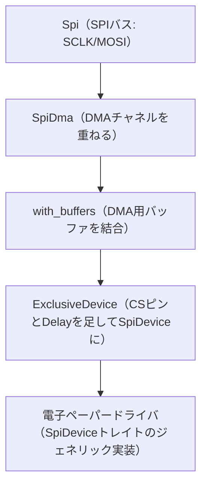

## このページでできるようになること

- 「誰がどのピンを持つか」を構造体の型でコンパイル時に確定させるパターンを説明できる
- 全ペリフェラルを1つの巨大な構造体で共有する設計が、なぜ破綻するかを説明できる
- SPIバス→DMA→ExclusiveDevice→ジェネリックドライバという層構造を図で説明できる
- uomクレートによる「単位を型で区別する」考え方を説明できる

## 先に結論

esp-halの`esp_hal::init()`が返す`peripherals`は、GPIOやI2C・SPIの**唯一の所有権のかたまり**です。参照元のesp32c3-embassyは、これをそのまま引き回さず、`DisplayPeripherals`（SPIとピン6本＋DMA）と`SensorPeripherals`（I2Cとピン2本）という**型付きフィールドの構造体**に分けて、表示系とセンサ系の初期化関数へそれぞれ渡します。ピンはmoveされるので、渡した瞬間に持ち主が確定し、二重使用はコンパイルエラーになります。第3部8ページの所有権が、配線図レベルの設計道具になった姿です。表示側ではさらに、SPIバスにDMAを重ね、`ExclusiveDevice`で`SpiDevice`に仕立て、ジェネリックなドライバへ渡す層構造（第8部8ページの回収）と、℃とhPaを型で区別するuomクレートまで登場します。

## 身近なたとえ

学校の実験室の鍵を思い浮かべてください。悪い管理は、全部屋の鍵がついた鍵束を1つだけ作り、使いたい人が鍵束ごと借りていく方式です。誰かが借りている間、他の全員は無関係な部屋にも入れません。よい管理は、化学室セット・物理室セットのように**必要な鍵だけの小さな鍵束**を作って各班に渡し切る方式です。どの班がどの部屋に入れるか、貸し出した時点で確定します。

たとえと違うのは、Rustでは「同じ鍵を2つの班に渡す」試みが、その場で（実行前に、コンパイルの段階で）エラーになることです。鍵の複製そのものが型システム上できません。

## 仕組み

### 悪い例 — 巨大な鍵束を全員で回す

まず、やってしまいがちな設計から。全ペリフェラルを1つの構造体（あるいは`Mutex`に包んだグローバル）に入れ、各taskが`&mut`で借りて使う方式です。これは2つの理由で破綻します。第一に、借用は同時に1つ——表示taskが構造体を借りている間、センサtaskはI2Cに触れません。無関係なピンなのに、です。第二に、「このtaskは本当はどのピンを使うのか」がコードを全部読まないと分からなくなります。所有の単位が大きすぎるのです。

### 参照元の答え — 用途別の型付き構造体

参照元の`main.rs`は、用途ごとの構造体を定義します（出典: esp32c3-embassy `src/main.rs`、Claudio Mattera、MIT OR Apache-2.0。以下の引用も同じ。C3向けのためピン番号は参照元のままです）。

```rust
// これは抜粋です（main.rs）
/// Peripherals used by the display
struct DisplayPeripherals {
    sclk: GPIO6<'static>,
    mosi: GPIO7<'static>,
    cs: GPIO8<'static>,
    busy: GPIO9<'static>,
    rst: GPIO10<'static>,
    dc: GPIO19<'static>,
    spi2: SPI2<'static>,
    dma: DMA_CH0<'static>,
}

/// Peripherals used by the sensor
struct SensorPeripherals {
    sda: GPIO1<'static>,
    scl: GPIO2<'static>,
    i2c0: I2C0<'static>,
    rng: Rng,
}
```

注目してほしいのはフィールドの型です。`u8`のピン番号ではなく、**`GPIO6<'static>`というピンそのものの型**が並んでいます。esp-halではペリフェラルは1つずつが固有の型を持つシングルトン（唯一物）で、コピーできません。`main`はこう分配します。

```rust
// これは抜粋です（main.rs）
let sender = setup_display_task(
    spawner,
    DisplayPeripherals {
        sclk: peripherals.GPIO6,
        mosi: peripherals.GPIO7,
        // …
    },
    history,
)?;
```

`peripherals.GPIO6`と書いた瞬間、GPIO6の所有権は`DisplayPeripherals`へmoveし、`peripherals`からは失われます。もし後から`SensorPeripherals`にも`sda: peripherals.GPIO6`と書けば、「moveした値を使った」というコンパイルエラーです。つまり——

- **誰がどのピンを持つかが、構造体定義を見ただけで分かる**（ドキュメントとしての型）
- **ピンの二重割り当てが実行前に必ず見つかる**（配線ミスの一種をコンパイラが検出）
- 各モジュールは自分に必要な構造体だけ受け取ればよく、他のピンの存在すら知らない

第3部8ページの所有権のルールがそのまま、「配線の設計図をコンパイラに検査させる」道具になっています。

### SPIの層構造 — バスからジェネリックドライバまで

`DisplayPeripherals`を受け取った`setup_display_task`の中では、第8部8ページで学んだ「バスとデバイスの分離」が実物として組み上がります。



- **Spi（バス）**: SCLKとMOSIを割り当てた生のバス。まだ「どのデバイスと話すか」を知らない
- **SpiDma**: DMA（Direct Memory Access）チャネルを重ね、CPUを介さず転送できる形にする。電子ペーパーは画面1枚ぶんのデータ転送が大きいのでDMA向き
- **ExclusiveDevice**: embedded-hal-busの部品。バス＋CSピン＋Delayを束ねて、embedded-halの`SpiDevice`トレイトを実装する。「このバスはこのデバイスが独占する」という宣言でもある
- **ドライバ**: 電子ペーパーのドライバ（参照元では作者自身のwaveshare-154bv2-rsクレート）は`SpiDevice`を実装した**何か**を受け取るジェネリックな型。esp-halのSPIだという事実すら知らない

この層構造のおかげで、ドライバはどのチップでも動き、バス共有が必要になったら`ExclusiveDevice`を共有版の部品に差し替えるだけで済みます。センサ側も同じ思想で、bme280-rsドライバは`embedded_hal_async::i2c::I2c`を実装した何かを受け取るだけです。

### uom — ℃とhPaを型で区別する

参照元の測定値の型`Sample`（`domain.rs`）は、`f32`を直接持ちません。

```rust
// これは抜粋です（domain.rs）
pub struct Sample {
    pub temperature: Temperature,  // uomのThermodynamicTemperature
    pub humidity: Humidity,        // uomのRatio（%）
    pub pressure: Pressure,        // uomのPressure
}
```

uom（units of measurement）は、物理量を単位ごとの型にするクレートです。`Temperature`と`Pressure`は別の型なので、気温の変数に気圧を代入する・引数の順番を取り違える、といったミスがコンパイルエラーになります。値を取り出すときは`temperature.get::<degree_celsius>()`のように**単位を明示**するため、「この数字は℃なのか°Fなのか」という古典的な事故（火星探査機を失った実話で有名です）も型が防ぎます。ピンの持ち主も、失敗の種類も、物理量の単位も型にする——このプロジェクトの一貫した思想です。なお教材の`examples/16-sensor-node`は学習の段差を優先して`f32`のまま扱っています。実プロジェクトで測定値の種類が増えてきたら、uomは検討に値します。

このページの内容はexamplesに対応する検証済みコードがありません（`code_status: concept-only`）。引用は参照元プロジェクトのものです。

## よくある失敗

- **同じピンを2つの構造体に入れようとしてコンパイルエラー** — `use of moved value: peripherals.GPIO6`のようなエラーになります。これはバグではなく検出です。どちらの系統がそのピンを使うのか、配線図に立ち返って決め直します
- **「あとで柔軟に使いたいから」と全ペリフェラルを1つのstructやMutexに入れる** — 借用が衝突して、無関係なペリフェラル同士が待ち合う設計になります。柔軟さが欲しい場面こそ、用途別に小さく分けるのが正解です
- **ドライバに具体型を要求してしまう** — 自作ドライバの引数を`Spi<'static, Async>`のような具体型にすると、DMA化やバス共有への変更、他チップへの移植のたびにドライバを書き直すことになります。`SpiDevice`/`I2c`トレイトで受けるのが層構造の要です

## やってみよう

教材の`examples/16-sensor-node`の`main`を見て、参照元スタイルの`SensorPeripherals`をC6向けに定義してみましょう。必要なフィールドは3つ（SDA=GPIO6、SCL=GPIO7、I2C0）です。`esp_hal::peripherals::{GPIO6, GPIO7, I2C0}`をuseして構造体を書き、`main`のI2C初期化部分を`fn setup_sensor(p: SensorPeripherals)`に切り出す形を紙の上で設計してください。

## 確認問題

1. `DisplayPeripherals`のフィールドが`u8`のピン番号ではなく`GPIO6<'static>`のような型である利点は何ですか。
2. `ExclusiveDevice`は層構造の中でどんな役割を果たしていますか。「バス」と「デバイス」という言葉を使って答えてください。
3. uomを使うと防げるのは、どんな種類のバグですか。具体例を1つ挙げてください。

<details>
<summary>答え</summary>

1. ピンの所有権そのものが構造体にmoveされるため、同じピンの二重使用がコンパイルエラーで検出されます。番号（`u8`）はただの数値なのでコピーでき、二重使用を防げません。
2. SPIバス（SCLK/MOSIの共有配線）にCSピンとDelayを組み合わせ、「1つのデバイスとの会話」を表す`SpiDevice`に変換する役割です。ドライバはバスの実体を知らず、`SpiDevice`トレイトだけに依存できます。
3. 単位や物理量の取り違えです。例: 気温（℃）を渡すべき引数に気圧（hPa）の変数を渡す、hPaのつもりでPaの数値を代入する、といったミスがコンパイルエラーや明示的な単位指定で防がれます。

</details>

## まとめ

- ペリフェラルは用途別の型付き構造体に分けてmoveで渡し切る。「誰がどのピンを持つか」が型で確定し、二重使用はコンパイルエラーになる
- SPIはバス→DMA→ExclusiveDevice→ジェネリックドライバの層で組む。ドライバはトレイトだけに依存し、チップにも配線変更にも強くなる
- uomは単位を型にして、物理量の取り違えを実行前に検出する

## 次のページ

部品はすべて揃いました。センサ・スリープ・時計・HTTPS・エラー設計・ペリフェラル分配——これらを組み合わせて、あなた自身の測定端末を設計します。

[10. 自分の測定端末を作る →](/embassy-esp32-c6/sensor-node/10-roadmap/)

---

前: [8. taskはResultを返せない](/embassy-esp32-c6/sensor-node/08-error-design/) | 次: [10. 自分の測定端末を作る](/embassy-esp32-c6/sensor-node/10-roadmap/)
