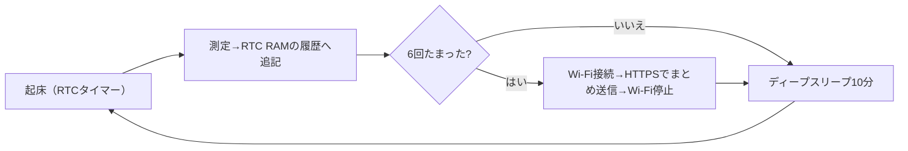

## このページでできるようになること

- 「観測値をクラウドへ送る電池端末」の要求仕様を、通信方式・デューティサイクル・劣化運転の3つの設計判断に分解できる
- Wi-Fi＋HTTPS直送・ESP-NOW中継・BLE（Bluetooth Low Energy）の3方式を、電力とインフラの観点で比較して選べる
- 参照元をフォークする道と、examplesから組み上げる道のどちらで作り始めるか判断できる

## 先に結論

このページにはコードがありません。あるのは設計演習です。あなたの手元にはもう、動く部品が揃っています。`examples/16-sensor-node`（BME280＋RTC RAM＋ディープスリープ）、`examples/17-https`（TLSでのGET）、`examples/08-wifi`（ステーション接続）、`examples/final-wireless-button`（ESP-NOWの再送・重複排除・劣化運転）。そして参照元esp32c3-embassyという「完成品の実例」の読み方をこの編で身につけました。ここからやることは、**要求仕様を自分で書き、通信方式を選び、デューティサイクルを決め、劣化運転を設計する**——つまり、この教材があなたに渡してきた判断を、今度はあなた自身が下すことです。

## 身近なたとえ

料理教室の最終回に似ています。ここまでは先生のレシピどおりに、切り方（センサ読み取り）、火加減（スリープ）、味付け（通信）を習ってきました。最終回の課題は「冷蔵庫の中身で一品作る」。レシピはありません。あるのは技術と、先生が作った見本料理（参照元）を味見して構成を推理する力です。

たとえと違うのは、ソフトウェアの見本料理は**レシピ（ソースコード）ごと公開されていて、しかもフォークして自分の味に改造してよい**（MIT OR Apache-2.0）ことです。

## 仕組み

### 設計演習 — 要求仕様から始める

次の要求仕様を出発点にします（数字は自分の状況に合わせて書き換えてください）。

> ベランダの温度・湿度・気圧を**10分ごと**に測り、**1時間ごと**にまとめてクラウドへHTTPSで送る。電源は電池。家の中に2.4GHz帯のWi-Fiがある。センサやWi-Fiが一時的に故障しても、端末は止まらず動き続けること。

設計は3つの判断に分解できます。順番に考えましょう。

### 判断1: 通信方式 — 3つの選択肢

| | Wi-Fi＋HTTPS直送 | ESP-NOW＋中継機 | BLE |
|---|---|---|---|
| 端末からクラウドまで | 端末が直接送る | 端末→中継機（常時給電）→クラウド | 端末→スマホ等→クラウド |
| 起動あたりの通信コスト | 大（接続＋DHCP＋TLSハンドシェイク） | 小（コネクションレスで即送信） | 中（アドバタイズは軽い） |
| 必要な追加ハード | なし | 中継機用にもう1台 | 回収役のスマホ/PC |
| 暗号化・認証 | TLSで端末〜サーバ間を保護 | 自分で設計（最終プロジェクトの範囲では平文） | ペアリング等の設計次第 |
| 到達距離 | アクセスポイント圏内 | 機器間の電波が届く範囲 | 近距離 |

Wi-Fi直送のいちばんの敵は**起動のたびに払う接続コスト**です。接続確立・DHCP・TLSハンドシェイクの間はずっと無線が動き、そのぶん電池が減ります。参照元が「時刻同期の初回だけWi-Fiを使い、以後は一切つながない」設計にしたのは、まさにこのコストを払いたくないからでした。ESP-NOW中継方式は端末側の通信を一瞬で終わらせられますが、常時給電の中継機という**インフラを1台増やす**取引です。BLEは回収役が近くに来る前提が要ります。上の要求仕様（家の中にWi-Fiがある・1時間に1回だけ送る）なら、Wi-Fi直送とESP-NOW中継のどちらも成立します。**あなたならどちらを選び、理由を何と説明しますか。**これが最初の演習です。

### 判断2: デューティサイクル — 測定と送信を分ける

要求仕様をよく読むと、測定は10分ごと、送信は1時間ごと。つまり**6回測って1回送る**のが正解で、毎回Wi-Fiにつなぐ必要はありません。これは16のRTC RAM履歴バッファがそのまま効く形です。

さらに第6ページの部品が2つ入ります。送るデータに付ける時刻は`boot_time`方式＋RTC RAM保存で維持し、起床は丸め起床で00分・10分…に揃える。そして第12部で学んだ鉄則——**ディープスリープ前にWi-Fiを止める**（参照元のコードには「止めないと無限にブロックする」という注意書きがあります）。ここでの演習: 電池を長持ちさせたいとき、まず削るべきは「測定の頻度」と「送信の頻度」のどちらでしょうか。無線がいちばんの電力消費者だと知っていれば、答えは出せるはずです。

### 判断3: 劣化運転 — 何が壊れても止まらない

要求仕様の最後の一文は、故障の一覧表を作れと言っています。この編と最終プロジェクトで見た戦略を割り当てていきます。

| 故障 | 戦略 | 学んだ場所 |
|---|---|---|
| センサが応答しない | 欠測の印（NaN等）を記録してサイクル継続 | 16と第8ページ |
| Wi-Fiにつながらない | 送信をあきらめて履歴に貯めたまま眠り、次回まとめて再送 | 最終プロジェクトの再送設計の応用 |
| 送信は成功したが応答が異常 | ログに残して継続。同じデータを二重送信しない工夫（重複排除） | 第11部8ページ |
| 時刻が未同期（初回・電池交換後） | 同期できるまで測定値に「時刻なし」の印を付けるか、同期を待つ | 第6ページ |

演習: この表に「RTC RAMの履歴が満杯になった」の行を足すとしたら、戦略は何にしますか（ヒント: 16のリングバッファは何を捨てていましたか）。

### 作り始める2本の道

**道1: 参照元をフォークして改造する。** esp32c3-embassyはMIT OR Apache-2.0で、READMEで「出発点として使ってよい」と明言されています。C6への移植の差分はこの編の調査で判明済みです——featureを`esp32c3`から`esp32c6`へ、targetを`riscv32imc`から`riscv32imac`へ、ピン番号を自分の配線へ、あとはesp-radio/esp-rtos/embassy-executorのマイナーバージョン差の追従だけ。スタックの世代が教材とほぼ同じなので、大規模な書き換えは不要です。完成品の構造（モジュール分割・エラー設計・型付きペリフェラル）をそのまま土台にできるのが利点で、「約1900行を読みながら削って組み替える」根気が必要なのが対価です。改造したら、ライセンス表記と出典を必ず残してください。

**道2: examplesから組み上げる。** 16を骨格に、08-wifiの接続部と17のTLS部を移植し、final-wireless-buttonの再送・重複排除の考え方を送信部に足します。全部が教材でcargo checkを通した、あなたが1行ずつ説明できる部品です。構造は自分で設計することになるので、第12部8ページのモジュール分割と、この編の第8・9ページのパターンを設計図にしてください。時間はかかりますが、全行に責任を持てるファームウェアになります。

**表示系への展開。** 参照元にはもう1つ、この編で深入りしなかった部品があります。WaveShareの電子ペーパー（SPI接続）です。電子ペーパーは**表示の保持に電力を使わない**ため、ディープスリープ中心の端末と最高に相性がよい表示装置です。第9ページの層構造（SPI DMA＋ExclusiveDevice＋ジェネリックドライバ）はそのまま表示ドライバの受け口になります。クラウドの代わりに、あるいはクラウドと並行して、手元に数字が出る端末はそれだけで完成品の顔になります。

### 実物を読む力 — 応用編の締め

この教材の応用編は、どれも同じ1つのことを訓練してきました。キーボード編では、Zennの記事とファームウェアを読み解いて自分のC6キーボードの設計判断につなげました。このセンサ端末編では、実在の気象ステーションを読み解き、時刻・TLS・エラー・所有権の設計を自分の言葉で説明できるようになりました。今後この教材に別の応用編（たとえばロボット）が加わることがあっても、やることは変わりません。**本物のプロジェクトを、学んだ知識を物差しにして読む。読めたら、フォークするなり真似るなりして、自分の要求仕様に合わせて作り替える。**チュートリアルの中だけで完結する力ではなく、公開されている世界中のコードすべてを教材に変える力——それがこの編の卒業証書です。

作ったら、READMEに正直な`status`を書いて公開してください。あなたの端末が、次の誰かの「参照元」になります。

## よくある失敗

- **最初から全機能を一度に組もうとする** — センサ＋スリープだけ、Wi-Fi＋HTTPSだけ、と動く部品単位で段階を踏み、最後に結合します。examplesが機能ごとに分かれているのは、この積み上げ順のためでもあります
- **通信方式を「なんとなく高機能そうだから」で選ぶ** — 方式選択は電力・インフラ・距離の取引です。表を書いて自分の要求仕様と突き合わせずに選ぶと、電池が数日で切れる端末や、中継機の置き場所がない構成になります
- **フォークしたコードの出典とライセンスを消してしまう** — MIT OR Apache-2.0は自由に使える代わりに、著作権表示とライセンス文の保持が条件です。出典を書くことは義務であると同時に、未来の自分が「どこから来たコードか」を思い出す助けにもなります

## やってみよう

冒頭の要求仕様の数字を自分の環境に合わせて書き換え、判断1〜3の答えをそれぞれ3行以内で書いてみましょう。「通信方式は◯◯。理由は◯◯」「測定◯分ごと・送信◯回に1回」「センサ故障時は◯◯」。この1枚が、あなたの端末の設計書の第1版です。

## 確認問題

1. 「測定10分ごと・送信1時間ごと」の仕様で、毎回の起床でWi-Fiに接続する設計が悪手なのはなぜですか。
2. ESP-NOW中継方式がWi-Fi直送より端末の電池に優しい理由と、その代わりに払う代償を1つずつ挙げてください。
3. 電子ペーパーがディープスリープ中心の端末と相性がよいのはなぜですか。

答え

1. 無線接続（接続確立・DHCP・TLSハンドシェイク）は起動あたりの電力コストが最も大きい処理のひとつだからです。6回に5回の接続は送るデータがないのに電池を消費します。RTC RAMに貯めてまとめ送りすれば接続回数を6分の1にできます。
2. 理由: ESP-NOWはコネクションレスで、接続確立やDHCPなしに一瞬で送信を終えられるからです。代償: 受け取ってクラウドへ転送する常時給電の中継機を1台、別途用意・運用する必要があります。
3. 電子ペーパーは一度描いた表示を電力なしで保持できるため、端末が眠っている間も最後の測定値を表示し続けられるからです。

## まとめ

- 測定端末の設計は「通信方式」「デューティサイクル」「劣化運転」の3つの判断に分解できる。要求仕様を書き、表で比較して選ぶ
- 作り始める道は2本。参照元（MIT OR Apache-2.0）をC6向けにフォークするか、検証済みexamplesを部品に組み上げるか
- 応用編が渡したのは「実物を読む力」。公開されているコードすべてが、今日からあなたの教材になる

## 次のページ

センサ端末編はここで完結です。読み返したい用語が出てきたら、いつでも用語集へ。

[用語集 →](/embassy-esp32-c6/appendix/glossary/)

---

前: [9. 型でピンの持ち主を決める](/embassy-esp32-c6/sensor-node/09-peripherals-types/) | 次: [用語集](/embassy-esp32-c6/appendix/glossary/)
